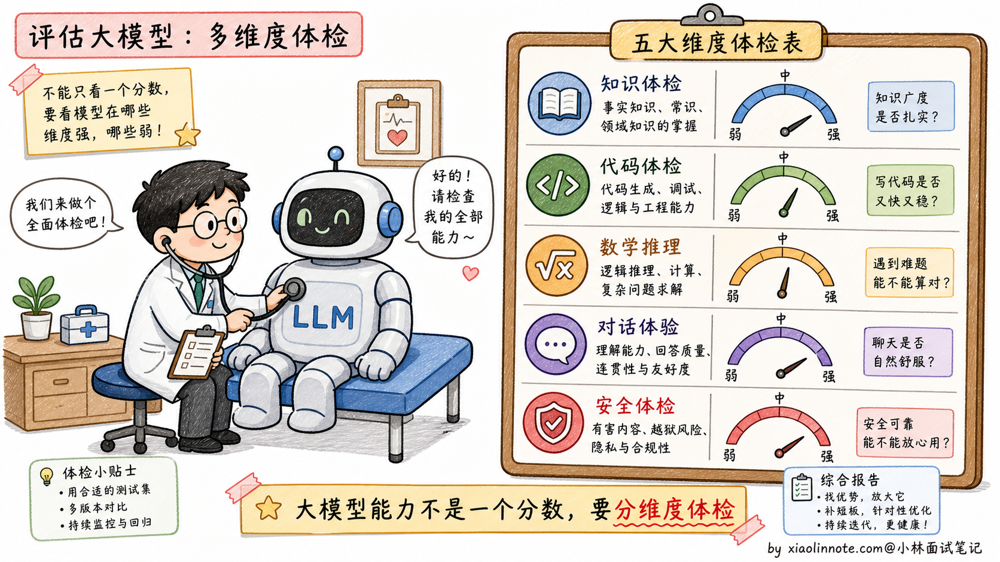
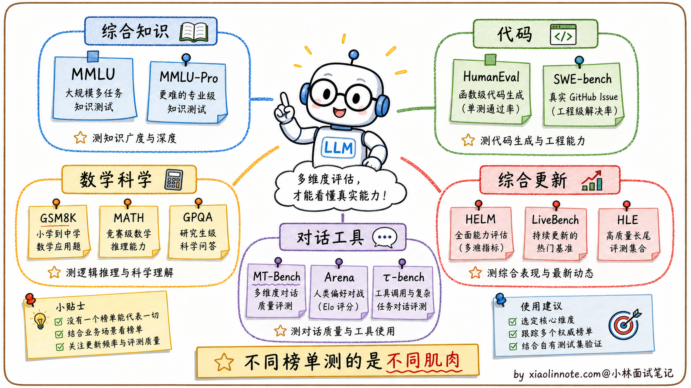
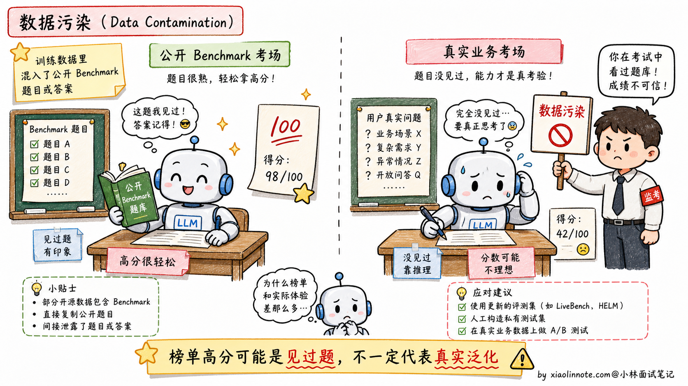
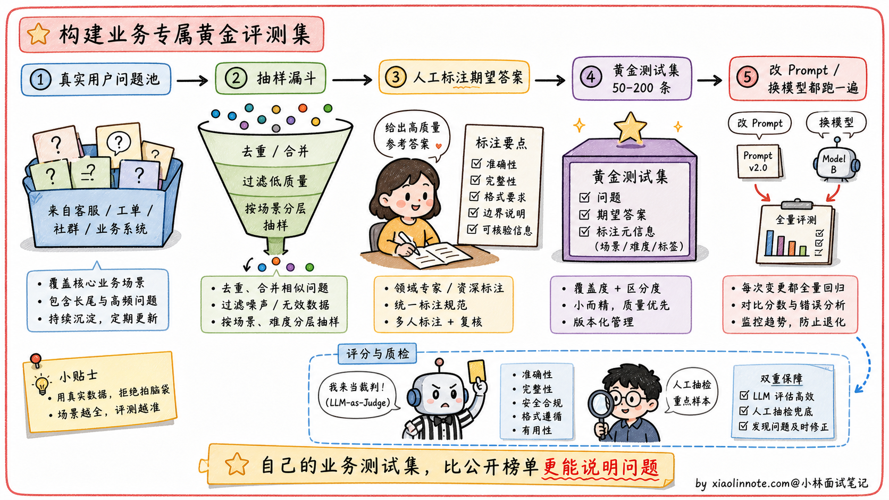
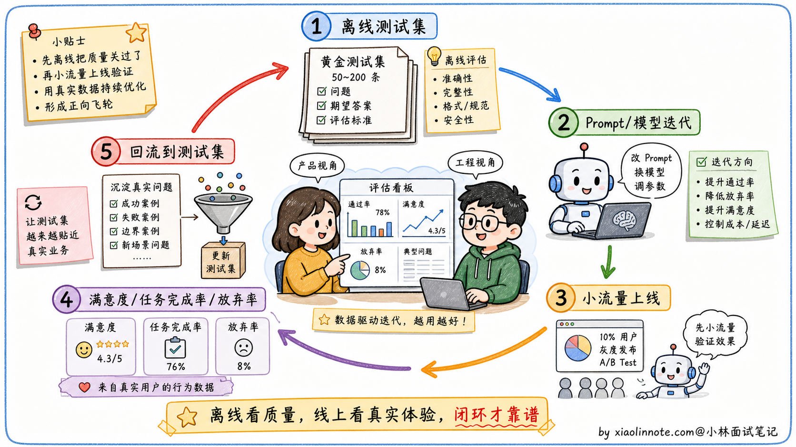

# 大模型能力评测指标

> 来源：[xiaolinnote.com](https://xiaolinnote.com/ai/llm/evaluation_metrics.html)
> 一句话总结：学术 Benchmark 用于横向对比模型综合能力，但不能完全信任（数据污染），工业界标配是"学术 Benchmark + 业务测试集 + 线上指标"的闭环评测体系。

## 一、评测指标的作用

大模型能力是多维度的，"感觉不错"不足以支撑工程决策。评测指标的价值在于把**主观感受**转化为**可比较的数字**。

适用场景：换模型选型、微调效果衡量、Prompt 优化前后对比。

难点：语言生成是开放性任务，"正确答案"边界模糊，因此需要多种不同侧重的 Benchmark。

## 二、主流学术 Benchmark

### 2.1 综合知识能力

| Benchmark | 测试内容 | 难度特点 |
|----------|---------|---------|
| MMLU | 57 个学科，四选一选择题 | 知识广度 + 基础推理 |
| MMLU-Pro | MMLU 升级版，选项更多 | 更高难度，更强调推理链 |

可以理解为"超全面的文化水平考试"。

### 2.2 代码能力

| Benchmark | 测试方式 | 特点 |
|----------|---------|------|
| HumanEval | 164 道编程题，给函数签名 + docstring，生成实现 | OpenAI 设计，Pass@k 指标 |
| MBPP | 基础编程题 | 入门级代码能力 |
| SWE-bench Verified | 修真实 GitHub issue | 更接近真实软件工程 |

**Pass@k**：生成 k 个候选代码，至少 1 个通过所有测试的比例。

### 2.3 数学与科学推理

| Benchmark | 测试内容 | 难度 |
|----------|---------|------|
| GSM8K | 小学数学应用题 | 基础四则运算 + 逻辑推理 |
| MATH | 竞赛数学（代数、几何、组合） | 中高难度 |
| GPQA | 研究生级别科学问答 | 需专业知识和多步推理 |

### 2.4 对话与 Agent 能力

| Benchmark | 测试方式 | 特点 |
|----------|---------|------|
| MT-Bench | 多轮交互场景，LLM-as-Judge 打分 | 考对话质量 |
| Chatbot Arena | 用户真实偏好投票 | 反映真实用户体验 |
| τ-bench | 工具调用 + 多轮状态管理 | 贴近 Agent 应用 |

### 2.5 综合与新型评测

| Benchmark | 特点 |
|----------|------|
| HELM | 多维度：准确率、鲁棒性、公平性、有害性 |
| LiveBench | 持续更新题目，降低数据污染 |
| Humanity's Last Exam | 更难、更广的综合知识和推理 |

## 三、数据污染问题

**数据污染（Data Contamination）** 是学术 Benchmark 的系统性缺陷：

- 大模型训练数据覆盖互联网大部分公开内容
- MMLU、GSM8K 等题目在网上公开流传
- 模型在预训练时可能已"见过"测试题答案 → 成绩虚高

**结果**：排行榜靠前的模型实际用起来可能不如名次更低的竞品。

应对方向：
1. 避免用公开 Benchmark 直接当训练集
2. 用 LiveBench 等持续更新题库的评测
3. 用业务真实数据做评测

## 四、业务测试集构建

### 4.1 构建方法

1. **采样**：从真实用户请求中采样
2. **标注**：人工标注期望答案
3. **规模**：50-200 条有代表性的"黄金测试集"
4. **回归**：每次改 Prompt 或换模型都跑一遍

### 4.2 评分方式

| 任务类型 | 评分方式 |
|---------|---------|
| 客观任务（信息提取、分类、代码） | 程序自动验证 |
| 主观任务（摘要、问答质量） | LLM-as-Judge（让 GPT-4o 等强模型按标准打分） |
| 质量校准 | 人工抽查 10-20% 样本 |

## 五、离线评估 + 线上指标闭环

| 维度 | 离线评估 | 线上指标 |
|------|---------|---------|
| 目的 | 快速迭代找问题 | 确认优化真正改善用户体验 |
| 方法 | 业务测试集 + Benchmark | 用户满意度、任务完成率、会话放弃率 |
| 优势 | 速度快、成本低 | 反映真实效果 |
| 局限 | 可能与实际效果偏差 | 滞后、受外部因素影响 |

## 六、复习清单

1. **为什么需要评测指标？** 把主观感受转化为可比较的数字，支撑模型选型、微调效果衡量等工程决策。
2. **MMLU 测什么？** 57 个学科的综合知识广度和推理基础，四选一选择题。
3. **HumanEval 和 SWE-bench Verified 的区别？** HumanEval 是函数级编程题，SWE-bench Verified 是修真实 GitHub issue，更贴近真实工程。
4. **Pass@k 是什么？** 生成 k 个候选代码，至少 1 个通过所有测试的比例。
5. **GSM8K、MATH、GPQA 分别是什么难度？** 小学数学 → 竞赛数学 → 研究生级科学问答。
6. **MT-Bench 怎么评分？** 多轮交互场景，用 LLM-as-Judge 方式打分。
7. **什么是数据污染？** 模型在预训练时已见过 Benchmark 测试题，导致成绩虚高。
8. **数据污染的后果？** 排行榜高的模型实际效果可能不如名次更低的竞品。
9. **业务测试集怎么建？** 从真实用户请求采样 50-200 条，人工标注期望答案，形成黄金测试集。
10. **LLM-as-Judge 是什么？** 让更强的模型（如 GPT-4o）按给定标准对输出打分，用于主观任务评估。
11. **为什么要人工抽查？** 校准 LLM-Judge 的评分可信度，通常抽查 10-20% 样本。
12. **完整的评测闭环是什么？** 学术 Benchmark（横向对比）+ 业务测试集（离线评估）+ 线上指标（真实效果），三者结合。
