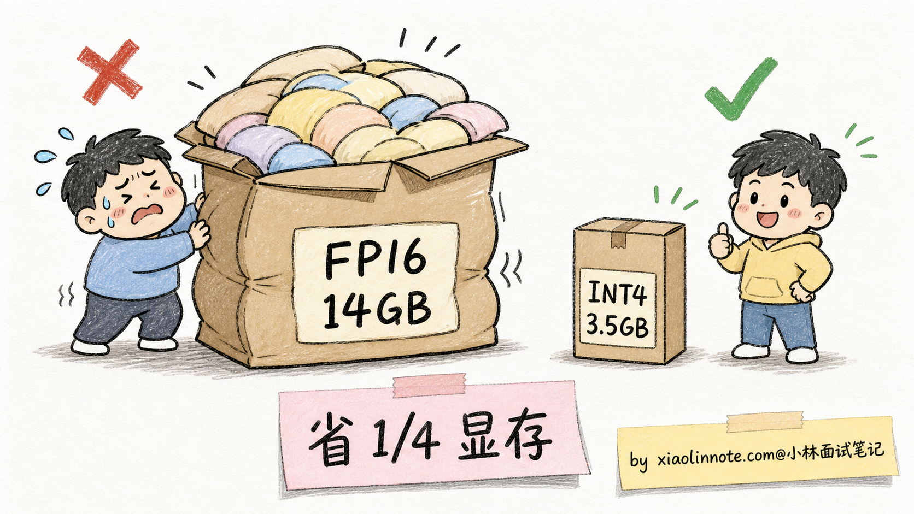
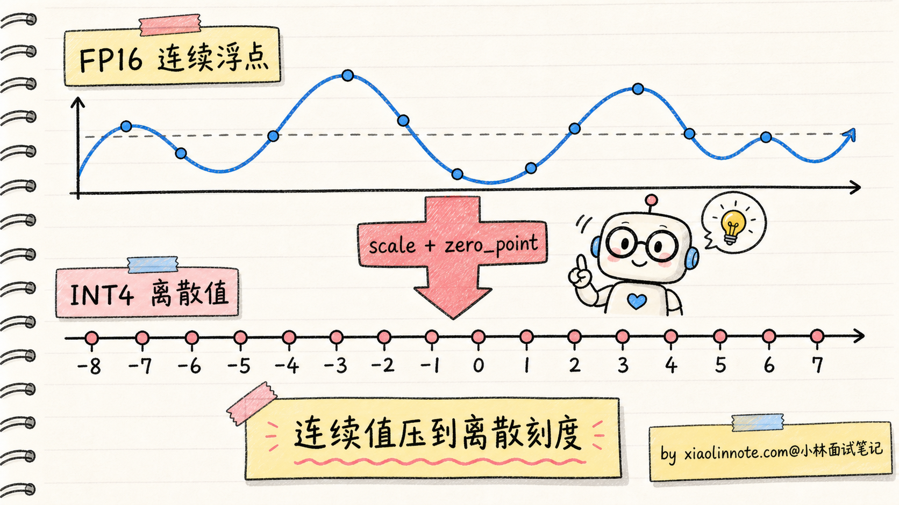
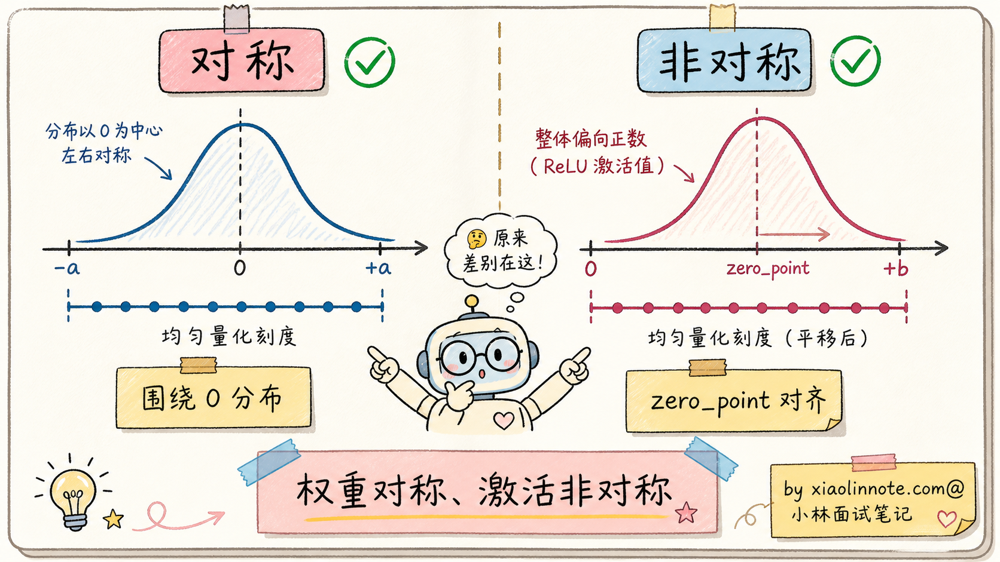
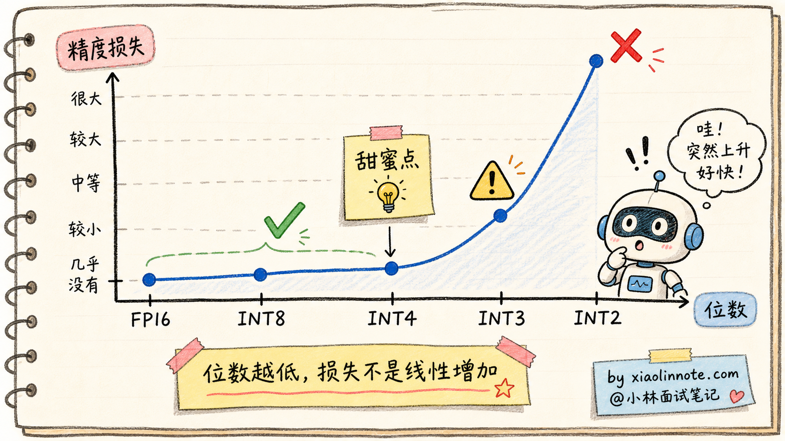
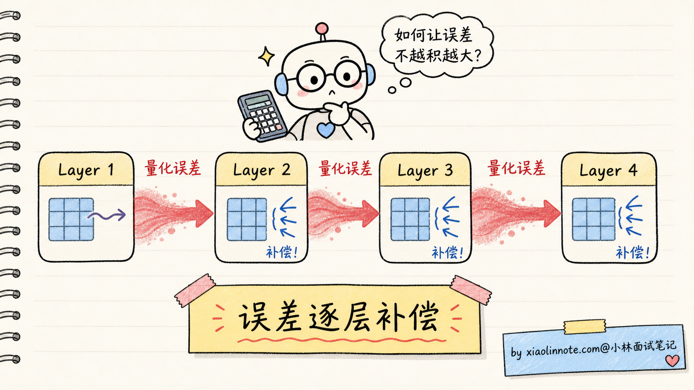
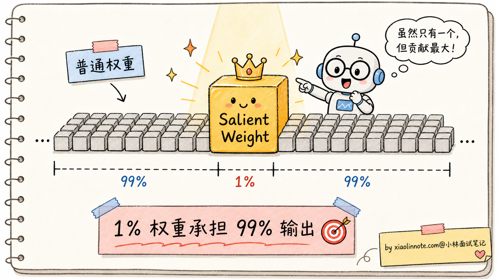
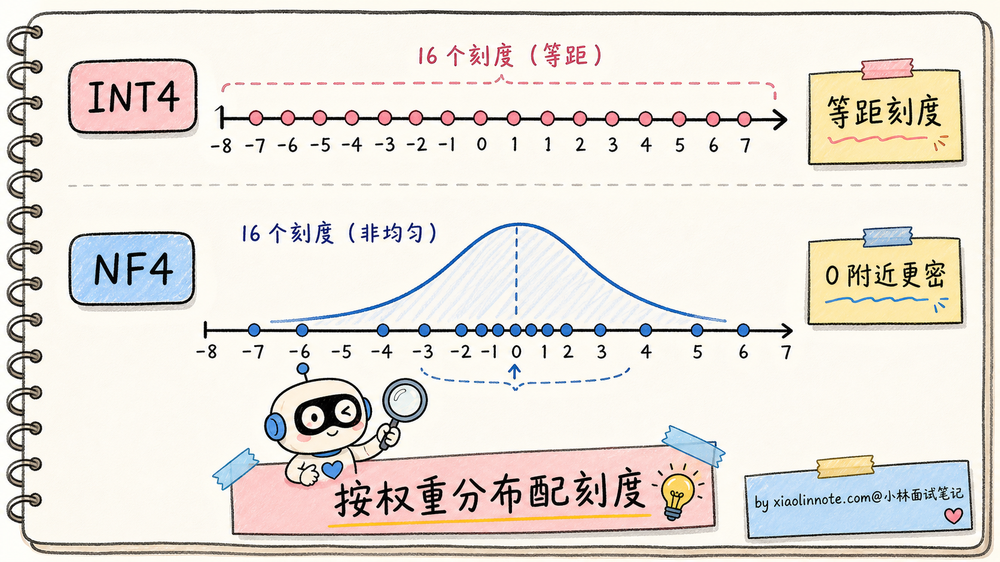
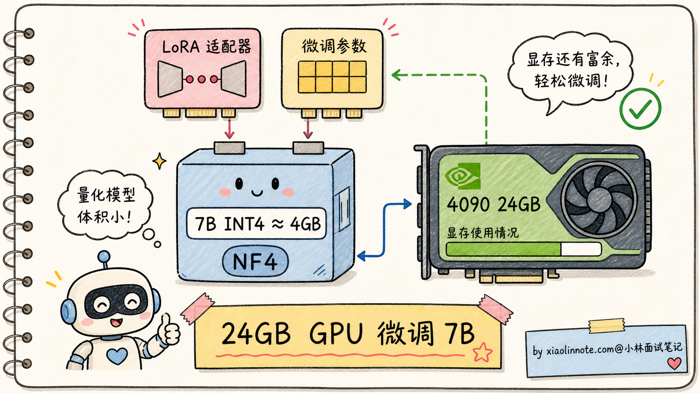
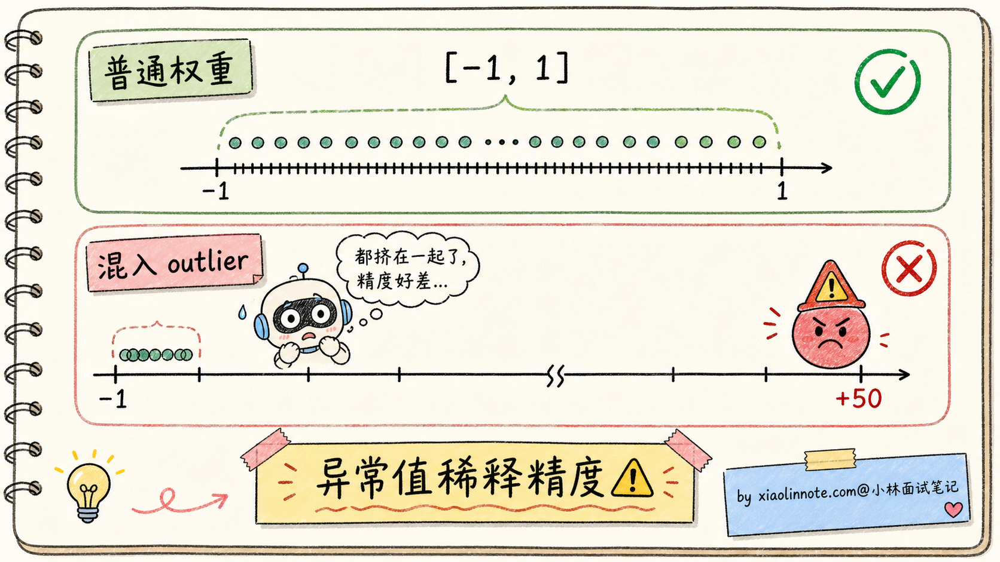

# 大模型量化：INT8/INT4/AWQ/GPTQ/QLoRA 怎么选

> 来源：<https://xiaolinnote.com/ai/llm/quantization.html>
> 一句话总结：量化是用更低比特表示模型参数以压缩显存和加速推理，INT4 是部署甜蜜点，AWQ 重速度、GPTQ 重精度、QLoRA NF4 重微调，三者不可混为一谈。

## 一、量化的本质：连续浮点 → 离散整数

### 1.1 为什么要量化

> 模型参数本质就是数字，FP16 训练完后，部署阶段可以「压扁」成 INT8/INT4。

```
7B 模型显存占用：
  FP16: 7×10⁹ × 2B  = 14 GB
  INT4: 7×10⁹ × 0.5B = 3.5 GB    ← 压到 1/4
70B 模型显存占用：
  FP16: 140 GB   （至少 4 张 A100 80G）
  INT4:  35 GB   （1 张 A100 80G 够用）
```

收益不止显存，**推理速度** 也提 2~4 倍（INT4 算力吞吐高 + 访存少），对 access-bound 的推理是双倍加速。



### 1.2 线性量化的核心公式

> 量化的基本套路：算出 `scale` 和 `zero_point`，把连续浮点压到离散整数。

```text
# 把 [-2.5, 2.5] 区间的 FP16 量化到 INT4（16 个离散值 -8..7）
scale      = (max - min) / (2^bits - 1) = 5 / 15 ≈ 0.333
zero_point = round(-min / scale)          = round(7.5)    = 8

量化:   int_val = round(fp_val / scale) + zero_point - 8
反量化: fp_val  ≈ (int_val - zero_point + 8) × scale

# 举例：fp_val = 0.7 → int = round(0.7/0.333) ≈ 2 → 还原 ≈ 0.666，损失 0.034
```

所有量化算法的差异都集中在三件事：**怎么算 scale/zero_point、怎么处理 outlier、怎么补偿误差**。



### 1.3 对称 vs 非对称量化

| 维度 | 对称量化 | 非对称量化 |
|------|----------|------------|
| 假设 | 数值对称分布 `min = -max` | 数值有偏（如 ReLU 后全正） |
| zero_point | 不需要 | 需要 |
| 公式复杂度 | 简单 | 稍复杂 |
| 适用对象 | 权重（通常对称分布） | 激活值（ReLU/GeLU 后偏分布） |



## 二、精度边界：INT8/INT4/INT3/INT2

### 2.1 各位数的精度损失（7B 模型）

| 量化位数 | 模型体积 | 平均精度损失 | 实用性 |
|----------|----------|--------------|--------|
| FP16 | 14 GB | 基线 | 训练用 |
| INT8 | 7 GB | < 0.5% | 几乎无损（接近免费午餐） |
| INT4 | 3.5 GB | 1~3% | 主流部署甜蜜点 |
| INT3 | 2.6 GB | 5~10% | 边缘设备 |
| INT2 | 1.75 GB | 20%+ | 一般不可用 |

**关键洞见**：损失曲线**不是线性**的，是「先平后陡」——INT8→INT4 损失增加小，INT4→INT3 突然飙升，INT2 基本废掉。



### 2.2 精度损失不是均匀的

> 同一份 INT4 模型，不同任务掉点差异巨大——这是 GPTQ/AWQ 出现的原因。

| 任务类型 | INT4 精度损失 |
|----------|---------------|
| 简单分类 / 抽取 | 几乎无损 |
| 通用对话 | 1~2% |
| 数学推理 | 5~10% |
| 长链路代码生成 | 10%+ |

## 三、三大主流算法对比

### 3.1 GPTQ：误差补偿的逐层量化

> 核心思路：**量化误差可以被「补偿」到后续权重里**。基于 Optimal Brain Surgeon 的二阶优化理论。

**流程**：
1. 准备校准数据（典型 128 条文本、几万 tokens）
2. 用 FP16 跑一遍，记录每层输入激活值
3. 从第一层开始，用 **Hessian 矩阵** 估算每个权重的重要性
4. 量化当前层 → 把误差反向修正到「未量化的后续权重」
5. 逐层重复



**优劣**：

| 优点 | 缺点 |
|------|------|
| 数学严谨（二阶优化） | 量化耗时长（7B 模型要几小时） |
| 支持极端低位 INT3/INT2 | 依赖校准数据 |
| 纯权重量化，Transformer 通用 | 激活值仍 FP16，速度提升不如 AWQ |

落地：**AutoGPTQ**、**Optimum**，早期最普及的方案。

### 3.2 AWQ：激活感知的权重保护

> 核心洞见：**约 1% 的权重承担了 99% 的输出贡献**（Salient Weights）。把这 1% 保护好，其他 99% 激进压到 INT4，效果几乎不掉。

**怎么找关键权重**：看激活值 X。`贡献 = W × X`，如果某位置 X 特别大（如 attention 中某些 token 比其他位置大 100 倍），对应的权重列就是「重要权重」。

**关键技术**：**逐通道缩放**——把重要通道的数值扩大（占据更宽整数范围、损失更小），不重要通道不动。这是数学等价变换，不改模型输出。



**优劣**：

| 优点 | 缺点 |
|------|------|
| 推理速度比 GPTQ **快 1.5~2 倍** | 极端低位（INT3）效果不如 GPTQ |
| INT4 精度损失比 GPTQ **略好 0.5~1%** | 需要校准数据 |
| 量化耗时短（7B 几十分钟，不用算 Hessian） | — |

### 3.3 QLoRA + NF4：消费级 GPU 微调

> GPTQ/AWQ 解决**部署**问题；QLoRA 解决**微调**问题——让 4-bit 量化的模型**还能继续学习**。

**NF4（NormalFloat 4-bit）**：**非均匀量化**。利用「模型权重近似均值为 0 的正态分布」这一事实，把 16 个量化值也按正态分布排布——0 附近密、远离 0 稀，量化误差更小。



**QLoRA 三个关键优化**：
1. **NF4 量化**：基座模型压到 4-bit
2. **双重量化（Double Quantization）**：连 scale 常数也再量化一次
3. **分页优化器（Paged Optimizer）**：用 NVIDIA 统一内存把优化器状态溢出到 CPU，避免显存峰值

**效果**：24 GB 的 4090 即可微调 7B 模型，48 GB 卡能上 13B~33B。



### 3.4 三大算法横向对比

| 维度 | GPTQ | AWQ | QLoRA + NF4 |
|------|------|-----|-------------|
| 提出方 | 2022 IST Austria | 2023 MIT | 2023 华盛顿大学 |
| 核心思想 | 误差补偿（二阶） | 激活感知（一阶） | 正态分布非均匀 + LoRA |
| 适用阶段 | 部署量化 | 部署量化 | **微调** |
| 量化耗时（7B） | 几小时 | 几十分钟 | 几十分钟 |
| 推理速度 | 中 | **快（+1.5~2x）** | — |
| INT4 精度 | 高 | **更高** | — |
| 极端低位 | **支持 INT3/INT2** | INT3 略差 | — |
| 代表实现 | AutoGPTQ、Optimum | AutoAWQ、vLLM | bitsandbytes、peft |
| 校准数据 | 必需 | 必需 | 必需 |

## 四、怎么选：场景 → 方案

| 场景 | 推荐方案 | 理由 |
|------|----------|------|
| 生产部署，看重推理速度 | AWQ / GPTQ / FP8 / 框架原生 INT4 | 看 vLLM / SGLang / TensorRT-LLM 当前 kernel 支持 |
| 生产部署，追求最高精度 | FP16 / GPTQ INT4 | 精度不妥协；显存紧再用 GPTQ |
| 个人微调，消费级 GPU | **QLoRA NF4** | 4090 就能微调 7B~13B |
| 边缘部署（手机/笔记本） | GGUF Q4_K_M / INT3 GPTQ | 极致压缩 |
| 批量推理，CPU 部署 | llama.cpp + GGUF | 无 GPU 也能跑 |

**避坑提示**：
- **AWQ vs GPTQ**：别死记，**先看目标框架和 GPU kernel 哪种支持最成熟**。跑得快不快取决于「量化格式 + 推理 kernel」是否匹配。
- **INT4 vs INT8**：显存够、质量高 → INT8/FP8/FP16；显存紧、吞吐敏感 → INT4。70B 模型 INT4 性价比最高。
- **GGUF 不是算法，是 llama.cpp 用的文件格式**（容器），里面可以存各种量化方案（Q4_K_M、Q5_K_M、Q8_0）。**算法（GPTQ/AWQ/NF4）vs 文件格式（GGUF/safetensors）是两层东西**，混为一谈就是没真正搞懂量化。

## 五、副作用与陷阱

### 5.1 Outlier（异常值）问题

权重里偶尔有「绝对值是其他权重几十倍」的值，会把量化范围拉得很宽，导致普通权重精度被严重稀释。

| 应对方案 | 机制 |
|----------|------|
| AWQ 逐通道缩放 | 把重要通道扩大、不重要不动，数学等价 |
| GPTQ Hessian | 识别 outlier 优先保护 |
| 极端情况 | 还是会出错，需要重选校准数据或换方案 |



### 5.2 KV Cache 量化（2024~2026 研究热点）

权重量化已成熟，但 **KV Cache 量化**（FP16 → INT8/INT4）才刚起步：
- 长上下文下 KV Cache 占用比权重还大
- 量化收益大，但**对长链路推理（数学/代码）精度损失敏感**

### 5.3 任务敏感度差异

不要轻信「INT4 损失 1~3%」的平均值——必须**在自己的业务集上评测**，尤其涉及数学推理、长代码、工具调用时。

## 六、复习清单

1. **量化的本质是什么？** 把 FP32/FP16 浮点参数映射到 INT8/INT4 整数，核心是 scale + zero_point 的线性映射。
2. **7B 模型 FP16 → INT4 显存变化？** 14 GB → 3.5 GB，压到 1/4。
3. **INT4 量化后推理速度提升多少？** 通常 2~4 倍，取决于硬件 INT4 计算单元。
4. **线性量化的 scale 怎么算？** `(max - min) / (2^bits - 1)`。
5. **对称 vs 非对称量化区别？** 对称假设 `min=-max` 不需要 zero_point，用于权重；非对称用 zero_point 对齐范围，用于激活值。
6. **GPTQ 核心思想？** 逐层量化 + 误差补偿，基于二阶 Hessian，支持极端低位 INT3/INT2。
7. **AWQ 核心洞见？** 1% 权重承担 99% 输出贡献（Salient Weights），用激活值大小定位，逐通道缩放保护，推理比 GPTQ 快 1.5~2 倍。
8. **NF4 为什么是非均匀量化？** 权重近似正态分布，所以 16 个量化值按正态分布排布，0 附近密、远处稀，误差更小。
9. **QLoRA 三大优化？** NF4 量化 + 双重量化（scale 再量化）+ 分页优化器（CPU 卸载）。
10. **24 GB 4090 能微调多大的模型？** 7B 标配，48 GB 卡能上 13B~33B。
11. **GGUF 是什么？** llama.cpp 用的**文件格式**（容器），不是算法，里面存的是 Q4_K_M/Q5_K_M/Q8_0 等量化权重。
12. **怎么选量化方案？** 部署看速度选 AWQ，看精度选 GPTQ；微调选 QLoRA NF4；边缘选 GGUF Q4_K_M 或 INT3 GPTQ。
