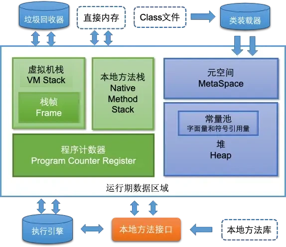
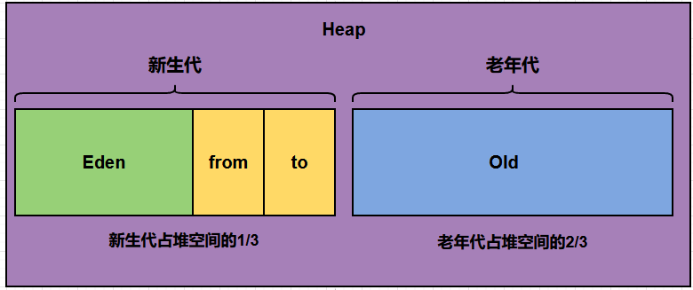

# JVM 面试题

> 来源：[小林coding - Java虚拟机面试题](https://xiaolincoding.com/interview/jvm.html)

## 一、内存模型

### 1.1 JVM 运行时内存结构

JDK 8 规范下，JVM 运行时内存共分为五大部分 + 直接内存：



| 区域                 | 线程归属 | 存储内容                                                    | 异常                     |
| -------------------- | -------- | ----------------------------------------------------------- | ------------------------ |
| **程序计数器**       | 线程私有 | 当前线程执行的字节码行号；Native 方法时为 undefined         | 唯一不会 OOM 的区域      |
| **虚拟机栈**         | 线程私有 | 栈帧（局部变量表、操作数栈、动态链接、方法出口）            | StackOverflowError / OOM |
| **本地方法栈**       | 线程私有 | 为 Native 方法服务（HotSpot 中与虚拟机栈合二为一）          | StackOverflowError / OOM |
| **堆**               | 线程共享 | 对象实例、数组；分为新生代（Eden + S0 + S1）和老年代        | OOM                      |
| **方法区（元空间）** | 线程共享 | 类信息、常量、静态变量、JIT 编译缓存；JDK8 起用本地内存实现 | OOM                      |
| **直接内存**         | —        | NIO 使用的堆外内存，不受堆大小限制                          | OOM                      |

### 1.2 堆 vs 栈

| 对比维度 | 栈                                  | 堆                             |
| -------- | ----------------------------------- | ------------------------------ |
| 用途     | 局部变量、方法参数、返回地址        | 对象实例、数组                 |
| 生命周期 | 随方法调用创建/销毁，确定性强       | 由 GC 决定，不确定             |
| 存取速度 | 快（LIFO 操作简单）                 | 相对较慢（分配/回收开销大）    |
| 空间     | 较小（`-Xss` 配置），递归过深易溢出 | 较大，动态扩展，对象过多易溢出 |
| 可见性   | 线程私有                            | 线程共享                       |

### 1.3 栈中存的是指针还是对象？

栈中存储的是**对象引用（指针）**，而非对象本身。基本类型直接存值，对象类型存的是指向堆中实例的引用（64 位系统上 8 字节）。

### 1.4 堆的分代结构



```
堆
├── 新生代（Young Generation）
│   ├── Eden 区（默认占新生代 80%）
│   ├── Survivor 0 / From（默认 10%）
│   └── Survivor 1 / To（默认 10%）
└── 老年代（Old Generation）
```

- **新生代**：新对象先分配在 Eden；Eden 满时触发 Minor GC，存活对象复制到 Survivor，年龄达标则晋升老年代
- **老年代**：存放长期存活对象，Major GC/Full GC 频率低但耗时长
- **元空间**（JDK8+）：取代永久代，用本地内存存储类元数据，不再受堆大小限制
- **大对象**（G1 中的 Humongous Object）：超过 Region 一半大小的对象直接分配到老年代

### 1.5 大对象分配在哪个区域？

大对象直接分配到**老年代**。原因：

- 避免新生代空间不足频繁触发 Minor GC
- 避免大对象在 Eden/Survivor 间反复复制的开销
- 老年代空间更大，减少内存碎片

### 1.6 程序计数器为什么是私有的？

多线程环境下，CPU 通过时间片轮转调度线程。线程切换后恢复执行时，需要知道下一条指令的位置，因此每个线程需要独立的程序计数器来记录各自的执行进度。

### 1.7 方法区中方法的执行过程

1. **解析方法调用**：根据符号引用找到方法地址
2. **栈帧创建**：在虚拟机栈中分配栈帧（局部变量表、操作数栈、动态链接、方法出口）
3. **执行方法**：执行字节码指令
4. **返回处理**：返回结果，清理栈帧，恢复调用者执行环境

### 1.8 方法区中存储的内容

- **类信息**：类结构、访问修饰符、父类与接口
- **方法字节码**：编译后的字节码指令
- **静态变量**：类初始化阶段（`<clinit>`）赋值
- **运行时常量池**：字面量 + 符号引用，具备动态性（如 `String.intern()`）
- **符号引用与直接引用**：解析阶段将符号引用替换为直接引用
- **JIT 编译缓存**：热点方法的本地机器码（CodeCache）

### 1.9 String 保存在哪里？

- 字符串常量池：JDK 6 及之前在**方法区（永久代）**，JDK 7 起移到**堆**中
- 字符串对象本身是不可变的，可被多个引用共享

### 1.10 `String s = new String("abc")` 涉及的内存区域

1. 字面量 `"abc"` → 字符串常量池（堆中），如果不存在则先创建
2. `new String("abc")` → 在堆中额外创建一个新 String 实例
3. `s` → 栈中存储引用，指向堆中的新实例

**结论**：常量池已有 "abc" 则创建 **1 个对象**（堆实例），否则创建 **2 个对象**（常量池 + 堆实例）。

---

## 二、引用类型

### 2.1 四种引用类型

| 类型       | 类                 | GC 行为                              | 典型用途           |
| ---------- | ------------------ | ------------------------------------ | ------------------ |
| **强引用** | `A a = new A()`    | 只要引用存在就不回收                 | 日常编码           |
| **软引用** | `SoftReference`    | OOM 前回收                           | 缓存               |
| **弱引用** | `WeakReference`    | 下一次 GC 必回收                     | 缓存、避免内存泄漏 |
| **虚引用** | `PhantomReference` | GC 时回收，必须配合 `ReferenceQueue` | 管理堆外内存       |

强度排序：强 > 软 > 弱 > 虚

### 2.2 弱引用使用场景

- **缓存系统**：内存压力大时自动释放缓存项（如 `WeakHashMap`）
- **对象池**：管理暂不使用的对象，无强引用时可被 GC
- **避免内存泄漏**：防止对象被意外长期保留

---

## 三、内存溢出与内存泄漏

### 3.1 内存泄漏 vs 内存溢出

- **内存泄漏（Leak）**：对象不再使用但无法被 GC 回收（如集合中遗忘 remove、未关闭资源）
- **内存溢出（OOM）**：没有足够内存分配新对象，是内存泄漏累积的结果

### 3.2 JVM 各区域内存溢出情况

| 区域          | 异常类型                                 | 触发原因                 |
| ------------- | ---------------------------------------- | ------------------------ |
| 堆            | `OutOfMemoryError: Java heap space`      | 对象过多/过大            |
| 栈            | `StackOverflowError`                     | 递归过深/栈帧过大        |
| 栈            | `OutOfMemoryError`                       | 无法分配新栈（线程过多） |
| 方法区/元空间 | `OutOfMemoryError: Metaspace`            | 加载类过多               |
| 直接内存      | `OutOfMemoryError: Direct buffer memory` | NIO 堆外内存分配过多     |

### 3.3 堆溢出排查思路

1. 通过 `-XX:+HeapDumpOnOutOfMemoryError` 导出堆转储
2. 使用 MAT/jvisualvm 分析大对象和引用链
3. 定位泄漏对象，修复代码或调整内存参数

### 3.4 栈溢出常见原因

- 递归调用无终止条件（最常见）
- 栈帧中局部变量过大

---

## 四、类加载机制

### 4.1 创建对象的过程

1. **类加载检查**：检查类是否已被加载
2. **分配内存**：在堆中为对象分配内存（指针碰撞 / 空闲列表）
3. **初始化零值**：将分配的内存初始化为零值
4. **设置对象头**：设置对象的哈希码、GC 分代年龄等信息
5. **执行 `<init>` 方法**：执行构造方法

### 4.2 对象的生命周期

创建 → 使用 → 不可达 → GC 回收

### 4.3 类加载器

| 类加载器                    | 加载范围                                       |
| --------------------------- | ---------------------------------------------- |
| **Bootstrap ClassLoader**   | `JAVA_HOME/lib` 下的核心类库                   |
| **Extension ClassLoader**   | `JAVA_HOME/lib/ext` 下的扩展类库               |
| **Application ClassLoader** | 用户类路径（classpath）上的类                  |
| **自定义 ClassLoader**      | 继承 `java.lang.ClassLoader`，加载特殊路径的类 |

### 4.4 双亲委派模型

**加载流程**：子加载器 → 委托父加载器 → 父加载器无法加载 → 子加载器自己加载

```
自定义 ClassLoader
  ↓ 委托
Application ClassLoader
  ↓ 委托
Extension ClassLoader
  ↓ 委托
Bootstrap ClassLoader（尝试加载）
```

**双亲委派的作用**：

- **安全性**：防止核心类被篡改（如自定义 `java.lang.String` 不会被加载）
- **避免重复加载**：父加载器已加载的类，子加载器无需再加载

### 4.5 类加载过程

```
加载 → 验证 → 准备 → 解析 → 初始化
  └───── 连接 ──────┘
```

| 阶段       | 说明                                                              |
| ---------- | ----------------------------------------------------------------- |
| **加载**   | 通过类的全限定名获取二进制字节流，生成 Class 对象                 |
| **验证**   | 验证字节码格式、元数据、符号引用的正确性                          |
| **准备**   | 为静态变量分配内存并赋零值（`static final` 常量在此阶段赋实际值） |
| **解析**   | 将符号引用替换为直接引用                                          |
| **初始化** | 执行 `<clinit>` 方法，即静态变量赋值和静态代码块                  |

---

## 五、垃圾回收

### 5.1 什么是垃圾回收？如何触发？

GC 是 JVM 自动回收不再被引用的对象所占内存的机制。触发方式：

- **Minor GC**：Eden 区空间不足时自动触发
- **Full GC**：老年代空间不足、元空间不足、调用 `System.gc()`（仅建议）、CMS 的 Concurrent Mode Failure

### 5.2 判断垃圾的方法

| 方法           | 原理                                   | 优缺点                 |
| -------------- | -------------------------------------- | ---------------------- |
| **引用计数法** | 对象被引用时计数+1，为0则可回收        | 简单但无法解决循环引用 |
| **可达性分析** | 从 GC Roots 出发，不可达的对象即为垃圾 | JVM 实际采用的方法     |

**GC Roots 包括**：栈帧中的局部变量引用、静态变量引用、常量引用、本地方法栈中的 JNI 引用、同步锁持有的对象

### 5.3 垃圾回收算法

| 算法          | 原理                       | 优点           | 缺点                       |
| ------------- | -------------------------- | -------------- | -------------------------- |
| **标记-清除** | 标记存活对象，清除未标记的 | 简单           | 内存碎片、效率不高         |
| **标记-复制** | 将存活对象复制到另一半空间 | 无碎片、效率高 | 空间利用率低（需预留一半） |
| **标记-整理** | 标记后将存活对象向一端移动 | 无碎片         | 移动对象开销大             |

> 新生代用**标记-复制**（Eden + S0/S1），老年代用**标记-清除**或**标记-整理**。

### 5.4 垃圾回收器

| 回收器                | 作用区域     | 算法             | 特点                        |
| --------------------- | ------------ | ---------------- | --------------------------- |
| **Serial**            | 新生代       | 标记-复制        | 单线程，STW，适合客户端     |
| **Serial Old**        | 老年代       | 标记-整理        | 单线程，STW                 |
| **ParNew**            | 新生代       | 标记-复制        | Serial 多线程版，常配合 CMS |
| **Parallel Scavenge** | 新生代       | 标记-复制        | 吞吐量优先                  |
| **Parallel Old**      | 老年代       | 标记-整理        | 吞吐量优先                  |
| **CMS**               | 老年代       | 标记-清除        | 低停顿，但有碎片问题        |
| **G1**                | 整堆（分区） | 标记-整理 + 复制 | 可预测停顿，Region 化管理   |

### 5.5 Minor GC / Major GC / Full GC

| 类型         | 回收区域      | 触发条件                                       | 停顿时间 |
| ------------ | ------------- | ---------------------------------------------- | -------- |
| **Minor GC** | 新生代        | Eden 区满                                      | 短       |
| **Major GC** | 老年代        | 老年代满                                       | 较长     |
| **Full GC**  | 整堆 + 元空间 | 老年代/元空间不足、CMS Concurrent Mode Failure | 最长     |

**Full GC 触发场景**：

- 老年代空间不足
- 元空间/永久代空间不足
- 显式调用 `System.gc()`
- CMS 的 Concurrent Mode Failure
- 晋升到老年代的对象大小 > 老年代剩余空间

### 5.6 CMS vs G1

| 对比维度 | CMS            | G1                                     |
| -------- | -------------- | -------------------------------------- |
| 算法     | 标记-清除      | 标记-整理 + 复制                       |
| 内存布局 | 传统分代       | Region 化（不再物理隔离新生代/老年代） |
| 碎片问题 | 有碎片         | 无碎片（Region 内整理）                |
| 停顿时间 | 较低但不可控   | 可预测（`-XX:MaxGCPauseMillis`）       |
| 适用场景 | 中等堆、低延迟 | 大堆（6GB+）、可预测停顿               |

### 5.7 G1 回收器特色

- **Region 化内存布局**：堆划分为大小相等的 Region，每个 Region 可以是 Eden/Survivor/Old/Humongous
- **可预测停顿**：用户设定最大停顿时间目标，G1 优先回收收益最大的 Region
- **无碎片**：采用标记-整理算法，避免内存碎片
- **大对象处理**：超过 Region 一半的对象作为 Humongous Object 直接分配在连续 Region 中

### 5.8 GC 只对堆进行 GC 吗？

不是。虽然 GC 主要针对堆，但方法区/元空间也会被回收（卸载无用的类），只是条件更严格：

- 该类所有实例已被回收
- 加载该类的 ClassLoader 已被回收
- 对应的 Class 对象没有在任何地方被引用
