# Java 并发编程面试题

> 来源：[小林coding - Java并发编程面试题](https://xiaolincoding.com/interview/juc.html)
> 一句话总结：Java 并发的核心主线是 JMM → synchronized/锁升级 → volatile/CAS → AQS → 线程池，搞清这条线就能覆盖面试 80% 的高频问题。

## 一、内存模型与线程基础

### 1.1 JMM（Java 内存模型）

JMM 是解决多线程并发问题的一套规则，核心处理**可见性、原子性、有序性**三个问题。

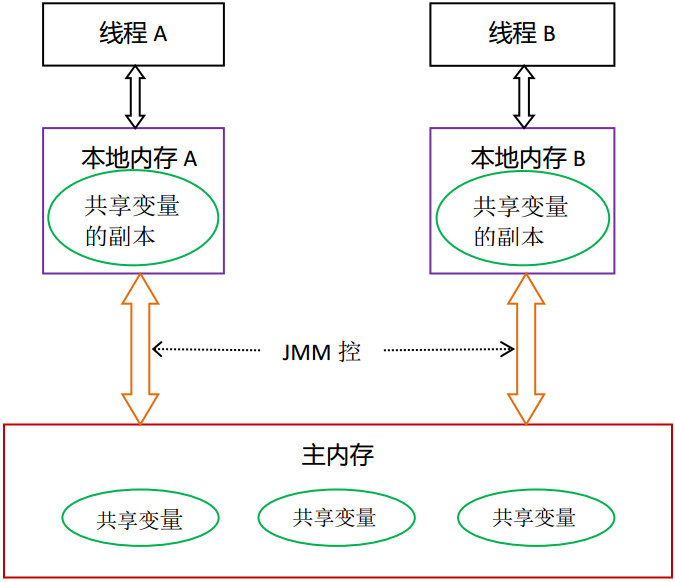

| 特性   | 问题本质                 | 解决手段                               |
| ------ | ------------------------ | -------------------------------------- |
| 可见性 | CPU 缓存导致线程读旧值   | `volatile` 刷主存 + 缓存失效           |
| 原子性 | 复合操作（如 i++）被中断 | `synchronized` / `Lock` 互斥           |
| 有序性 | 编译器/CPU 指令重排      | `volatile` 内存屏障 / `happens-before` |

> JMM 核心思路：定义主内存 + 工作内存，规定变量必须从主内存加载到工作内存才能操作，改完写回主内存。

### 1.2 线程模型：平台线程 vs 虚拟线程

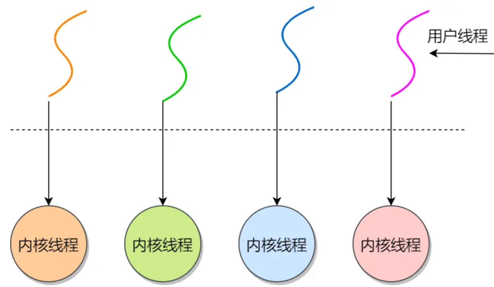

| 维度     | 平台线程（Platform Thread）          | 虚拟线程（Virtual Thread，Java 21） |
| -------- | ------------------------------------ | ----------------------------------- |
| 映射模型 | 1:1（1 个 Java 线程 = 1 个 OS 线程） | M:N（多虚拟线程映射少量载体线程）   |
| 栈空间   | 默认 ~1MB                            | 几百字节起步，动态扩缩              |
| 调度方   | OS 内核                              | JVM ForkJoinPool（用户态）          |
| 创建上限 | 几千个                               | 百万级                              |
| 适用场景 | 通用                                 | IO 密集型高并发                     |

### 1.3 线程状态

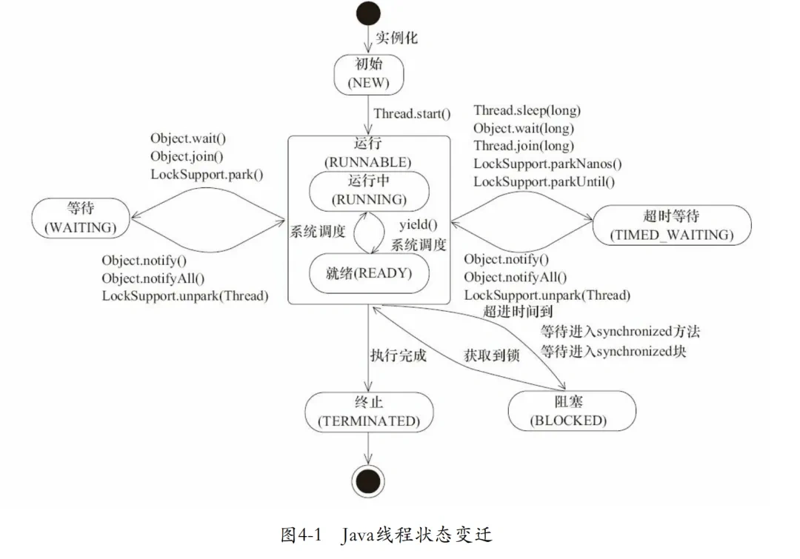

| 状态          | 说明                               |
| ------------- | ---------------------------------- |
| NEW           | 未调用 start()                     |
| RUNNABLE      | 就绪 + 运行中                      |
| BLOCKED       | 等待监视器锁                       |
| WAITING       | 等待其他线程操作（wait/join/park） |
| TIMED_WAITING | 带超时的等待                       |
| TERMINATED    | 执行完毕                           |

### 1.4 BLOCKED vs WAITING

| 维度       | BLOCKED            | WAITING                 |
| ---------- | ------------------ | ----------------------- |
| 触发原因   | 锁竞争失败（被动） | 主动调用 wait/join/park |
| 唤醒机制   | 锁释放后自动触发   | 需显式 notify/signal    |
| CPU 消耗   | 不消耗             | 不消耗                  |
| 参与锁竞争 | 是（等锁）         | 否                      |

### 1.5 sleep vs wait

| 特性     | `sleep()`            | `wait()`             |
| -------- | -------------------- | -------------------- |
| 所属类   | `Thread`（静态方法） | `Object`（实例方法） |
| 释放锁   | ❌                   | ✅                   |
| 使用前提 | 任意位置             | 必须在同步块内       |
| 唤醒机制 | 超时自动恢复         | 需 notify/notifyAll  |
| 设计用途 | 暂停线程             | 线程间协调           |

> `sleep()` 会释放 CPU 但不释放锁；`wait()` 既释放 CPU 也释放锁。

### 1.6 线程创建方式

| 方式                       | 优点                             | 缺点                       |
| -------------------------- | -------------------------------- | -------------------------- |
| 继承 Thread                | 编写简单，this 即当前线程        | 无法再继承其他类           |
| 实现 Runnable              | 可继承其他类，多线程共享目标对象 | 需 Thread.currentThread()  |
| 实现 Callable + FutureTask | 有返回值，可抛异常               | 编码稍复杂                 |
| 线程池（Executor）         | 复用线程，控制并发数，性能优     | 配置复杂，错误配置可能死锁 |

### 1.7 线程停止方式

| 方法               | 说明                                        | 注意                             |
| ------------------ | ------------------------------------------- | -------------------------------- |
| 标志位（volatile） | 循环检测 running 标志                       | 确保标志可见性                   |
| interrupt()        | 设置中断标志，阻塞中抛 InterruptedException | 阻塞时中断会清除标志，需重新设置 |
| Future.cancel()    | 线程池任务取消                              | 依赖中断机制                     |
| 资源关闭           | 关闭 Socket 等解除不可中断阻塞              | 结合中断状态判断                 |
| ~~stop()~~         | 暴力停止                                    | 已废弃，可能导致状态不一致       |

## 二、锁机制与同步

### 2.1 synchronized 原理

基于 JVM 监视器（Monitor）实现，编译后在同步块前后加 `monitorenter` / `monitorexit` 字节码指令。Monitor 内部维护 entryList（竞争队列）和 waitSet（等待队列）。

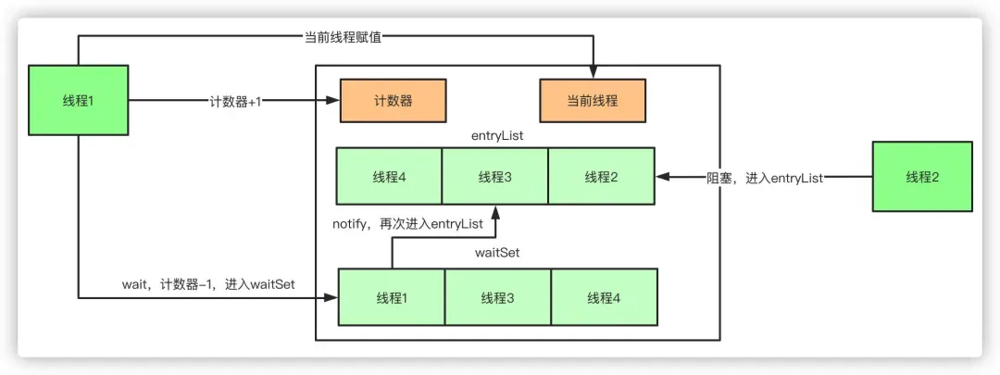

- 加锁：清除工作内存 → 从主内存读取
- 释放锁：工作内存写回主内存

### 2.2 synchronized 锁升级

JDK 1.6 引入，升级路径：**无锁 → 偏向锁 → 轻量级锁 → 重量级锁**，只能升级不能降级。


| 阶段     | 锁标志         | 适用场景       | 核心机制                      |
| -------- | -------------- | -------------- | ----------------------------- |
| 无锁     | 01（偏向位 0） | 无竞争         | 存 HashCode、分代年龄         |
| 偏向锁   | 01（偏向位 1） | 单线程反复进入 | Mark Word 记录线程 ID，零开销 |
| 轻量级锁 | 00             | 短时间轻度竞争 | CAS + 自旋（自适应）          |
| 重量级锁 | 10             | 长时间激烈竞争 | OS Mutex，线程阻塞/唤醒       |

> 偏向锁 JDK 15 起默认禁用（JEP 374），实际路径已简化为 **无锁 → 轻量级锁 → 重量级锁**。

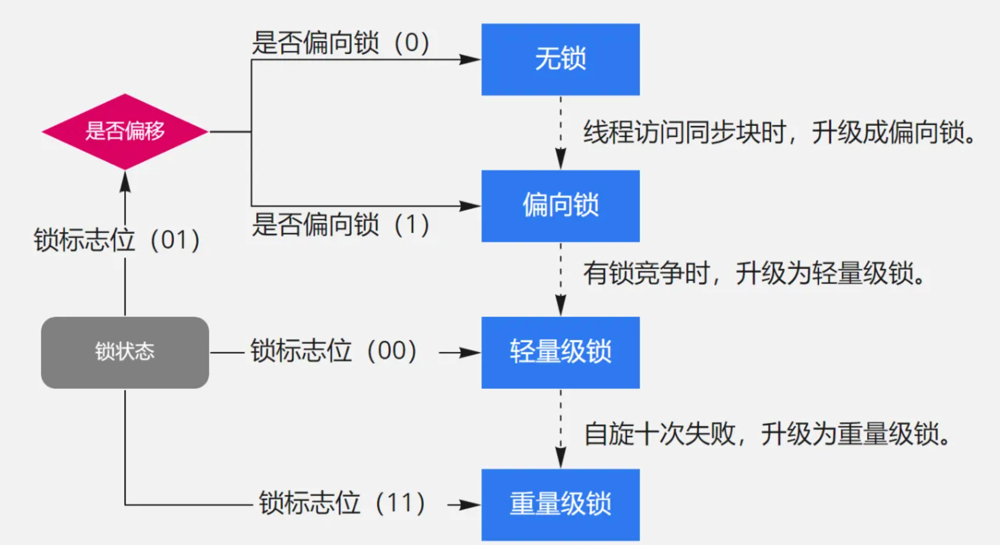

### 2.3 JVM 对 synchronized 的优化

| 优化       | 说明                                         |
| ---------- | -------------------------------------------- |
| 锁升级     | 根据竞争程度逐步升级，避免无竞争时重量级开销 |
| 锁消除     | JIT 逃逸分析发现无竞争，消除同步             |
| 锁粗化     | 循环内反复加锁 → 粗化到循环外一次加锁        |
| 自适应自旋 | 根据上次自旋结果动态调整自旋次数             |

### 2.4 synchronized vs ReentrantLock

| 维度      | synchronized        | ReentrantLock          |
| --------- | ------------------- | ---------------------- |
| 实现      | JVM 层（Monitor）   | API 层（AQS）          |
| 加锁/解锁 | 自动                | 手动 lock()/unlock()   |
| 锁类型    | 非公平锁            | 公平锁 / 非公平锁      |
| 响应中断  | ❌                  | ✅ lockInterruptibly() |
| 超时获取  | ❌                  | ✅ tryLock(timeout)    |
| 条件变量  | 单个（wait/notify） | 多个（Condition）      |
| 可重入    | ✅                  | ✅（state 计数器）     |

> 可重入锁：同一线程可多次获取同一把锁，计数器 +1；释放时 -1，减到 0 才真正释放。

### 2.5 公平锁 vs 非公平锁

| 维度     | 公平锁                         | 非公平锁                    |
| -------- | ------------------------------ | --------------------------- |
| 获取顺序 | 按等待队列 FIFO                | 直接 CAS 抢锁，抢不到再排队 |
| 吞吐量   | 低（线程切换开销大）           | 高（减少线程挂起/恢复）     |
| 饥饿问题 | 无                             | 可能                        |
| 源码区别 | `hasQueuedPredecessors()` 判断 | 无此判断                    |

> synchronized 是非公平锁；ReentrantLock 默认非公平，传 `true` 为公平锁。`tryLock()` 始终非公平。

### 2.6 synchronized 锁静态方法 vs 普通方法

| 维度     | 普通方法                     | 静态方法        |
| -------- | ---------------------------- | --------------- |
| 锁对象   | 当前实例（this）             | 类的 Class 对象 |
| 作用范围 | 同一实例互斥，不同实例不互斥 | 所有实例互斥    |

## 三、volatile 与 CAS

### 3.1 volatile 的作用

1. **保证可见性**：写操作立即刷主存，读操作直接从主存读
2. **禁止指令重排序**：通过内存屏障实现

内存屏障插入策略：

| 操作          | 屏障                 | 作用                               |
| ------------- | -------------------- | ---------------------------------- |
| volatile 写前 | StoreStore           | 防止前面普通写重排到 volatile 写后 |
| volatile 写后 | StoreLoad            | 防止 volatile 写与后面读/写重排    |
| volatile 读后 | LoadLoad + LoadStore | 防止 volatile 读与后面读写重排     |

### 3.2 volatile vs synchronized

| 维度     | volatile         | synchronized     |
| -------- | ---------------- | ---------------- |
| 可见性   | ✅               | ✅               |
| 原子性   | ❌（i++ 不安全） | ✅               |
| 有序性   | ✅（禁止重排）   | ✅               |
| 阻塞     | 不会             | 会               |
| 适用场景 | 状态标志位       | 复合操作、临界区 |

### 3.3 CAS（Compare-And-Swap）

CAS 包含三个操作数：内存位置 V、预期值 A、新值 B。只有 V == A 时才更新为 B，否则重试。由硬件指令（cmpxchg）保证原子性。

**CAS 的缺点：**

| 缺点       | 说明                     | 解决                             |
| ---------- | ------------------------ | -------------------------------- |
| ABA 问题   | 值 A→B→A，CAS 无法感知   | AtomicStampedReference（版本号） |
| 自旋开销   | 长时间不成功占用 CPU     | 自适应自旋 / 改用锁              |
| 单变量限制 | 只能保证一个变量原子操作 | AtomicReference / 加锁           |

### 3.4 悲观锁 vs 乐观锁

| 维度 | 悲观锁                      | 乐观锁                 |
| ---- | --------------------------- | ---------------------- |
| 思路 | 假设一定冲突，先加锁        | 假设不冲突，提交时检查 |
| 实现 | synchronized、ReentrantLock | CAS、版本号、时间戳    |
| 适用 | 写多                        | 读多                   |

## 四、AQS 框架

### 4.1 AQS 核心原理

AQS（AbstractQueuedSynchronizer）是构建锁和同步器的框架，核心三要素：

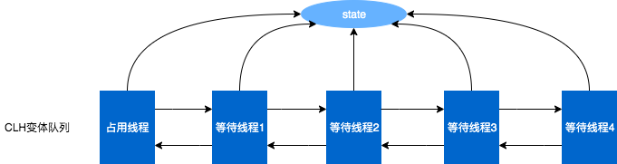

1. **state**：volatile int，表示同步状态（锁占有/许可证数/倒计数）
2. **FIFO 双向队列**：存放等待线程（CLH 变体）
3. **模板方法**：子类重写 tryAcquire/tryRelease 等

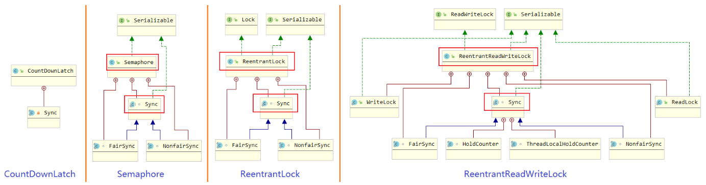

| 工具类         | state 含义 | 获取方法  | 释放方法    |
| -------------- | ---------- | --------- | ----------- |
| ReentrantLock  | 锁占有次数 | lock()    | unlock()    |
| Semaphore      | 剩余许可证 | acquire() | release()   |
| CountDownLatch | 倒计数     | await()   | countDown() |

### 4.2 CAS 与 AQS 的关系

CAS 为 AQS 提供原子操作支持：AQS 内部使用 CAS 更新 state 变量，保证线程安全的状态修改。

### 4.3 用 AQS 实现可重入公平锁

核心逻辑：

- `tryAcquire`：state == 0 时，先 `hasQueuedPredecessors()` 检查队列是否有前驱（公平性），无前驱则 CAS 获取；state != 0 时检查是否当前线程持有（可重入），是则 state + 1
- `tryRelease`：state - 1，减到 0 时释放锁

## 五、ThreadLocal

### 5.1 原理

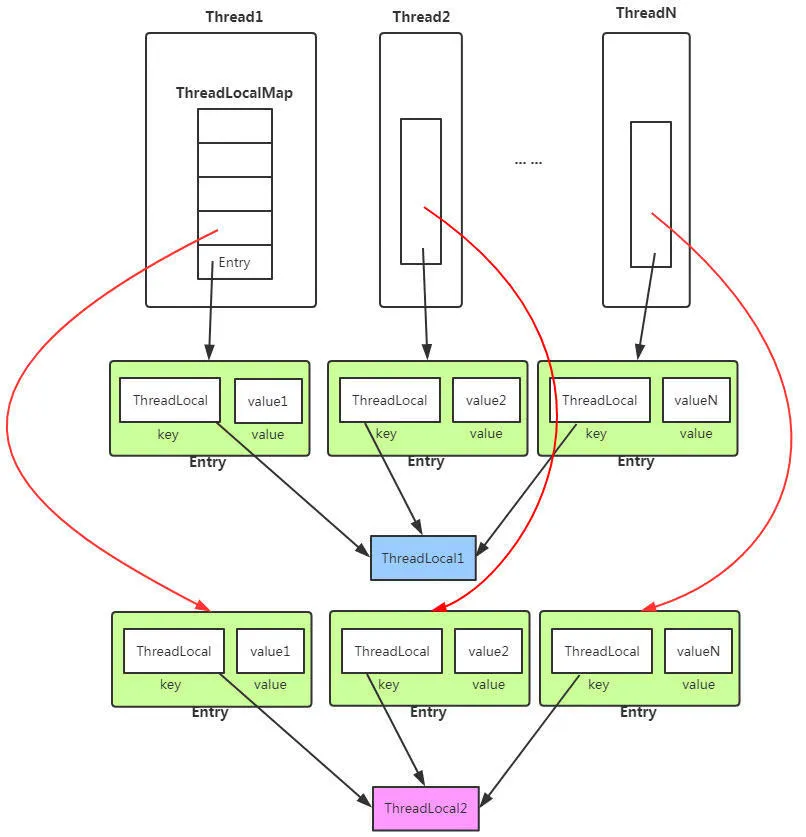

- Thread 类持有 `ThreadLocal.ThreadLocalMap` 成员
- ThreadLocalMap 的 Entry 继承 `WeakReference<ThreadLocal<?>>`（**弱 key + 强 value**）
- Key = ThreadLocal 对象（弱引用），Value = 线程局部变量值（强引用）

### 5.2 内存泄漏问题

| 步骤 | 说明                                                    |
| ---- | ------------------------------------------------------- |
| 根因 | Key 被 GC 回收 → Entry.key = null，但 value 仍被强引用  |
| 触发 | 线程池复用线程，不再调用该 ThreadLocal                  |
| 清理 | set/get/remove 时触发 expungeStaleEntries，但不保证及时 |
| 解决 | **使用完毕后必须调用 remove()**                         |

## 六、线程池

### 6.1 工作原理

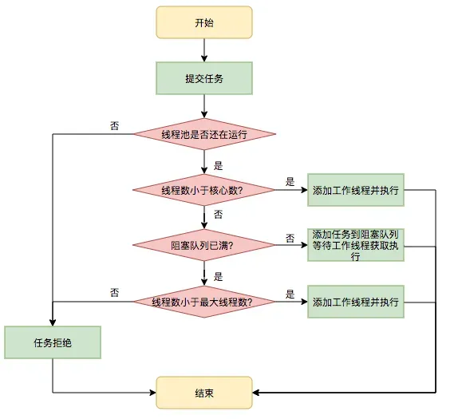

```
提交任务 → 核心线程未满？→ 创建核心线程执行
                ↓ 已满
          队列未满？→ 入队等待
                ↓ 已满
          线程数 < maximumPoolSize？→ 创建非核心线程
                ↓ 已达最大
          执行拒绝策略
```

### 6.2 七大参数

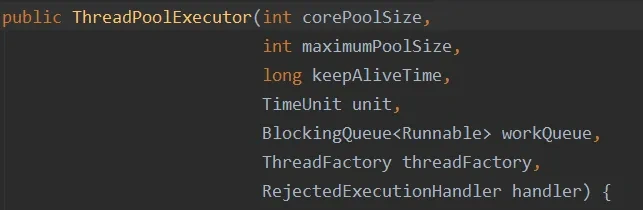

| 参数            | 说明                        |
| --------------- | --------------------------- |
| corePoolSize    | 核心线程数，空闲不销毁      |
| maximumPoolSize | 最大线程数（核心 + 非核心） |
| keepAliveTime   | 非核心线程空闲存活时间      |
| unit            | 存活时间单位                |
| workQueue       | 任务阻塞队列                |
| threadFactory   | 线程工厂（命名、优先级）    |
| handler         | 拒绝策略                    |

### 6.3 四种拒绝策略

| 策略                | 行为                          | 适用场景       |
| ------------------- | ----------------------------- | -------------- |
| AbortPolicy         | 抛 RejectedExecutionException | 默认，关键业务 |
| CallerRunsPolicy    | 调用者线程执行任务            | 缓解压力       |
| DiscardPolicy       | 静默丢弃                      | 可容忍丢失     |
| DiscardOldestPolicy | 丢弃最老任务再提交            | 实时性优先     |

### 6.4 四种线程池

| 类型                 | 核心/最大线程       | 队列                     | 风险         |
| -------------------- | ------------------- | ------------------------ | ------------ |
| FixedThreadPool      | n/n                 | 无界 LinkedBlockingQueue | 队列堆积 OOM |
| CachedThreadPool     | 0/Integer.MAX_VALUE | SynchronousQueue         | 线程爆炸 OOM |
| SingleThreadExecutor | 1/1                 | 无界 LinkedBlockingQueue | 队列堆积 OOM |
| ScheduledThreadPool  | n/Integer.MAX_VALUE | DelayedWorkQueue         | 线程爆炸 OOM |

> 阿里手册：**禁止用 Executors 创建线程池**，应手动 new ThreadPoolExecutor 并设置有界队列和可控线程数。

### 6.5 核心线程数配置经验

| 任务类型   | 核心线程数   | 说明                   |
| ---------- | ------------ | ---------------------- |
| CPU 密集型 | CPU 核数 + 1 | 避免线程切换开销       |
| IO 密集型  | CPU 核数 × 2 | 线程等待 IO 时让出 CPU |

### 6.6 shutdown vs shutdownNow

| 维度       | shutdown() | shutdownNow()            |
| ---------- | ---------- | ------------------------ |
| 状态       | SHUTDOWN   | STOP                     |
| 队列任务   | 继续执行完 | 不再执行，返回未执行任务 |
| 运行中任务 | 等待完成   | 尝试 interrupt 中断      |

## 七、并发工具类

| 工具           | 作用                 | 核心方法              |
| -------------- | -------------------- | --------------------- |
| CountDownLatch | 等待 N 个线程完成    | await() / countDown() |
| CyclicBarrier  | N 个线程互相等待到齐 | await()（可重用）     |
| Semaphore      | 控制并发访问数       | acquire() / release() |

| 对比     | CountDownLatch       | CyclicBarrier  |
| -------- | -------------------- | -------------- |
| 侧重点   | 一个线程等待其他线程 | 线程间相互等待 |
| 可复用   | ❌                   | ✅（自动重置） |
| 计数方式 | 递减                 | 递增到阈值     |

## 八、死锁

### 8.1 四个必要条件

| 条件       | 说明                           |
| ---------- | ------------------------------ |
| 互斥       | 资源同一时刻只能被一个线程使用 |
| 持有并等待 | 持有资源同时等待其他资源       |
| 不可剥夺   | 已持有资源不能被强行抢占       |
| 环路等待   | 线程间形成环形资源依赖链       |

### 8.2 避免死锁

最常见方法：**资源有序分配法**——所有线程按相同顺序申请资源，破坏环路等待条件。

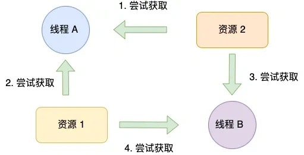

## 九、Go 协程 vs Java 线程

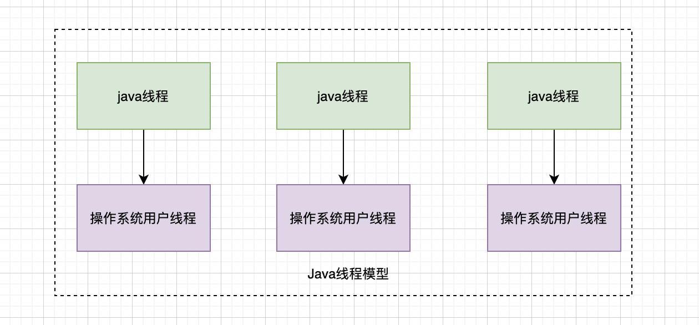 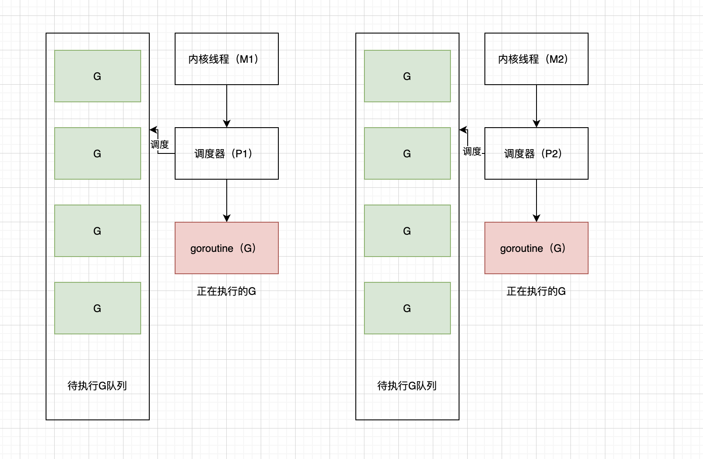

| 维度     | Go 协程（Goroutine） | Java 平台线程       | Java 虚拟线程（21+）          |
| -------- | -------------------- | ------------------- | ----------------------------- |
| 调度模型 | GMP（用户态 M:N）    | 1:1（内核态）       | M:N（ForkJoinPool）           |
| 初始栈   | 2KB，动态伸缩        | ~1MB 固定           | 几百字节，动态伸缩            |
| 创建方式 | `go func()`          | new Thread / 线程池 | `Thread.startVirtualThread()` |
| 通信方式 | Channel（推荐）      | 共享内存 + 锁       | 共享内存 + 锁                 |
| 调度方式 | 协作式               | 抢占式              | 协作式（IO 自动让出）         |

## 十、场景题

### 10.1 双重检查锁定（DCL）为什么需要 volatile？

```java
private static volatile Singleton instance;
public static Singleton getInstance() {
    if (instance == null) {              // 第一次检查
        synchronized (Singleton.class) {
            if (instance == null) {      // 第二次检查
                instance = new Singleton(); // volatile 防止重排
            }
        }
    }
    return instance;
}
```

`instance = new Singleton()` 分三步：① 分配内存 → ② 初始化对象 → ③ 赋值引用。无 volatile 时 ②③ 可能重排，其他线程拿到未初始化的对象。

### 10.2 两线程并发 i++ 各 50 次

无同步时结果 **1~100 均可能**（理论最低 2），因为 i++ 非原子操作。解决：`AtomicInteger` 或 `synchronized`。

### 10.3 3 线程并发 + 1 线程等待

用 `CountDownLatch(3)`，3 个线程完成后 `countDown()`，等待线程 `await()`。

## 复习清单

1. **JMM 解决哪三大问题？** 可见性、原子性、有序性。
2. **volatile 能保证线程安全吗？** 不能，只保证可见性和有序性，不保证原子性。
3. **synchronized 锁升级路径？** 无锁→偏向锁→轻量级锁→重量级锁（单向，JDK15+ 偏向锁已默认禁用）。
4. **synchronized 和 ReentrantLock 核心区别？** 自动 vs 手动解锁、非公平 vs 可公平、不可中断 vs 可中断、单条件 vs 多条件。
5. **AQS 三要素？** volatile state + FIFO 双向队列 + 模板方法（tryAcquire/tryRelease）。
6. **ThreadLocal 内存泄漏原因？** 弱 key 被 GC 后 value 仍被强引用；解决：用完必须 remove()。
7. **CAS 的 ABA 问题？** 值 A→B→A 无法感知；用 AtomicStampedReference 加版本号解决。
8. **线程池提交任务执行流程？** 核心线程→队列→非核心线程→拒绝策略。
9. **为什么不推荐 Executors 创建线程池？** Fixed/Single 用无界队列可能 OOM，Cached 线程数无上限可能 OOM。
10. **死锁四个必要条件？** 互斥、持有并等待、不可剥夺、环路等待；破坏环路等待最常用（资源有序分配）。
11. **Go 协程 vs Java 线程核心区别？** Go 是用户态 M:N 调度 + 2KB 轻量 + Channel 通信；Java 平台线程 1:1 内核调度 + 1MB 栈；Java 21 虚拟线程已接近协程模型。
12. **DCL 单例为什么加 volatile？** 防止 new Singleton() 的指令重排导致其他线程拿到未初始化对象。
