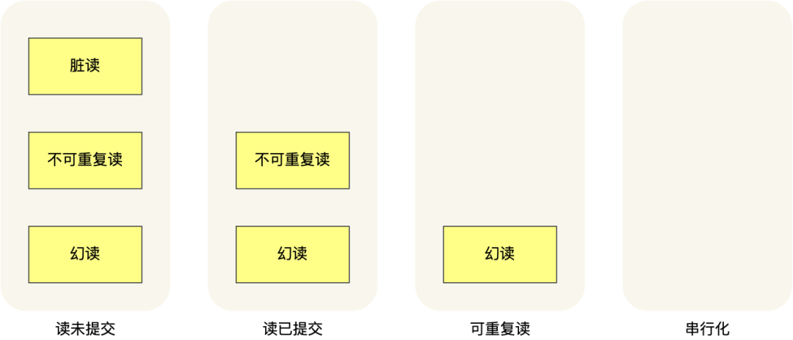
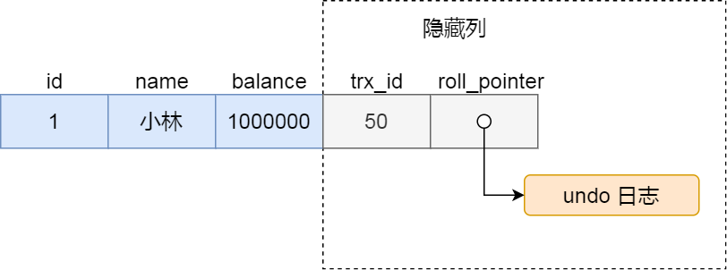
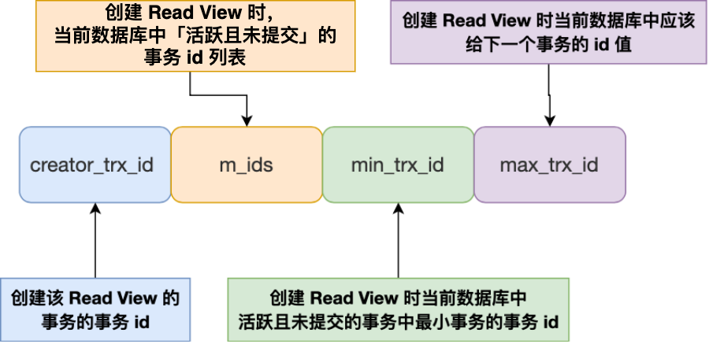
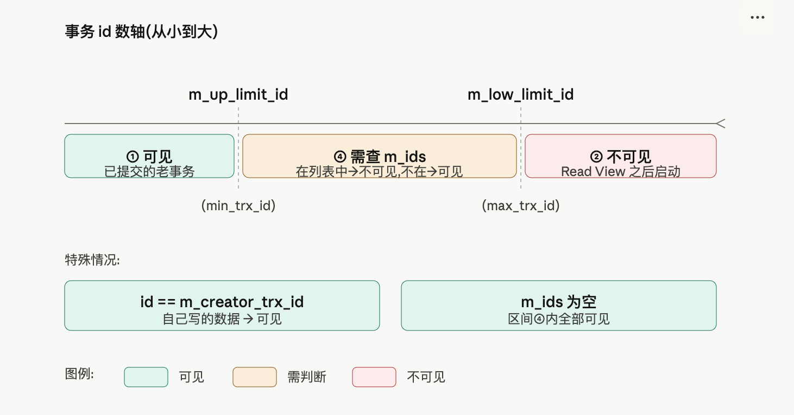

# MySQL 事务隔离与 MVCC

> 来源：[事务隔离级别是怎么实现的？](https://xiaolincoding.com/mysql/transaction/mvcc.html)
> 一句话总结：MySQL InnoDB 通过 undo log + 隐藏字段 + Read View 实现 MVCC，以支持读提交与可重复读隔离级别下的无锁并发读。

## 一、事务基础

### 1.1 ACID 特性

事务是数据库执行的最小工作单元，InnoDB 通过不同技术保证 ACID：

| 特性 | 含义 | InnoDB 实现技术 |
| ---- | ---- | --------------- |
| 原子性 Atomicity | 事务内操作要么全成功，要么全回滚 | undo log |
| 一致性 Consistency | 事务前后数据满足完整性约束 | 原子性 + 隔离性 + 持久性 |
| 隔离性 Isolation | 并发事务互不干扰 | MVCC / 锁机制 |
| 持久性 Durability | 事务提交后修改永久生效 | redo log |

### 1.2 并发事务的三种问题

| 问题 | 定义 | 触发条件 |
| ---- | ---- | -------- |
| 脏读 | 读到其他事务未提交的数据 | 一个事务读取了另一个未提交事务修改的数据 |
| 不可重复读 | 同一事务内两次读取同一数据结果不同 | 事务 A 读取后，事务 B 更新并提交，A 再次读取 |
| 幻读 | 同一事务内两次查询记录数量不同 | 事务 A 查询范围后，事务 B 插入满足条件的新记录并提交 |

## 二、事务隔离级别

### 2.1 四种隔离级别

SQL 标准定义了四种隔离级别，隔离级别越高，并发性能越低：

| 隔离级别 | 读到的数据范围 | 实现方式 |
| -------- | -------------- | -------- |
| 读未提交 read uncommitted | 可读到其他事务未提交的变更 | 直接读最新数据 |
| 读提交 read committed | 只能读到其他事务已提交的变更 | 每条语句执行前生成 Read View |
| 可重复读 repeatable read（InnoDB 默认） | 事务启动后看到的数据保持一致 | 事务启动时生成 Read View |
| 串行化 serializable | 完全串行执行 | 读写锁（共享锁 / 排他锁） |

### 2.2 隔离级别与并发问题

| 隔离级别 | 脏读 | 不可重复读 | 幻读 |
| -------- | ---- | ---------- | ---- |
| 读未提交 | 可能 | 可能 | 可能 |
| 读提交 | 不可能 | 可能 | 可能 |
| 可重复读 | 不可能 | 不可能 | 很大程度避免 |
| 串行化 | 不可能 | 不可能 | 不可能 |

> **注意**：InnoDB 默认的可重复读级别通过 MVCC 解决快照读幻读，通过 next-key lock 解决当前读幻读，因此无需升级到串行化。

### 2.3 快照读 vs 当前读

| 类型 | 语句示例 | 解决幻读方式 |
| ---- | -------- | ------------ |
| 快照读 | 普通 `SELECT` | MVCC + Read View |
| 当前读 | `SELECT ... FOR UPDATE` | next-key lock（记录锁 + 间隙锁） |

## 三、MVCC 与 Read View

### 3.1 隐藏字段

InnoDB 聚簇索引记录包含两个与事务相关的隐藏列：

| 隐藏列 | 作用 |
| ------ | ---- |
| `trx_id` | 最后一次修改该记录的事务 ID |
| `roll_pointer` | 指向 undo log 中旧版本记录的指针，形成版本链 |

### 3.2 Read View 的四个字段

Read View 是事务执行快照读时生成的一致性视图：

| 字段 | 含义 |
| ---- | ---- |
| `m_ids` | 创建 Read View 时活跃（已启动未提交）事务 ID 列表，不含自身 |
| `min_trx_id` | 活跃事务中的最小事务 ID |
| `max_trx_id` | 创建 Read View 时全局下一个将分配的事务 ID |
| `creator_trx_id` | 创建该 Read View 的事务 ID |

### 3.3 可见性判断规则

事务访问记录时，按以下规则判断版本可见性：

| 条件 | 结论 | 原因 |
| ---- | ---- | ---- |
| `trx_id == creator_trx_id` | 可见 | 自己的修改对自己总是可见 |
| `trx_id < min_trx_id` | 可见 | 记录在 Read View 创建前已提交 |
| `trx_id >= max_trx_id` | 不可见 | 记录在 Read View 创建后才生成 |
| `min_trx_id <= trx_id < max_trx_id` | 若 `trx_id` 在 `m_ids` 中则不可见，否则可见 | 活跃事务未提交则不可见，已提交则可见 |

对于不可见的版本，顺着 `roll_pointer` 读取 undo log 中的旧版本，直到找到可见版本。

### 3.4 RC 与 RR 的区别

| 隔离级别 | Read View 生成时机 | 效果 |
| -------- | ------------------ | ---- |
| 读提交 RC | 每条 SELECT 执行前 | 每次读取都能看到其他事务最新已提交数据 |
| 可重复读 RR | 事务启动时（第一条 SELECT 或 `START TRANSACTION WITH CONSISTENT SNAPSHOT`） | 整个事务期间看到的数据一致 |

> `BEGIN` / `START TRANSACTION` 并不会立即启动事务，只有执行第一条 SELECT 时才真正启动；`START TRANSACTION WITH CONSISTENT SNAPSHOT` 会立即启动事务。

## N. 复习清单

1. **事务的 ACID 分别是什么？** 原子性、一致性、隔离性、持久性。
2. **InnoDB 如何保证原子性和持久性？** undo log 保证原子性，redo log 保证持久性。
3. **脏读、不可重复读、幻读的区别是什么？** 脏读读到未提交数据；不可重复读是同一数据值变化；幻读是记录数量变化。
4. **InnoDB 默认隔离级别是什么？** 可重复读 repeatable read。
5. **四种隔离级别分别如何避免并发问题？** 读未提交直接读最新；读提交和可重复读使用 Read View，生成时机不同；串行化使用读写锁。
6. **什么是 MVCC？** 多版本并发控制，通过维护数据多个版本实现无锁并发读。
7. **Read View 的四个字段是什么？** m_ids、min_trx_id、max_trx_id、creator_trx_id。
8. **聚簇索引记录的两个隐藏列是什么？** trx_id 记录修改事务 ID，roll_pointer 指向 undo log 版本链。
9. **如何判断某个版本对当前事务是否可见？** 比较 trx_id 与 Read View 的 min/max_trx_id 和 m_ids。
10. **RC 和 RR 在 Read View 生成时机上有什么区别？** RC 是每条 SELECT 前生成，RR 是事务启动时生成。
