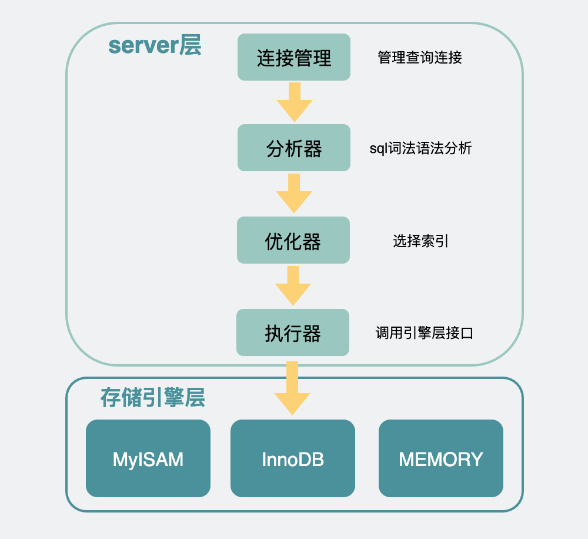
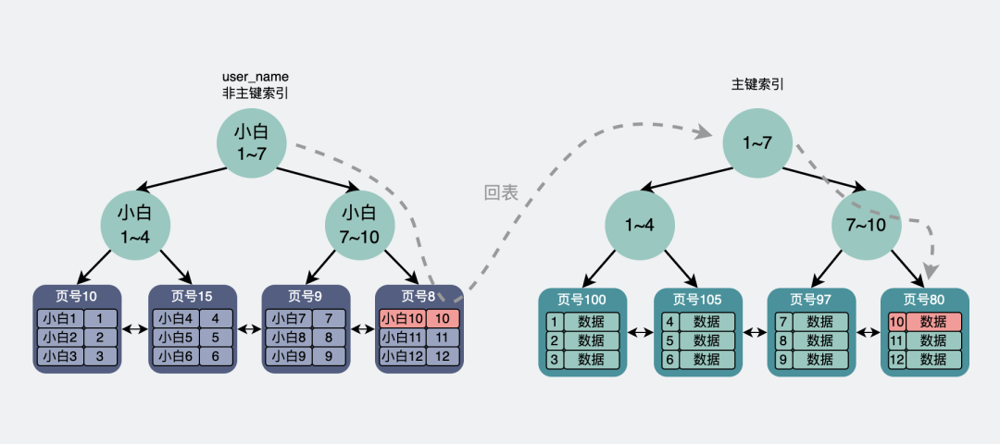
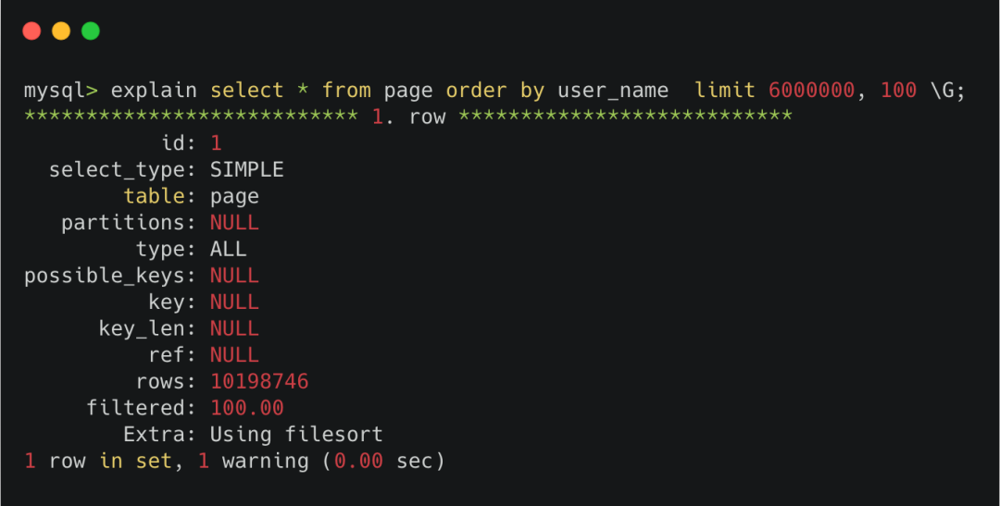
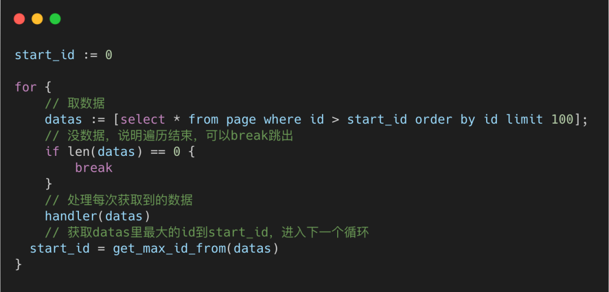

# MySQL 分页性能问题与优化

> 来源：[xiaolincoding.com](https://xiaolincoding.com/mysql/index/limit.html)
> 一句话总结：`LIMIT offset, size` 在 offset 大时性能急剧下降（深度分页），本质是 Server 层从引擎层取出大量无用数据再丢弃；优化方案需根据场景选择，核心思路是避免回表和减少无用数据传输。

## 一、limit 的执行架构

MySQL 内部分为 **Server 层**和**存储引擎层（InnoDB）**。执行器通过调用存储引擎接口逐行取数据，符合条件则放入**结果集**返回客户端。



**关键索引知识：**

| 索引类型 | 叶子节点内容 | 获取完整数据 |
|---------|------------|------------|
| 主键索引 | 完整行数据 | 直接获取 |
| 非主键索引 | 主键值 | 需回表到主键索引查询 |

> 主键索引和非主键索引的叶子节点数据都是**有序**的。



## 二、两种场景的 limit 执行过程

### 2.1 基于主键索引的 limit

**offset = 0：**
```sql
SELECT * FROM page ORDER BY id LIMIT 0, 10;
```
Server 层调用 InnoDB，在主键索引中取 0~10 条完整行数据，放入结果集返回。**性能好。**

**offset > 0：**
```sql
SELECT * FROM page ORDER BY id LIMIT 6000000, 10;
```
Server 层从 InnoDB 获取 **6000010 条完整行数据**，在 Server 层抛弃前 6000000 条，只保留最后 10 条。

**问题**：offset 越大，获取的无用完整行数据越多，`SELECT *` 时拷贝全部字段的开销尤其大。

### 2.2 基于非主键索引的 limit

**offset 较小时：**
```sql
SELECT * FROM page ORDER BY user_name LIMIT 0, 10;
```
在非主键索引取 10 条记录对应的主键 ID → 每条都**回表**到主键索引获取完整行数据。比主键索引多了一次回表开销。

**offset 非常大时：**
```sql
SELECT * FROM page ORDER BY user_name LIMIT 6000000, 10;
```
优化器发现 600 万次回表的代价 > 全表扫描，于是**选择全表扫描**（EXPLAIN 中 type = ALL）。



### 2.3 两种场景对比

| 维度 | 主键索引 limit | 非主键索引 limit |
|------|-------------|----------------|
| offset = 0 | 直接取 size 条完整行 | 取 size 条 ID 后回表 |
| offset 很大 | 取 offset+size 条完整行，丢弃前 offset 条 | 优化器可能直接选全表扫描 |
| 核心瓶颈 | 拷贝大量无用完整行数据 | 大量回表或退化为全表扫描 |

## 三、SQL 级别优化方案

### 3.1 主键索引：子查询延迟关联

**思路**：子查询只取 ID（不取完整行），减少无用数据拷贝。

```sql
SELECT * FROM page
WHERE id >= (
    SELECT id FROM page ORDER BY id LIMIT 6000000, 1
)
ORDER BY id LIMIT 10;
```

**执行过程**：
1. 子查询：在主键索引取 6000001 个 ID，丢弃前 6000000 个（只拷贝 ID，不拷贝完整行）
2. 外查询：拿到起始 ID 后，在主键索引通过 B+树定位（O(log n)），向后取 10 条

**效果**：比原始写法快约一倍（3s → 1.5s），但仍然要扫描 600 万条 ID。

### 3.2 非主键索引：延迟关联

**思路**：子查询只从非主键索引取 ID（无需回表），再用 ID 关联原表取完整数据。

```sql
SELECT * FROM page t1,
    (SELECT id FROM page ORDER BY user_name LIMIT 6000000, 100) t2
WHERE t1.id = t2.id;
```

**执行过程**：
1. 子查询：走 user_name 索引取 6000100 个 ID（不回表），丢弃前 600 万个
2. 外查询：用 100 个 ID 走主键索引获取完整行数据

**效果**：绕开了 600 万次回表，但仍然要扫描 600 万条 ID。

| 优化方案 | 解决的问题 | 未解决的问题 |
|---------|----------|------------|
| 子查询延迟关联（主键） | 减少无用完整行拷贝 | 仍需扫描 offset 条 ID |
| 延迟关联（非主键） | 避免大量回表 | 仍需扫描 offset 条 ID |

## 四、深度分页：场景化解决方案

> 深度分页在 MySQL 和 ES 中都**无根本解法**，只能通过场景规避。

### 4.1 场景一：全表数据导出（异构到 ES/Hive）

**问题**：数据量大时 `SELECT *` 超时报错，用 `LIMIT offset, size` 分批获取会遇到深度分页。

**解决方案：基于主键的游标分批获取**

```sql
-- 伪代码逻辑
SELECT * FROM page WHERE id > {last_max_id} ORDER BY id LIMIT 100;
```

**原理**：每次通过主键索引定位到 id 位置，向后取 100 条。不管翻到第几批，查询性能都**稳定不变**。



### 4.2 场景二：用户分页展示

**核心原则：从产品层面避免深度分页。**

| 策略 | 说明 |
|------|------|
| 限制结果数量 | 搜索/筛选结果控制在 1k~1w 条以内，不支持翻到很深 |
| 只支持上/下页 | 不支持跳页，每页请求带上上一页最后一条的 ID |
| 瀑布流模式 | 类似抖音，只能上划/下划，本质是游标分页 |

**游标分页（推荐）**：

```sql
-- 上一页返回的最后一条记录 ID 作为 start_id
SELECT * FROM page WHERE id > {start_id} ORDER BY id LIMIT 10;
```

> 不管翻到多少页，查询速度永远稳定。

### 4.3 方案对比

| 方案 | 适用场景 | 性能 | 是否支持跳页 |
|------|---------|------|------------|
| `LIMIT offset, size` | 数据量小（<1k），短期不会增长 | offset 大时差 | 支持 |
| 子查询延迟关联 | 主键索引，offset 中等 | 一般（仍扫 offset 条） | 支持 |
| 延迟关联 | 非主键索引，offset 中等 | 一般（仍扫 offset 条） | 支持 |
| 游标分页（start_id） | 数据导出、瀑布流、上下翻页 | 稳定（O(log n) 定位） | 不支持 |
| 搜索引擎（ES） | 搜索/筛选类页面 | 较好（但仍需控制深度） | 支持（需限制深度） |

## 五、复习清单

1. **为什么 `LIMIT 1000, 10` 比 `LIMIT 10` 慢？** offset > 0 时 Server 层会从引擎取 offset+size 条完整行数据，丢弃前 offset 条，这部分耗时随 offset 增大而增大。
2. **主键索引和非主键索引的叶子节点区别？** 主键索引叶子节点存完整行数据，非主键索引叶子节点只存主键值。
3. **什么是回表？** 通过非主键索引查到主键值后，再回主键索引查完整行数据的过程。
4. **非主键索引 + 大 offset 会怎样？** 优化器判断大量回表代价 > 全表扫描，直接选择全表扫描（type = ALL）。
5. **子查询延迟关联的原理？** 子查询只取 ID 不取完整行，减少无用数据拷贝；外查询用 ID 走主键索引定位获取数据。
6. **延迟关联解决什么问题？** 避免非主键索引大 offset 时的大量回表。
7. **什么是深度分页？** offset 达到百万、千万量级时，查询性能急剧下降的问题。
8. **深度分页有根本解法吗？** 没有，MySQL 和 ES 都无法根本解决，只能通过场景规避。
9. **全表数据导出用什么方案？** 基于主键的游标分批获取（`WHERE id > last_max_id LIMIT 100`），性能稳定。
10. **用户分页展示怎么避免深度分页？** 限制结果数量、只支持上下翻页（游标分页）、瀑布流模式。
11. **游标分页的优缺点？** 优点：性能稳定，不受页数影响；缺点：不支持跳页。