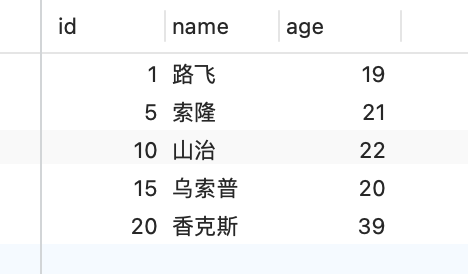
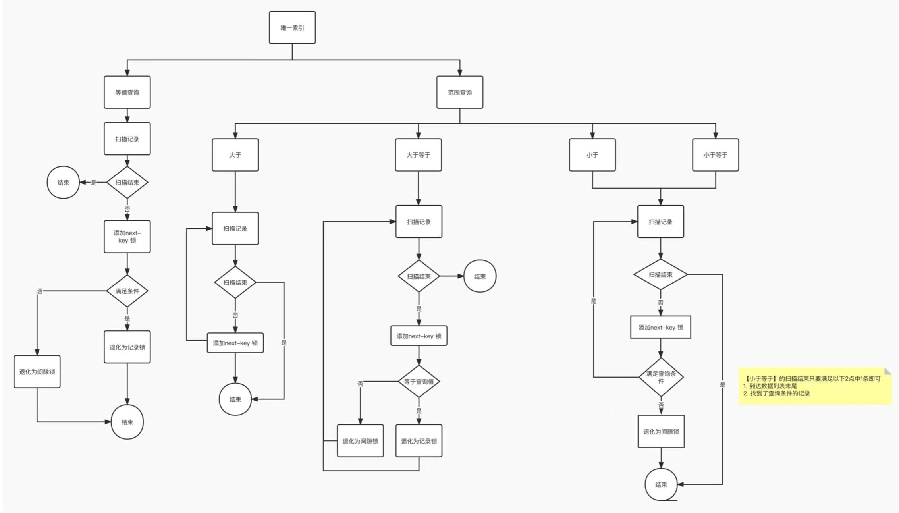
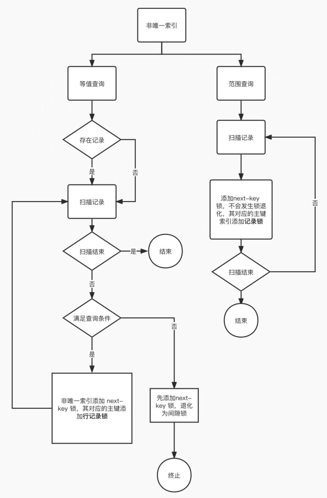

# MySQL 加锁规则

> 来源：[MySQL 是怎么加锁的？](https://xiaolincoding.com/mysql/lock/how_to_lock.html)
> 一句话总结：InnoDB 加锁对象是索引，基本单位是 next-key lock；在满足「仅靠记录锁或间隙锁就能避免幻读」的场景下，next-key lock 会退化为记录锁或间隙锁。

## 一、基本概念

### 1.1 哪些 SQL 会加行级锁

普通 `SELECT` 属于快照读，不加锁（串行化隔离级别除外）。会加行级锁的语句：

| SQL 类型 | 加锁方式 | 锁类型 |
| -------- | -------- | ------ |
| `select ... lock in share mode` | 对读取记录加锁 | 共享锁 S |
| `select ... for update` | 对读取记录加锁 | 独占锁 X |
| `update ... where ...` | 对修改记录加锁 | 独占锁 X |
| `delete ... where ...` | 对删除记录加锁 | 独占锁 X |

> 锁定读语句必须放在事务中，事务提交后锁释放。

### 1.2 行级锁的三种类型

| 锁类型 | 锁定范围 | 区间形式 | 主要作用 |
| ------ | -------- | -------- | -------- |
| Record Lock | 单条记录 | — | 防止记录被修改/删除 |
| Gap Lock | 记录之间的间隙 | 前开后开 `(a, b)` | 防止幻读，阻止插入新记录 |
| Next-Key Lock | 记录 + 前面间隙 | 前开后闭 `(a, b]` | 同时防止记录变更和间隙插入 |

## 二、加锁基本规则

1. **加锁对象是索引**；
2. **加锁基本单位是 next-key lock**（记录锁 + 间隙锁，前开后闭）；
3. **退化原则**：当记录锁或间隙锁单独就能避免幻读时，next-key lock 会退化；
4. 所有规则基于 **MySQL 8.0 + 可重复读隔离级别**。

后文实验表结构：

```sql
CREATE TABLE `user` (
  `id` bigint NOT NULL AUTO_INCREMENT,
  `name` varchar(30) NOT NULL,
  `age` int NOT NULL,
  PRIMARY KEY (`id`),
  KEY `index_age` (`age`)
) ENGINE=InnoDB;
```



> `id` 为主键索引（唯一索引），`age` 为二级索引（非唯一索引）。

## 三、唯一索引等值查询

| 记录是否存在 | 加锁位置 | 锁类型 | 原因 |
| ------------ | -------- | ------ | ---- |
| 存在 | 定位到的记录 | 退化为**记录锁** | 主键唯一性保证不会插入重复值，记录锁即可避免幻读 |
| 不存在 | 第一条大于查询值的记录 | 退化为**间隙锁** | 锁住查询值所在区间，防止其他事务插入该值 |

### 3.1 记录存在

```sql
select * from user where id = 1 for update;
```

- 对 `id = 1` 的主键索引加 **X 型记录锁**；
- 其他事务无法更新/删除 `id = 1`；
- 插入 `id = 1` 会报主键冲突，不会被阻塞。

### 3.2 记录不存在

```sql
select * from user where id = 2 for update;
```

- 找到第一条大于 2 的记录（`id = 5`），对其加 **X 型间隙锁**，范围 `(1, 5)`；
- 其他事务插入 `id = 2/3/4` 会被阻塞；
- 插入 `id = 1` 或 `id = 5` 会报主键冲突，不会被阻塞。

## 四、唯一索引范围查询

对扫描到的每个索引记录加 next-key lock，遇到特定边界条件时退化。

### 4.1 「大于 / 大于等于」范围查询

| 条件 | 边界记录是否存在 | 退化行为 |
| ---- | ---------------- | -------- |
| `>` | — | 扫描到的记录均加 next-key lock |
| `>=` | 存在 | 等值边界记录退化为**记录锁**；其余加 next-key lock |
| `>=` | 不存在 | 扫描到的记录均加 next-key lock |

### 4.2 「小于 / 小于等于」范围查询

| 条件 | 边界记录是否存在 | 终止记录加锁行为 | 其余扫描记录 |
| ---- | ---------------- | ---------------- | ------------ |
| `<` | 存在/不存在 | 退化为**间隙锁** | next-key lock |
| `<=` | 不存在 | 退化为**间隙锁** | next-key lock |
| `<=` | 存在 | 不退化，保持 next-key lock | next-key lock |

> 规律：唯一索引范围查询中，**终止范围的那条记录**在「小于」条件下通常退化为间隙锁，「小于等于」且记录存在时不退化。

## 五、非唯一索引等值查询

非唯一索引值可重复，扫描过程会持续扫描到第一个不符合条件的记录。

| 记录是否存在 | 二级索引加锁 | 第一个不符合条件记录 | 主键索引加锁 |
| ------------ | ------------ | -------------------- | ------------ |
| 存在 | 每条匹配记录加 next-key lock | next-key lock 退化为**间隙锁** | 每条匹配记录加**记录锁** |
| 不存在 | 无匹配记录 | 第一条不符合条件记录的 next-key lock 退化为**间隙锁** | 不加锁 |

> 示例：`select * from user where age = 25 for update;`
> - 若存在 `age = 25` 的记录：对匹配二级索引记录加 next-key lock，对下一条非匹配记录加间隙锁，对匹配记录的主键索引加记录锁。

## 六、非唯一索引范围查询

非唯一索引范围查询的 next-key lock **不会退化**为记录锁或间隙锁。

| 扫描对象 | 二级索引加锁 | 主键索引加锁 |
| -------- | ------------ | ------------ |
| 每个被扫描到的二级索引记录 | next-key lock | 对应记录加记录锁 |
| 最后一条记录后的 supremum pseudo-record | next-key lock（如 `(39, +∞]`） | — |

> 由于非唯一索引不具有唯一性，仅靠记录锁无法防止同值插入，因此必须保留间隙锁部分。

## 七、没有索引的查询

如果 `update/delete/select ... for update` 的查询条件**没有使用索引**，会导致全表扫描：

- **对表中每条记录的索引都加 next-key lock**；
- 效果等价于**锁住了整张表**；
- 其他事务对该表的增删改都会被阻塞。

> **线上禁忌**：加锁类 SQL 必须确保走了索引，否则会导致全表锁。

## 八、如何查看加的锁

```sql
select * from performance_schema.data_locks\G
```

| 字段 | 含义 |
| ---- | ---- |
| `LOCK_TYPE` | `RECORD` 表示行级锁（非记录锁） |
| `LOCK_MODE` | `X` = next-key lock；`X, REC_NOT_GAP` = 记录锁；`X, GAP` = 间隙锁 |
| `LOCK_DATA` | next-key / gap 锁的**右边界**；左边界为表中上一条记录的索引值 |

## 九、加锁规则总结



| 场景 | 核心规则 |
| ---- | -------- |
| 唯一索引等值，记录存在 | next-key lock 退化为记录锁 |
| 唯一索引等值，记录不存在 | 对第一条大于查询值的记录加间隙锁 |
| 唯一索引范围 | 扫描记录加 next-key lock；边界条件满足时退化为记录锁或间隙锁 |
| 非唯一索引等值 | 匹配记录二级索引加 next-key lock，首个不匹配记录二级索引退化为间隙锁，匹配记录主键加记录锁 |
| 非唯一索引范围 | 扫描记录二级索引加 next-key lock（不退化），匹配记录主键加记录锁 |
| 无索引 | 全表扫描，所有记录加 next-key lock，等价锁全表 |



## N. 复习清单

1. **InnoDB 加锁的基本单位是什么？** next-key lock（记录锁 + 间隙锁，前开后闭区间）。
2. **普通 SELECT 会加锁吗？** 不会，属于快照读（串行化隔离级别除外）。
3. **哪些 SQL 会加独占锁 X？** `select ... for update`、`update`、`delete`。
4. **唯一索引等值查询记录存在时加什么锁？** next-key lock 退化为记录锁。
5. **唯一索引等值查询记录不存在时加什么锁？** 对第一条大于查询值的记录加间隙锁。
6. **唯一索引范围查询中，>= 条件的等值边界如何处理？** 若边界记录存在，退化为记录锁。
7. **唯一索引 < 条件范围查询的终止记录加什么锁？** 退化为间隙锁；<= 且记录存在时不退化。
8. **非唯一索引等值查询为什么要对首个不匹配记录加间隙锁？** 防止其他事务插入相同索引值的新记录，避免幻读。
9. **非唯一索引范围查询的 next-key lock 会退化吗？** 不会退化。
10. **无索引的加锁类 SQL 有什么问题？** 全表扫描导致所有记录加 next-key lock，相当于锁全表。
11. **如何分析事务加了什么锁？** 查询 `performance_schema.data_locks`，看 `LOCK_MODE` 判断锁类型。
12. **LOCK_MODE 中 X、X,REC_NOT_GAP、X,GAP 分别代表什么？** next-key lock、记录锁、间隙锁。
