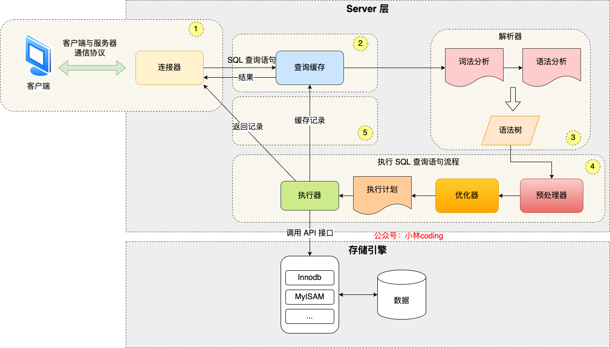
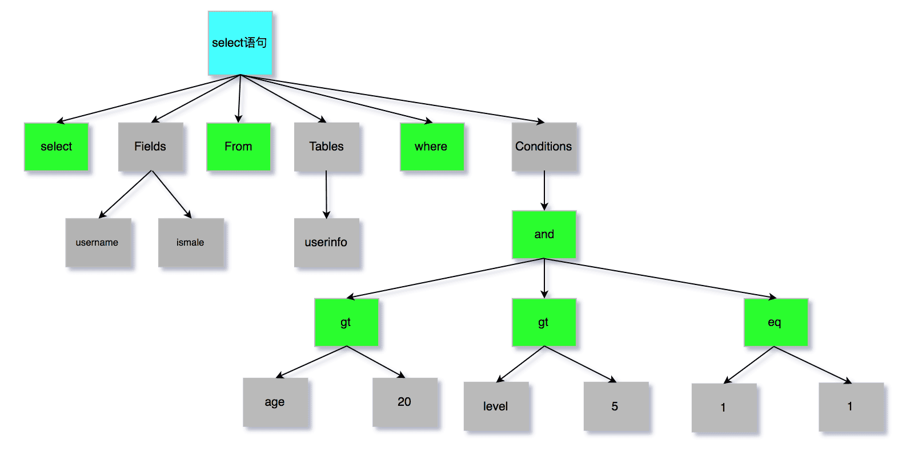
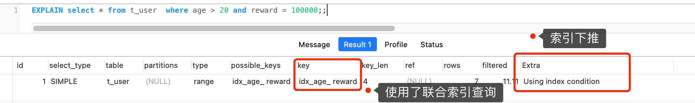

# MySQL 执行流程

> 来源：[执行一条 select 语句，期间发生了什么？](https://xiaolincoding.com/mysql/base/how_select.html)
> 一句话总结：一条 SQL 查询依次经过**连接器 → 查询缓存（8.0 已删除） → 解析器 → 预处理器 → 优化器 → 执行器**，最终与存储引擎交互返回结果。



## 一、整体架构

MySQL 架构分为两层：

| 层级 | 职责 | 核心组件 |
|------|------|----------|
| **Server 层** | 建立连接、分析和执行 SQL | 连接器、查询缓存、解析器、预处理器、优化器、执行器 |
| **存储引擎层** | 数据的存储和提取 | InnoDB、MyISAM、Memory 等 |

- Server 层还负责所有内置函数和跨存储引擎功能（存储过程、触发器、视图等）
- InnoDB 从 MySQL 5.5 起成为默认存储引擎，其索引默认使用 B+ 树

## 二、连接器

连接器负责与客户端建立连接和管理连接。

### 2.1 连接过程

```bash
mysql -h$ip -u$user -p
```

1. TCP 三次握手建立连接
2. 验证用户名和密码（失败则报 "Access denied for user"）
3. 读取用户权限并缓存，后续该连接的所有操作基于此权限判断

> 已建立的连接不受中途权限修改影响，需新建连接才生效。

### 2.2 连接管理

| 参数 | 默认值 | 说明 |
|------|--------|------|
| `wait_timeout` | 28800（8 小时） | 空闲连接最大空闲时长，超时自动断开 |
| `max_connections` | 151 | 最大连接数，超出报 "Too many connections" |

查看连接：`show processlist`；手动断开：`kill connection +id`

### 2.3 长连接 vs 短连接

| 维度 | 短连接 | 长连接 |
|------|--------|--------|
| 流程 | 连接→执行→断开 | 连接→执行→执行→...→断开 |
| 优势 | 不会累积内存 | 减少握手/挥手开销 |
| 劣势 | 每次都要 TCP 握手/挥手 | 长期占用内存，可能导致 OOM |

**长连接内存问题的两种解决方式**：

1. **定期断开长连接**：释放连接占用的内存资源
2. **`mysql_reset_connection()`**（MySQL 5.7+）：重置连接，释放内存，无需重连和重新验证权限

## 三、查询缓存

| 维度 | 说明 |
|------|------|
| 机制 | key-value 形式，key 为 SQL 语句，value 为查询结果 |
| 命中 | 直接返回 value，不再执行后续步骤 |
| 命中率 | 很低——任何对表的更新都会清空该表的全部缓存 |
| MySQL 8.0 | **已删除查询缓存模块** |
| 关闭方式 | 8.0 之前版本设置 `query_cache_type = DEMAND` |

> 注意：Server 层查询缓存 ≠ InnoDB 的 Buffer Pool，后者仍正常工作。

## 四、解析 SQL（解析器）

解析器完成两件事：

### 4.1 词法分析

将 SQL 字符串拆分为 Token，识别关键字与非关键字：

| Token 1 | Token 2 | Token 3 | Token 4 |
|---------|---------|---------|---------|
| `select`（关键字） | `username`（非关键字） | `from`（关键字） | `userinfo`（非关键字） |

### 4.2 语法分析

- 根据语法规则判断 SQL 是否合法
- 合法则构建**语法树**，供后续模块读取 SQL 类型、表名、字段名、where 条件等
- 语法错误在此阶段报错（如 `from` 写成 `form`）



> **重要**：表/字段是否存在的检查**不在解析器**，而在预处理器（prepare 阶段）。

## 五、执行 SQL

执行阶段分三步：**预处理 → 优化 → 执行**。

### 5.1 预处理器

- 检查表或字段是否存在（`ERROR 1146: Table doesn't exist`）
- 将 `select *` 中的 `*` 展开为表上所有列

### 5.2 优化器

基于查询成本选择最优执行计划，决定使用哪个索引。

**查看执行计划**：`explain select ...`

| explain 关键字段 | 含义 |
|------------------|------|
| `type` | 访问类型（const / ref / range / index / ALL） |
| `key` | 使用的索引名（null 表示无索引，即全表扫描） |
| `Extra` | 额外信息（Using index = 覆盖索引；Using index condition = 索引下推） |

**优化器选索引示例**：

```sql
select id from product where id > 1 and name like 'i%';
```

优化器选择普通索引（name）而非主键索引，因为这是覆盖索引，二级索引 B+ 树叶子节点直接存储主键值，无需回表，成本更低。

### 5.3 执行器

执行器与存储引擎以**记录为单位**交互，有三种典型模式：

#### 模式一：主键索引查询（const）

```sql
select * from product where id = 1;
```

| 步骤 | 动作 |
|------|------|
| 1 | 执行器调用 `read_first_record`，将条件交给存储引擎 |
| 2 | 存储引擎通过 B+ 树定位记录，返回给执行器 |
| 3 | 执行器判断记录是否符合条件，符合则发送给客户端 |
| 4 | 再次调用 `read_record`，const 类型直接返回 -1，退出循环 |

#### 模式二：全表扫描（ALL）

```sql
select * from product where name = 'iphone';  -- name 无索引
```

| 步骤 | 动作 |
|------|------|
| 1 | 执行器调用全扫描接口，存储引擎返回第一条记录 |
| 2 | 执行器判断 name 是否为 iphone，不符合则跳过，符合则发送客户端 |
| 3 | 循环读取下一条记录，重复判断 |
| 4 | 存储引擎读完所有记录后通知执行器，退出循环 |

#### 模式三：索引下推（Index Condition Pushdown）

MySQL 5.6+ 优化策略，将 Server 层部分过滤下推到存储引擎层，**减少回表次数**。

```sql
select * from t_user where age > 20 and reward = 100000;
-- 联合索引 (age, reward)，age 范围查询后 reward 无法用索引
```

| 维度 | 不使用索引下推 | 使用索引下推 |
|------|----------------|--------------|
| 过滤位置 | Server 层判断 reward | 存储引擎层判断 reward |
| 回表次数 | 每条 age > 20 的记录都回表 | 仅 reward = 100000 的记录才回表 |
| Extra | — | Using index condition |
| 性能 | 回表多 | 回表少，效率高 |



**索引下推流程**：
1. 存储引擎定位到 `age > 20` 的二级索引记录
2. **先不回表**，在二级索引中判断 reward 是否等于 100000
3. 不满足则跳过；满足才回表取完整记录返回 Server 层
4. Server 层判断其他条件后发送客户端

## 六、SQL 执行全流程总结

| 阶段 | 组件 | 核心职责 |
|------|------|----------|
| 连接 | 连接器 | TCP 握手、身份验证、权限读取 |
| 缓存 | 查询缓存 | 命中则直接返回（8.0 已删除） |
| 解析 | 解析器 | 词法分析 → 语法分析 → 构建语法树 |
| 预处理 | 预处理器 | 检查表/字段、展开 `select *` |
| 优化 | 优化器 | 基于成本选择执行计划 |
| 执行 | 执行器 | 与存储引擎交互，逐条记录读取/过滤/返回 |

## 复习清单

1. **MySQL 架构分哪两层？各负责什么？** Server 层（连接、解析、执行 SQL）和存储引擎层（数据存储和提取）。
2. **连接器验证权限后，中途修改权限会影响已有连接吗？** 不会，权限在连接建立时读取并缓存，需新建连接才生效。
3. **空闲连接最大时长由什么参数控制？默认多少？** `wait_timeout`，默认 28800 秒（8 小时）。
4. **长连接占用内存过多怎么解决？** 定期断开长连接，或使用 `mysql_reset_connection()` 重置连接。
5. **查询缓存为什么被 MySQL 8.0 删除？** 命中率极低——任何表更新都会清空该表所有缓存，得不偿失。
6. **解析器负责检查表或字段是否存在吗？** 不负责。解析器只做词法/语法分析，表/字段存在性在预处理器（prepare 阶段）检查。
7. **优化器的作用是什么？如何查看选择了哪个索引？** 基于查询成本选择最优执行计划；用 `explain` 查看，`key` 字段显示使用的索引。
8. **什么是覆盖索引？** 查询的字段全部包含在索引中，无需回表即可获取结果，Extra 显示 "Using index"。
9. **主键索引等值查询的访问类型是什么？** `const`，只需查找一次 B+ 树。
10. **索引下推解决了什么问题？** 将索引列的过滤条件下推到存储引擎层，在二级索引中先过滤再回表，减少回表次数。
11. **索引下推在 explain 中如何体现？** Extra 列显示 "Using index condition"。
12. **执行器与存储引擎的交互单位是什么？** 以记录（行）为单位交互。
