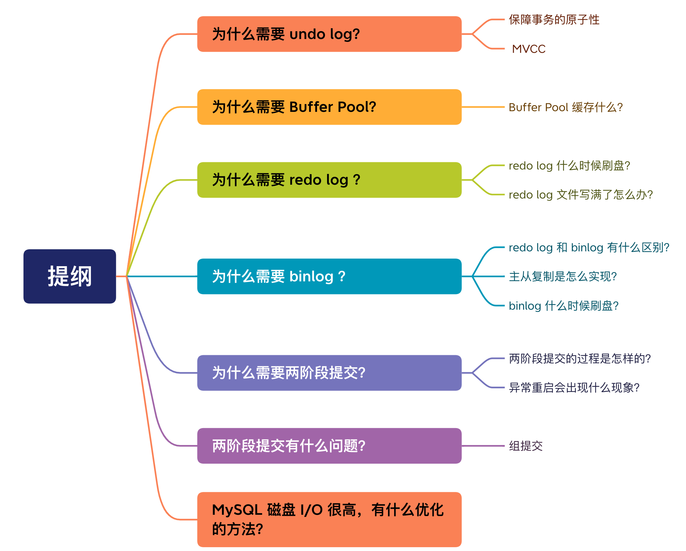
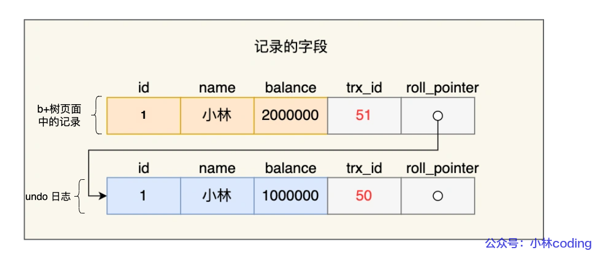
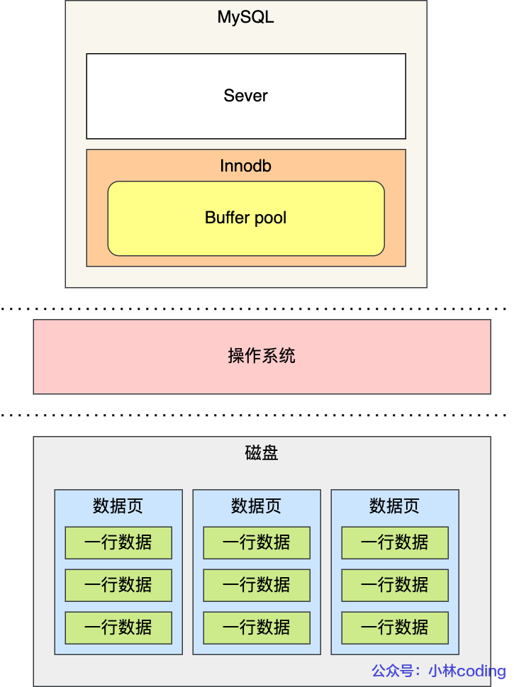
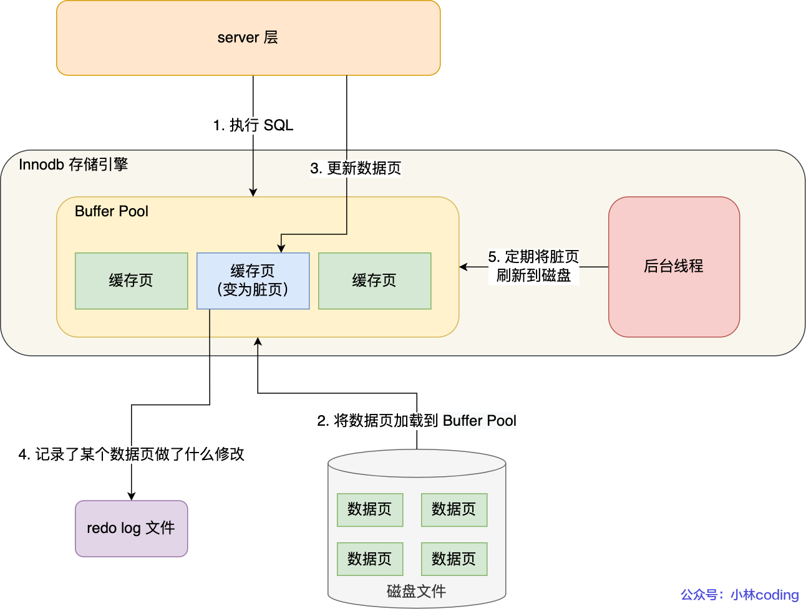
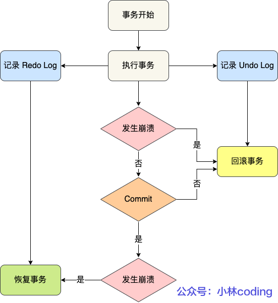
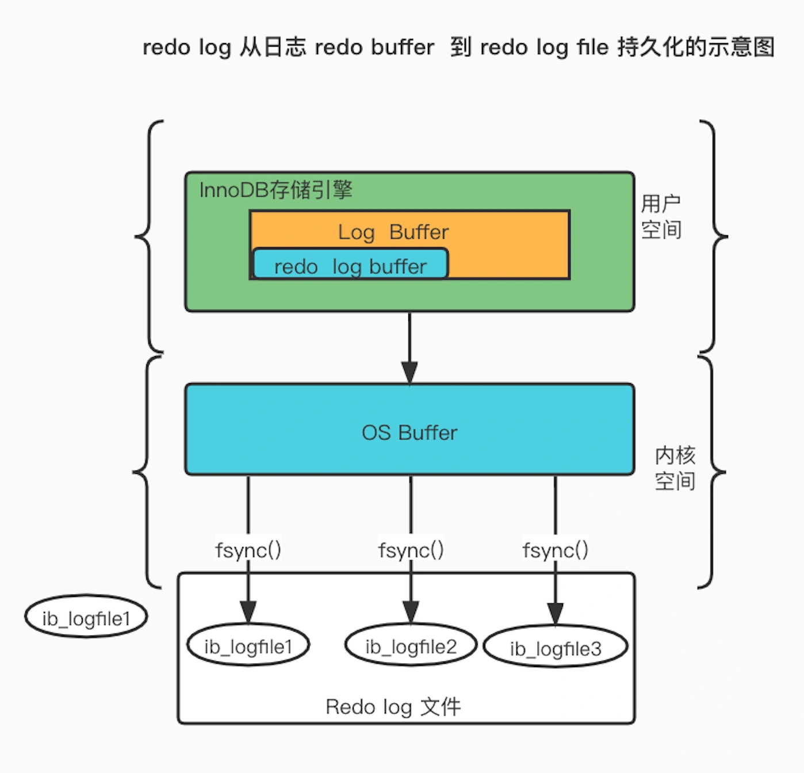

# MySQL 日志：undo log、redo log、binlog

> 来源：[xiaolincoding.com](https://xiaolincoding.com/mysql/log/how_update.html)
> 一句话总结：执行一条 update 语句涉及三种日志——undo log 保证事务原子性和 MVCC，redo log 通过 WAL 技术保证事务持久性，binlog 用于主从复制和数据备份，三者通过两阶段提交保证一致性。

## 一、三种日志总览

执行一条 update 语句时，MySQL 会涉及三种日志：

| 日志 | 所属层 | 核心作用 | 保证 ACID |
|------|-------|---------|----------|
| undo log（回滚日志） | InnoDB 存储引擎层 | 事务回滚、MVCC | 原子性 |
| redo log（重做日志） | InnoDB 存储引擎层 | 掉电故障恢复 | 持久性 |
| binlog（归档日志） | Server 层 | 数据备份、主从复制 | — |

## 二、undo log（回滚日志）

### 2.1 作用与原理

undo log 用于撤销回退，在事务未提交前，MySQL 先记录更新前的数据到 undo log，事务回滚时据此恢复。

**两大作用：**
1. **实现事务回滚，保障原子性**：事务执行出错或 ROLLBACK 时，通过 undo log 恢复到事务开始前
2. **实现 MVCC**：与 ReadView 配合，通过 undo log 版本链找到满足可见性的记录

### 2.2 不同操作的 undo log 记录内容

| 操作 | undo log 记录 | 回滚方式 |
|------|-------------|---------|
| INSERT | 记录主键值 | 删除该主键对应的记录 |
| DELETE | 记录整行内容 | 重新插入该行 |
| UPDATE（非主键列） | 记录旧值 | 反向更新为旧值 |
| UPDATE（主键列） | 先删后插的完整信息 | 反向执行插入+删除 |

**特殊处理：**
- DELETE 操作不立即删除，先打 delete flag，最终由 purge 线程清理
- UPDATE 主键列分两步执行：先删除旧行，再插入新行

### 2.3 版本链

每条 undo log 都有 `trx_id`（事务 ID）和 `roll_pointer`（指针），通过 roll_pointer 将多次更新的 undo log 串成**版本链**，配合 ReadView 实现 MVCC。

- **读提交（RC）**：每个 select 生成新的 ReadView，多次读可能不一致
- **可重复读（RR）**：事务启动时生成一个 ReadView，整个事务复用

### 2.4 undo log 的刷盘

undo log 本身不直接刷盘，而是通过 Buffer Pool 中的 Undo 页面缓存，对 Undo 页面的修改记录到 redo log，靠 redo log 的刷盘机制保证持久性。

## 三、Buffer Pool（缓冲池）

### 3.1 为什么需要 Buffer Pool

MySQL 数据存在磁盘，直接读写磁盘太慢。Buffer Pool 是 InnoDB 设计的内存缓冲区，提高读写性能。

**读写策略：**
- 读：先查 Buffer Pool，命中则直接返回；未命中则从磁盘加载
- 写：直接修改 Buffer Pool 中的页，标记为**脏页**，后续由后台线程择机刷盘

### 3.2 缓存内容

Buffer Pool 按**页**（默认 16KB）划分，缓存内容包括：
- 索引页、数据页
- Undo 页
- 插入缓存、自适应哈希索引、锁信息

**关键点**：查询一条记录时，InnoDB 会加载**整个页**到 Buffer Pool，再通过页目录定位具体记录。

## 四、redo log（重做日志）

### 4.1 WAL 技术

为防止 Buffer Pool 脏页因断电丢失，InnoDB 采用 **WAL（Write-Ahead Logging）** 技术：先写日志，再在合适时机写磁盘。

**流程**：更新内存（标记脏页） → 写 redo log → 此时更新完成 → 后台线程择机刷脏页

### 4.2 redo log 是什么

redo log 是**物理日志**，记录对某个数据页的物理修改（表空间、页号、偏移量、更新值）。事务提交时只需 redo log 持久化，不需等脏页刷盘。

### 4.3 redo log vs undo log

| 维度 | redo log | undo log |
|------|---------|---------|
| 记录内容 | 修改**后**的值（物理日志） | 修改**前**的值（逻辑日志） |
| 主要用途 | 事务崩溃恢复，保证持久性 | 事务回滚，保证原子性 |
| 崩溃场景 | 事务提交后宕机 → 用 redo log 恢复 | 事务执行错误 → 用 undo log 回滚 |

### 4.4 redo log buffer 与刷盘时机

redo log 先写入 **redo log buffer**（默认 16MB，参数 `innodb_log_buffer_size`），再择机刷盘。

**刷盘时机：**
1. MySQL 正常关闭时
2. redo log buffer 写入量超过一半时
3. 后台线程**每隔 1 秒**刷盘
4. 事务提交时（受 `innodb_flush_log_at_trx_commit` 控制）

### 4.5 innodb_flush_log_at_trx_commit 参数

| 值 | 事务提交时行为 | 数据安全性 | 写入性能 |
|----|-------------|----------|---------|
| **0** | 留在 redo log buffer，不主动刷盘 | 最低（进程崩溃丢 1s 数据） | 最高 |
| **1** | 直接持久化到磁盘（fsync） | 最高（不丢数据） | 最低 |
| **2** | 写到 redo log 文件（Page Cache） | 中等（OS 崩溃才丢） | 中等 |

> 参数 0 和 2 的持久化依赖后台线程每秒刷盘。推荐对安全性要求高的场景设为 1，折中方案设为 2。

### 4.6 redo log 文件循环写

redo log 文件组以**循环写**方式工作（环形）：

- **write pos**：当前写入位置
- **checkpoint**：当前可擦除位置
- write pos ~ checkpoint：可写区域（红色）
- checkpoint ~ write pos：待落盘脏页记录（蓝色）

如果 **write pos 追上 checkpoint**，redo log 满了，MySQL 会被阻塞，必须停下来刷脏页腾出空间。

### 4.7 redo log 的两个价值

1. **crash-safe**：保证 MySQL 异常重启后已提交事务不丢失
2. **性能优化**：将写操作从磁盘"随机写"变为"顺序写"（追加写）

## 五、binlog（归档日志）

### 5.1 为什么需要 binlog

binlog 是 Server 层日志，记录所有表结构变更和数据修改（不记录 SELECT/SHOW）。主要用于数据备份和主从复制。

> 历史原因：MySQL 最初自带 MyISAM 引擎没有 crash-safe 能力，binlog 只用于归档。InnoDB 以插件形式引入后，用 redo log 补足了 crash-safe。

### 5.2 redo log vs binlog 对比

| 维度 | redo log | binlog |
|------|---------|--------|
| 所属层 | InnoDB 存储引擎层 | Server 层 |
| 适用引擎 | 仅 InnoDB | 所有存储引擎 |
| 日志类型 | 物理日志（页级修改） | 逻辑日志（SQL 语句或行变更） |
| 写入方式 | 循环写（固定大小，覆盖旧记录） | 追加写（写满创建新文件，全量保存） |
| 用途 | 掉电故障恢复 | 数据备份、主从复制 |

> **注意**：整个数据库数据被删除，只能用 binlog 恢复，不能用 redo log（redo log 循环写，旧记录会被覆盖）。

### 5.3 binlog 三种格式

| 格式 | 说明 | 优点 | 缺点 |
|------|------|------|------|
| STATEMENT | 记录 SQL 语句 | 文件小 | 动态函数（uuid/now）导致主从不一致 |
| ROW | 记录行数据最终变更 | 数据一致性好 | 批量更新时文件大 |
| MIXED | 自动切换 STATEMENT/ROW | 兼顾两者 | — |

### 5.4 binlog 刷盘时机（sync_binlog）

binlog 写入流程：binlog cache → write（写入文件，实际在 Page Cache） → fsync（持久化到磁盘）

| sync_binlog | 行为 | 安全性 | 性能 |
|-------------|------|--------|------|
| 0 | 每次 commit 只 write，不 fsync | 最低 | 最高 |
| 1 | 每次 commit 都 write + fsync | 最高（最多丢 1 事务） | 最低 |
| N(N>1) | 累积 N 个事务后才 fsync | 中等 | 折中（常见 100~1000） |

### 5.5 主从复制

主从复制依赖 binlog，三个阶段：

| 阶段 | 过程 |
|------|------|
| 写入 Binlog | 主库写 binlog，提交事务，更新本地数据 |
| 同步 Binlog | 从库 I/O 线程连接主库 log dump 线程，binlog → relay log |
| 回放 Binlog | 从库回放线程读取 relay log，执行更新 |

**三种复制模型：**

| 模型 | 特点 | 可用性 | 一致性 |
|------|------|--------|--------|
| 同步复制 | 等所有从库复制成功才返回 | 差（任一节点故障影响业务） | 强 |
| 异步复制（默认） | 不等从库复制就返回 | 好 | 弱（主库宕机丢数据） |
| 半同步复制 | 等至少一个从库复制成功就返回 | 较好 | 较强 |

> 实际使用：1 主 2 从 1 备主（从库不宜过多，主库资源消耗大）。

## 六、两阶段提交

### 6.1 为什么需要

redo log 影响主库数据，binlog 影响从库数据。如果两个日志持久化出现半成功状态，会导致主从不一致。

**两阶段提交（2PC）** 将事务提交拆成 prepare + commit，中间穿插写入 binlog，保证两份日志的一致性。

### 6.2 两阶段提交流程

| 阶段 | 操作 |
|------|------|
| **Prepare** | 将 XID 写入 redo log，状态设为 prepare，持久化到磁盘 |
| **写入 binlog** | 将 XID 写入 binlog，持久化到磁盘 |
| **Commit** | 调用引擎提交接口，redo log 状态设为 commit（write 到 Page Cache 即可） |

> commit 阶段 redo log 状态只需 write 不需 fsync，因为 binlog 已持久化作为凭证。

### 6.3 异常重启恢复

MySQL 重启后扫描 redo log，遇到 prepare 状态的事务，拿 XID 去 binlog 中查找：
- **binlog 中无此 XID** → 回滚事务（redo log 刷了但 binlog 没刷）
- **binlog 中有此 XID** → 提交事务（两者都刷了）

> **两阶段提交以 binlog 写成功为事务提交成功的标识。**

### 6.4 两阶段提交的问题与组提交优化

**问题**：
1. **磁盘 I/O 高**：双 1 配置下每个事务 2 次 fsync
2. **锁竞争激烈**：早期用 prepare_commit_mutex 锁住整个提交过程

**组提交（group commit）优化**：将 commit 阶段拆分为三个队列并发执行：

| 阶段 | 作用 | leader 职责 |
|------|------|-----------|
| flush | redo log 组提交（write + fsync） | 合并多个事务的 redo log 一次刷盘 |
| sync | binlog 组提交（fsync） | 等待累积后合并刷盘 |
| commit | 引擎提交 | 按顺序设置 redo log 为 commit 状态 |

> MySQL 5.7 进一步优化：prepare 融入 flush 阶段，redo log 也支持组提交。

**调优参数**：
- `binlog_group_commit_sync_delay = N`：等待 N 微秒后刷盘（累积更多事务）
- `binlog_group_commit_sync_no_delay_count = N`：事务数达 N 个则不等，直接刷盘

## 七、磁盘 I/O 优化总结

| 优化手段 | 原理 | 风险 |
|---------|------|------|
| 组提交参数调整 | 延迟刷盘累积事务，合并 fsync | 可能增加响应时间 |
| sync_binlog = 100~1000 | 累积 N 个事务才 fsync | 掉电丢 N 个事务 |
| innodb_flush_log_at_trx_commit = 2 | redo log 写到文件（Page Cache）而非磁盘 | OS 崩溃才丢数据 |

## 八、一条 update 语句的完整执行流程

以 `UPDATE t_user SET name = 'xiaolin' WHERE id = 1;` 为例：

1. **查询记录**：通过主键索引查找 id=1，若不在 Buffer Pool 则从磁盘加载整页
2. **比较新旧值**：若相同则跳过，不同则传给 InnoDB
3. **写 undo log**：记录旧值到 Buffer Pool 的 Undo 页面，同时记 redo log
4. **更新内存**：修改 Buffer Pool 中的记录，标记脏页，写 redo log（WAL）
5. **写 binlog**：记录到 binlog cache，事务提交时刷盘
6. **两阶段提交**：prepare（redo log 刷盘）→ 写 binlog（刷盘）→ commit

## 九、复习清单

1. **undo log 的两大作用？** 事务回滚（原子性）和 MVCC（多版本并发控制）。
2. **undo log 版本链的关键字段？** trx_id（事务 ID）和 roll_pointer（回滚指针）。
3. **Buffer Pool 按什么单位缓存？** 按页（默认 16KB），查询一条记录会加载整个页。
4. **什么是 WAL 技术？** Write-Ahead Logging，先写日志再写磁盘，随机写变顺序写。
5. **redo log 的两个价值？** crash-safe（持久性）和性能优化（顺序写）。
6. **innodb_flush_log_at_trx_commit = 0/1/2 的区别？** 0 留在 buffer，1 fsync 到磁盘，2 写到文件（Page Cache）。安全性 1>2>0，性能 0>2>1。
7. **redo log 写满了会怎样？** write pos 追上 checkpoint 时 MySQL 被阻塞，必须刷脏页腾空间。
8. **binlog 三种格式？** STATEMENT（SQL 语句）、ROW（行变更）、MIXED（自动切换）。
9. **为什么不能用 redo log 恢复全库数据？** redo log 循环写，旧记录被覆盖；binlog 追加写，保存全量日志。
10. **主从复制三种模型？** 同步复制（等所有从库）、异步复制（不等从库）、半同步复制（等至少一个从库）。
11. **两阶段提交的过程？** prepare（redo log 刷盘+状态 prepare）→ 写 binlog（刷盘）→ commit（redo log 状态设为 commit）。
12. **异常重启时如何恢复？** 扫描 redo log 的 prepare 状态，拿 XID 去 binlog 查找：有则提交，无则回滚。
