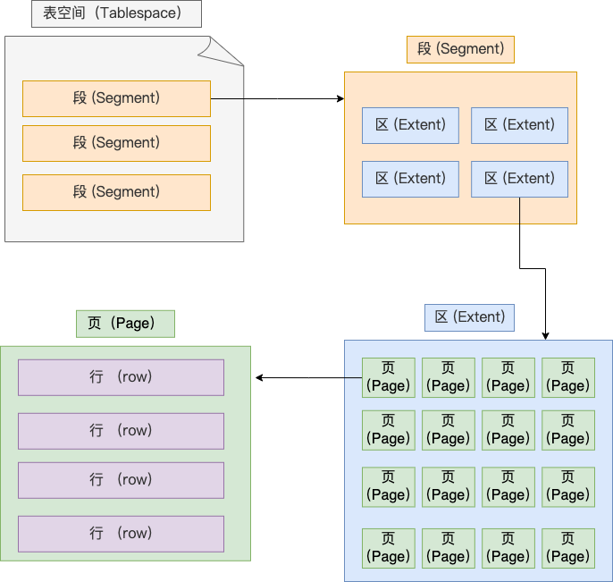
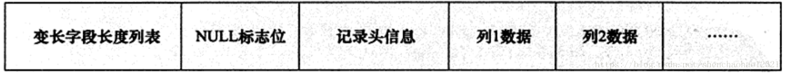
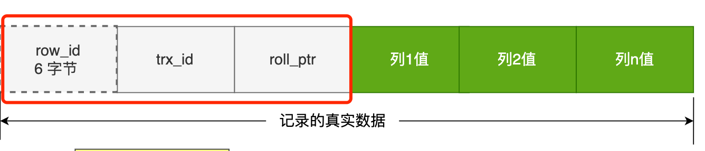

# MySQL 行记录存储结构

> 来源：https://xiaolincoding.com/mysql/base/row_format.html
> 一句话总结：InnoDB 一行记录由「额外信息」（变长字段长度列表 + NULL 值列表 + 记录头）和「真实数据」（用户字段 + 隐藏字段）组成，了解行格式即可解答 NULL 占空间、varchar 上限、行溢出等面试题。

## 一、数据存储文件

每创建一个 database，在 `datadir`（默认 `/var/lib/mysql/`）下生成同名目录，包含：

| 文件       | 作用                                     |
| ---------- | ---------------------------------------- |
| `db.opt`   | 存储数据库默认字符集和校验规则           |
| `表名.frm` | 存储表结构定义（MySQL 8.0+ 合并到 .ibd） |
| `表名.ibd` | 独占表空间文件，存储表数据+索引          |

> `innodb_file_per_table=1`（MySQL 5.6.6+ 默认）时，每张表数据单独存放在 `.ibd` 文件中。

## 二、表空间逻辑结构

表空间由大到小分为四层：**段 → 区 → 页 → 行**



| 层级             | 大小          | 说明                                                       |
| ---------------- | ------------- | ---------------------------------------------------------- |
| **段 (Segment)** | 多个区        | 数据段（叶子节点区集合）、索引段（非叶节点区集合）、回滚段 |
| **区 (Extent)**  | 1MB = 64 个页 | 连续分配，使链表相邻页物理位置相邻，范围查询走顺序 I/O     |
| **页 (Page)**    | 16KB          | InnoDB 磁盘管理最小单元，一次 I/O 读写 16KB                |
| **行 (Row)**     | 不定          | 记录按行存放，行格式决定存储结构                           |

> 关键：InnoDB 按「页」读写而非按「行」，单次 I/O 最少 16KB。

## 三、InnoDB 行格式对比

InnoDB 提供 4 种行格式：

| 行格式     | 引入版本     | 紧凑存储 | 行溢出处理方式                    | 默认版本   |
| ---------- | ------------ | -------- | --------------------------------- | ---------- |
| Redundant  | MySQL 5.0 前 | 否       | 页内存前 768B + 指针              | —          |
| Compact    | MySQL 5.0    | 是       | 页内存前 768B + 20B 指针          | MySQL 5.1  |
| Dynamic    | MySQL 5.7    | 是       | 页内仅存 20B 指针，数据全在溢出页 | MySQL 5.7+ |
| Compressed | MySQL 5.7    | 是       | 同 Dynamic，额外支持页级压缩      | —          |

> 重点掌握 Compact（结构代表）和 Dynamic（当前默认），二者差异主要在行溢出处理。

## 四、COMPACT 行格式详解

一条完整记录 = **记录的额外信息** + **记录的真实数据**



### 4.1 变长字段长度列表

- 存储变长字段（VARCHAR、TEXT、BLOB）实际占用的字节数
- 按列的**逆序**存放（与真实数据方向相反）
- 字段长度 ≤ 255B 用 1 字节表示，> 255B 用 2 字节表示
- **无变长字段时此列表不存在**

> 逆序设计原因：使得位置靠前的记录真实数据和对应长度信息在同一 CPU Cache Line 中，提高缓存命中率。

### 4.2 NULL 值列表

- 每个允许 NULL 的列对应 1 个 bit（1=NULL，0=非 NULL）
- 按列的**逆序**排列，高位补 0 凑整字节
- 至少占用 **1 字节**（8 位），9 个 NULL 字段则占 2 字节
- **所有字段为 NOT NULL 时此列表不存在**

| 场景                 | NULL 值列表十六进制 | 说明              |
| -------------------- | ------------------- | ----------------- |
| 所有列有值           | `0x00`              | 无 NULL 位        |
| 仅 age 为 NULL       | `0x04`              | 二进制 `00000100` |
| phone 和 age 为 NULL | `0x06`              | 二进制 `00000110` |

> 优化建议：字段尽量设 NOT NULL，至少节省 1 字节。

### 4.3 记录头信息

固定 5 字节，关键字段：

| 字段          | 作用                                               |
| ------------- | -------------------------------------------------- |
| `delete_mask` | 标记是否被删除（逻辑删除，非物理删除）             |
| `next_record` | 指向下一条记录的相对位置（链表结构）               |
| `record_type` | 0=普通记录，1=B+树非叶节点，2=最小记录，3=最大记录 |

### 4.4 真实数据与隐藏字段



除了用户定义的列，还有 3 个隐藏字段：

| 隐藏字段       | 大小 | 是否必需 | 作用                                    |
| -------------- | ---- | -------- | --------------------------------------- |
| `row_id`       | 6B   | 否       | 无主键且无唯一约束时自动生成            |
| `trx_id`       | 6B   | 是       | 创建该记录的事务 ID（MVCC）             |
| `roll_pointer` | 7B   | 是       | 指向 undo log 中上一版本（MVCC 版本链） |

> 有主键或唯一约束时，`row_id` 不存在。建议建表时指定主键，避免生成 row_id 浪费空间。

## 五、varchar(n) 最大取值

### 5.1 行最大长度限制

一行记录真实数据部分最大 **65535 字节**（包含隐藏字段和额外信息开销），实际可用更少。

### 5.2 单字段情况

```sql
-- ASCII 字符集（1 字符 = 1B）
CREATE TABLE t (name VARCHAR(65535));  -- ❌ 报错
-- 需扣除：变长字段长度列表 2B + NULL 值列表 1B + 隐藏字段 19B
-- 实际最大: 65535 - 2 - 1 - 19 = 65533（但还有其他开销）
```

| 字符集          | 1 字符占用 | varchar(n) 中 n 最大值（单字段） |
| --------------- | ---------- | -------------------------------- |
| ASCII / latin1  | 1B         | ≈ 65533                          |
| UTF-8 (utf8mb3) | 3B         | ≈ 21844                          |
| UTF-8 (utf8mb4) | 4B         | ≈ 16383                          |

### 5.3 多字段情况

多个 varchar 字段共享 65535 限额，需按比例分配。

## 六、行溢出处理

当一行数据超过页的可用空间时，发生**行溢出**：

| 对比项         | Compact                    | Dynamic（5.7+ 默认）      |
| -------------- | -------------------------- | ------------------------- |
| 溢出时页内保留 | 前 **768 字节** + 20B 指针 | 仅 **20B 指针**           |
| 溢出页存储     | 剩余数据                   | 全部真实数据              |
| 适用场景       | 通用                       | 含 TEXT/BLOB 大字段时更优 |

> 溢出临界点：单字段真实数据超过约 **8KB**（≈8126B）时触发，而非 16KB。这是因为页内还需存储记录头、隐藏字段等元数据。

行溢出后的存储结构：

```
┌─────────────────────┐      ┌─────────────────┐
│  数据页（主记录）     │      │   溢出页         │
│  ┌───────────────┐  │      │  ┌─────────────┐ │
│  │ 768B 数据      │  │ ───→ │  │ 剩余数据     │ │
│  │ 20B 溢出页指针 │  │      │  │ ...          │ │
│  └───────────────┘  │      │  └─────────────┘ │
│     (Compact)        │      └─────────────────┘
└─────────────────────┘
```

## 复习清单

1. **MySQL 数据存在哪个文件？** `.ibd` 独占表空间文件（MySQL 5.6.6+ 默认），表结构在 `.frm` 文件。
2. **表空间的四层结构？** 段 → 区（1MB/64页）→ 页（16KB）→ 行。
3. **InnoDB 读写最小单位？** 页（16KB），不是行。
4. **区（Extent）的作用？** 连续分配 64 个页，使范围查询走顺序 I/O 而非随机 I/O。
5. **4 种行格式及当前默认？** Redundant / Compact / Dynamic / Compressed，MySQL 5.7+ 默认 Dynamic。
6. **变长字段长度列表为什么逆序存放？** 使靠前的字段真实数据和长度信息在同一 CPU Cache Line，提高命中率。
7. **NULL 值占用空间吗？** 占。NULL 值列表至少 1 字节（bitmap），但不在真实数据部分占空间。
8. **行记录的 3 个隐藏字段？** `row_id`（6B，可选）、`trx_id`（6B，事务ID）、`roll_pointer`（7B，回滚指针）。
9. **varchar(n) 中 n 的上限受什么影响？** 字符集（每字符字节数）、单行 65535B 限额、其他字段开销。
10. **行溢出的临界点？** 单字段真实数据超过约 8KB（≈8126B），不是 16KB。
11. **Compact 和 Dynamic 行溢出的区别？** Compact 页内保留前 768B + 指针；Dynamic 页内仅保留 20B 指针。
12. **为什么建议字段设为 NOT NULL？** 避免 NULL 值列表占用空间（至少 1 字节），同时避免索引效率问题。
