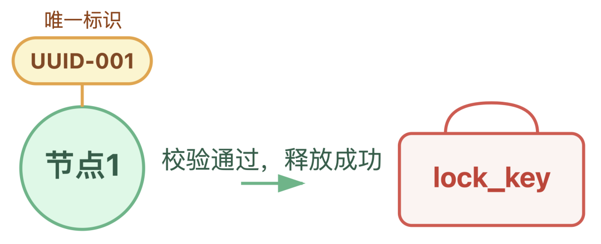
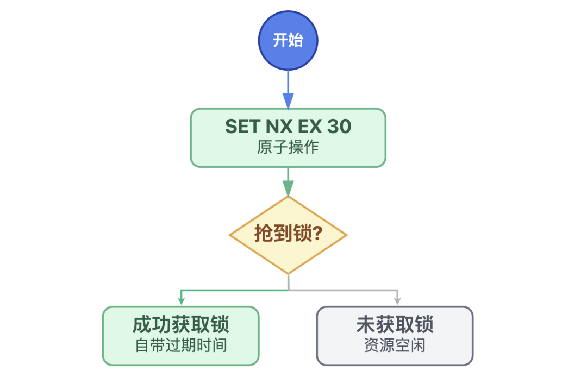
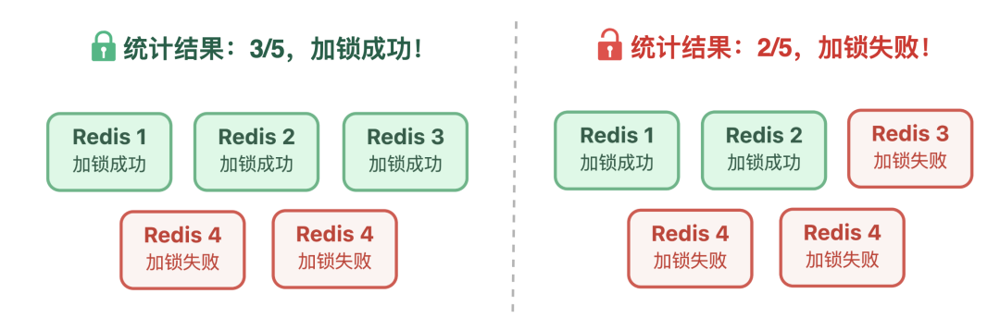
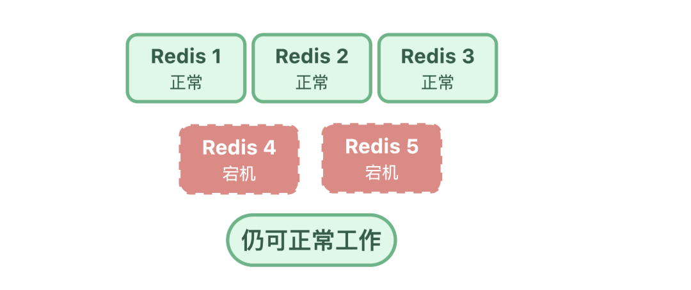
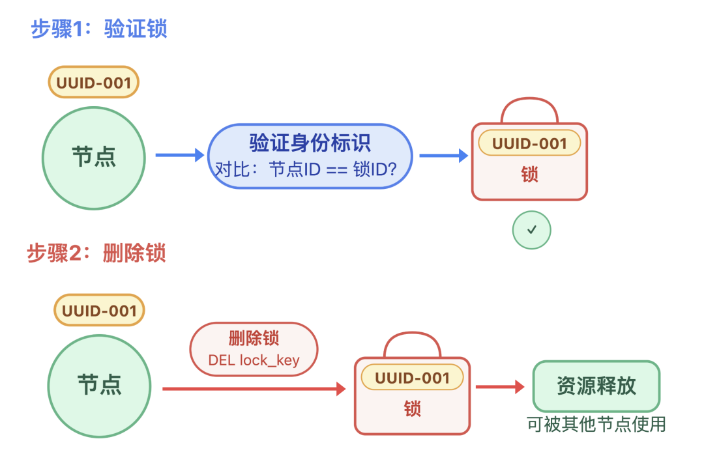
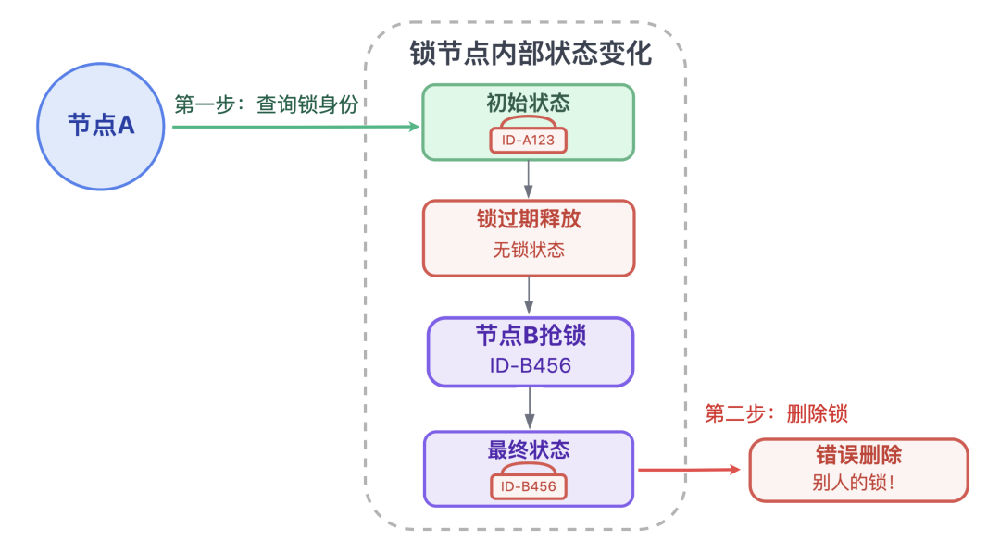
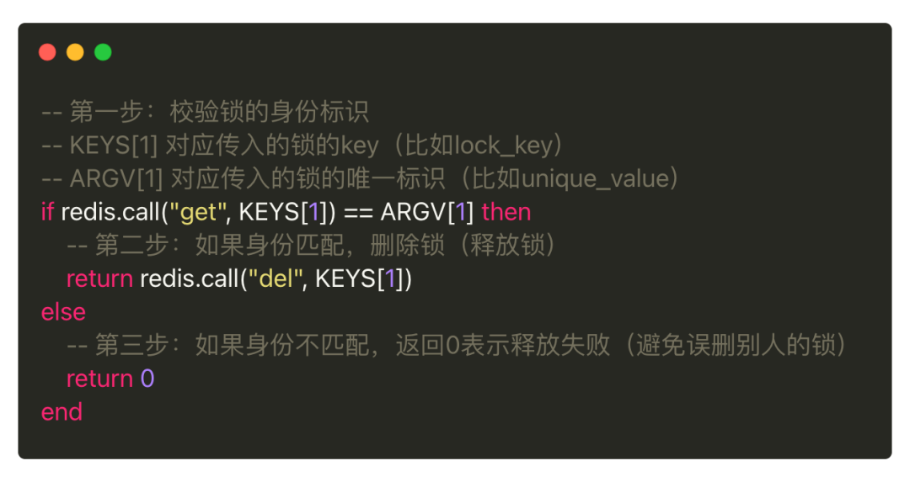
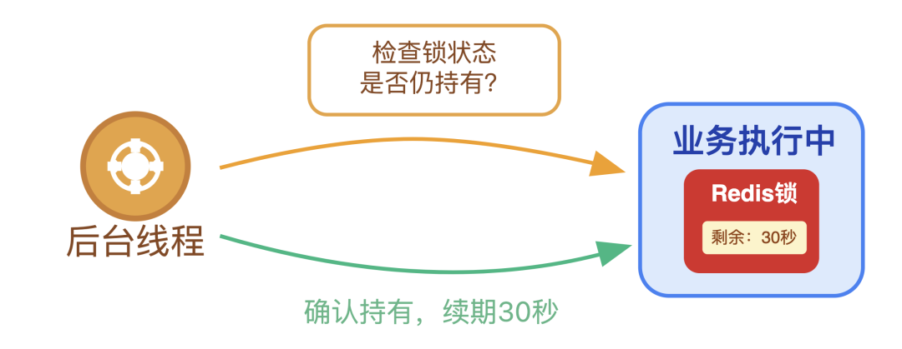

# Redis 分布式锁

> 来源：[小林 coding - 多节点争抢资源，Redis 分布式锁是怎么实现的？](https://xiaolincoding.com/redis/module/setnx.html)
> 一句话总结：Redis 分布式锁通过 SET NX EX 原子命令 + Lua 脚本释放 + Redlock 算法，解决互斥性、防死锁、高可用三大核心问题。

## 一、分布式锁面临的四大问题

| 问题 | 原因 | 后果 |
|------|------|------|
| 锁争抢 | 判断锁状态和加锁分两步，非原子 | 多节点同时认为自己拿到锁，数据错乱 |
| 僵尸锁 | 未设过期时间 + 节点宕机 | 锁永远不释放，其他节点被阻塞 |
| 锁过期 | 过期时间 < 任务执行时间 | 任务未完成锁已释放，其他节点抢到锁，并发冲突 |
| 单点不可靠 | 锁存在单个 Redis 节点 | 节点宕机则整个锁机制瘫痪 |

## 二、加锁机制

### 2.1 单节点锁：SET NX EX

核心命令：

```bash
SET lock_key unique_value NX EX 30
```

三个关键参数解析：

| 参数 | 作用 | 解决的问题 |
|------|------|-----------|
| `unique_value` | 每个节点的唯一标识 | 释放锁时验身份，防止误删别人的锁 |
| `NX` | 仅当 key 不存在时才设置 | 保证互斥性，解决锁争抢 |
| `EX 30` | 设置 30 秒过期时间 | 防止僵尸锁 |




**关键**：SET + NX + EX 是一条原子命令，抢锁和设过期时间一步完成，不存在中间状态。



### 2.2 Redlock 算法：解决单点不可靠

核心思想：部署 N 个独立 Redis 节点（推荐 5 个），**超过半数节点加锁成功才算成功**。



执行步骤：
1. 依次向 N 个节点发送 `SET NX EX` 加锁请求
2. 统计成功节点数 ≥ N/2+1 → 加锁成功
3. 成功数 < 半数 → 加锁失败，向所有节点释放锁



> 类比：少数服从多数的投票机制，少数节点宕机不影响整体。

## 三、释放锁机制

### 3.1 为什么不能直接 DEL？

直接删除可能导致误删别人的锁：

1. 节点 A 查锁 → 确认是自己的
2. 锁过期自动释放
3. 节点 B 抢到锁
4. 节点 A 执行 DEL → 误删了 B 的锁





### 3.2 Lua 脚本原子释放

将「验身份 + 删锁」封装为一个原子操作：

```lua
if redis.call("get", KEYS[1]) == ARGV[1] then
    return redis.call("del", KEYS[1])
else
    return 0
end
```



## 四、落地实践

### 4.1 简单场景：单节点锁


三个关键细节：

| 细节 | 说明 |
|------|------|
| unique_value 必须唯一 | 全网唯一标识，防止误解锁 |
| EX 时间预留缓冲 | 任务平均 10s → 建议设 30s |
| 加锁失败别死等 | 最多重试 3 次，间隔几百 ms |


### 4.2 长任务场景：看门狗自动续期

Redisson 内置的 Watch Dog 机制：
- 抢到锁后启动后台线程
- 每隔 10s 检查锁是否仍在使用
- 如果是 → 自动续期 30s



### 4.3 核心场景：Redlock 高可用


| 部署要点 | 说明 |
|----------|------|
| 节点数量 | 奇数（3/5/7），便于计算半数 |
| 节点独立性 | 不能有主从关系，分布在不同物理机/机房 |
| 请求超时 | 每个节点 50~100ms，避免慢节点拖垮流程 |

## 五、三大陷阱

| 陷阱 | 说明 | 应对 |
|------|------|------|
| 看门狗不是万能的 | 持锁节点宕机 → 看门狗线程终止 → 锁仍会过期 | 业务逻辑短平快 + 异常兜底 |
| Redlock 切勿滥用 | 多节点通信性能开销大 | 非核心业务用「单节点锁 + 看门狗」即可 |
| 锁粒度要适中 | 太粗→性能瓶颈；太细→锁爆炸 | 根据业务合理设计，平衡并发安全与性能 |


## 六、方案选型对比

| 维度 | 单节点锁 | 单节点锁 + 看门狗 | Redlock |
|------|----------|-------------------|---------|
| 互斥性 | 有 | 有 | 有 |
| 防死锁 | 有（EX 过期） | 有（EX + 自动续期） | 有 |
| 高可用 | 无（单点故障） | 无（单点故障） | 有（多节点投票） |
| 性能 | 最高 | 高 | 较低（多节点通信） |
| 适用场景 | 非核心业务 | 执行时间不确定 | 支付/下单等核心业务 |
| 实现复杂度 | 低 | 中（依赖 Redisson） | 高 |

## 复习清单

1. **分布式锁要解决哪三大核心问题？** 互斥性、防死锁、高可用。
2. **SET NX EX 为什么是原子的？** 一条命令同时完成加锁和设过期时间，不存在中间状态。
3. **unique_value 的作用？** 释放锁时验证身份，防止误删别人的锁。
4. **为什么不能直接 DEL 释放锁？** 查锁和删锁非原子，中间锁可能过期被别人抢到，导致误删。
5. **Lua 脚本释放锁的逻辑？** 先 GET 比较 unique_value，匹配才 DEL，整个操作原子执行。
6. **Redlock 的核心规则？** N 个独立节点（推荐 5），超过半数加锁成功才算成功。
7. **看门狗机制的工作原理？** 后台线程定时（如 10s）检查锁是否仍在用，是则续期。
8. **看门狗有什么局限性？** 持锁节点宕机则看门狗线程也终止，锁最终仍会过期。
9. **Redlock 的部署要点？** 奇数节点、节点独立（无主从）、请求超时 50~100ms。
10. **什么场景用单节点锁？什么场景用 Redlock？** 非核心业务用单节点锁，支付/下单等核心业务用 Redlock。
