# Redis 常见面试题

> 来源：[小林 coding - Redis 常见面试题](https://xiaolincoding.com/redis/base/redis_interview.html)
> 一句话总结：Redis 是基于内存的高性能 KV 数据库，核心考点涵盖数据类型与底层结构、线程模型、持久化机制、集群方案、过期/淘汰策略、缓存设计与实战应用。

## 一、认识 Redis

### 1.1 Redis 是什么

Redis（Remote Dictionary Server）是基于内存的 KV 数据库，读写极快，常用于**缓存、消息队列、分布式锁**。

核心特性：
- 9 种数据类型（String / Hash / List / Set / ZSet / BitMap / HyperLogLog / GEO / Stream）
- 操作原子性（单线程执行命令，无并发竞争）
- 支持事务、持久化、Lua 脚本、集群、发布/订阅、内存淘汰、过期删除

### 1.2 Redis vs Memcached

| 维度 | Redis | Memcached |
|------|-------|-----------|
| 数据类型 | 丰富（9 种） | 仅 key-value |
| 持久化 | 支持 AOF / RDB | 不支持 |
| 集群 | 原生支持 | 需客户端分片 |
| 高级功能 | 发布订阅、Lua、事务 | 不支持 |
| 共同点 | 基于内存、有过期策略、高性能 | 同左 |

### 1.3 为什么用 Redis 做 MySQL 缓存

- **高性能**：内存读写 >> 磁盘读写，热点数据缓存后响应极快
- **高并发**：Redis 单机 QPS 轻松破 10w，MySQL 单机 QPS 难破 1w

## 二、数据类型与底层结构

### 2.1 五种基本类型及应用场景

| 类型 | 底层实现 | 典型场景 |
|------|----------|----------|
| String | SDS | 缓存对象、计数、分布式锁、共享 Session |
| List | quicklist（3.2+） | 消息队列 |
| Hash | 压缩列表/哈希表（7.0 用 listpack 替代压缩列表） | 缓存对象、购物车 |
| Set | 哈希表/整数集合 | 点赞、共同关注、抽奖 |
| ZSet | 压缩列表/跳表（7.0 用 listpack 替代压缩列表） | 排行榜、排序 |

扩展类型：BitMap（签到）、HyperLogLog（UV 统计）、GEO（地理位置）、Stream（消息队列，支持消费组）

### 2.2 SDS vs C 字符串

| 维度 | C 字符串 | SDS |
|------|----------|-----|
| 二进制安全 | 否（用 \0 判结束） | 是（用 len 判结束） |
| 获取长度 | O(n) | O(1) |
| 缓冲区溢出 | 可能 | 自动扩容，不会 |

### 2.3 各类型转换阈值

| 类型 | 小数据用 | 大数据用 | 阈值 |
|------|----------|----------|------|
| List | 压缩列表 | 双向链表 | <512 元素且 <64B（3.2 后统一 quicklist） |
| Hash | 压缩列表 | 哈希表 | <512 元素且 <64B |
| Set | 整数集合 | 哈希表 | 元素全为整数且 <512 |
| ZSet | 压缩列表 | 跳表 | <128 元素且 <64B |

> Redis 7.0 废弃压缩列表，统一改用 listpack。

## 三、线程模型

### 3.1 Redis 是单线程吗？

**核心命令执行是单线程**（接收请求→解析→读写→响应），但 Redis 程序本身有多线程：

| 版本 | 后台线程 | 职责 |
|------|----------|------|
| 2.6+ | 2 个 | 关闭文件（BIO_CLOSE_FILE）、AOF 刷盘（BIO_AOF_FSYNC） |
| 4.0+ | +1 个 | 异步释放内存（BIO_LAZY_FREE），用 unlink 替代 del 删除大 key |

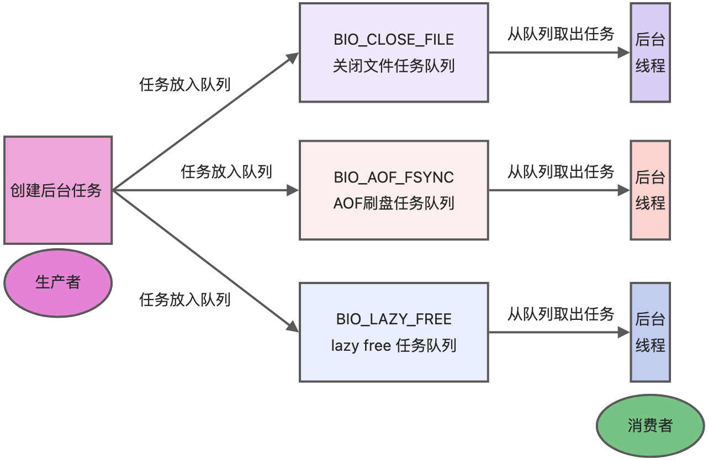

### 3.2 单线程事件循环

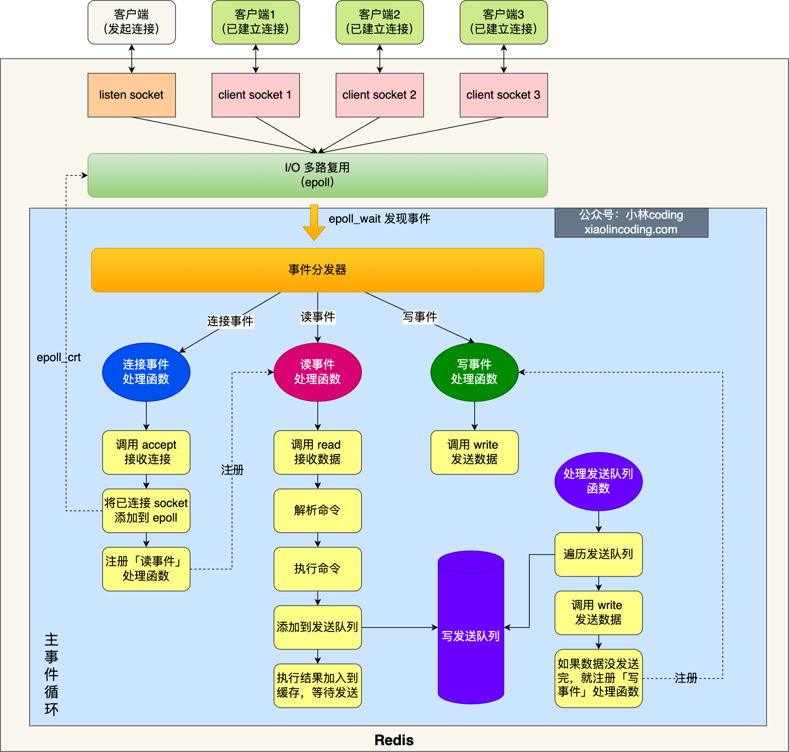

流程：epoll_create → bind/listen → epoll_ctl 注册事件 → 进入事件循环：
1. 处理发送队列（write）
2. epoll_wait 等待事件：连接事件→accept；读事件→read+解析+执行；写事件→write 响应

### 3.3 单线程为什么快？

- 内存操作 + 高效数据结构，CPU 不是瓶颈
- 避免多线程竞争、切换、死锁开销
- I/O 多路复用（epoll），一个线程处理大量连接

### 3.4 Redis 6.0 多线程

| 对比项 | Redis 6.0 之前 | Redis 6.0 之后 |
|--------|---------------|----------------|
| 网络 I/O | 单线程 | 多线程（可配 io-threads） |
| 命令执行 | 单线程 | **仍然单线程** |
| 默认多线程读 | - | 否，需设 io-threads-do-reads yes |
| 线程数建议 | - | 4 核设 2~3，8 核设 6 |

Redis 6.0 默认启动 6 个额外线程：3 个后台 BIO + 3 个 I/O 线程（io-threads=4 时）。

## 四、持久化

### 4.1 三种持久化方式对比

| 方式 | 原理 | 优点 | 缺点 |
|------|------|------|------|
| AOF | 追加写命令日志 | 数据丢失少 | 文件大、恢复慢 |
| RDB | 内存全量快照 | 恢复快 | 快照间隔导致数据丢失 |
| 混合持久化 | AOF 重写时前半段 RDB + 后半段 AOF | 兼顾速度与安全 | 兼容性差（需 4.0+） |

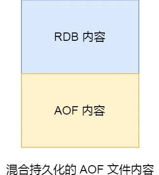

### 4.2 AOF 写回策略

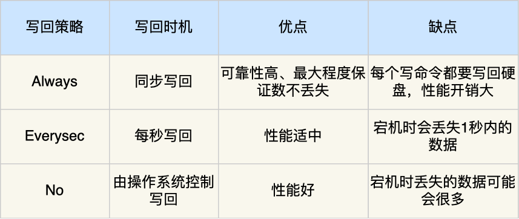

| 策略 | 写回时机 | 数据安全 | 性能 |
|------|----------|----------|------|
| Always | 每次写操作后同步刷盘 | 最高 | 最低 |
| Everysec | 每秒刷盘 | 折中 | 折中 |
| No | 由 OS 决定 | 最低 | 最高 |

### 4.3 AOF 重写

- 由 **bgrewriteaof 子进程**执行，不阻塞主进程
- 重写期间新写命令同时写入 AOF 缓冲区 + AOF 重写缓冲区
- 重写完成后，重写缓冲区内容追加到新 AOF 文件，再替换旧文件

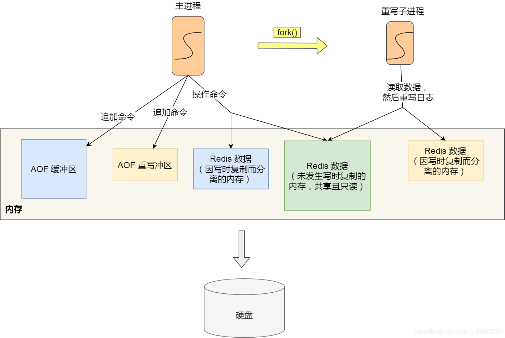

### 4.4 RDB 快照

- **save**：主线程执行，会阻塞 → 不推荐
- **bgsave**：fork 子进程执行，利用 **写时复制（COW）**，主进程可继续处理命令

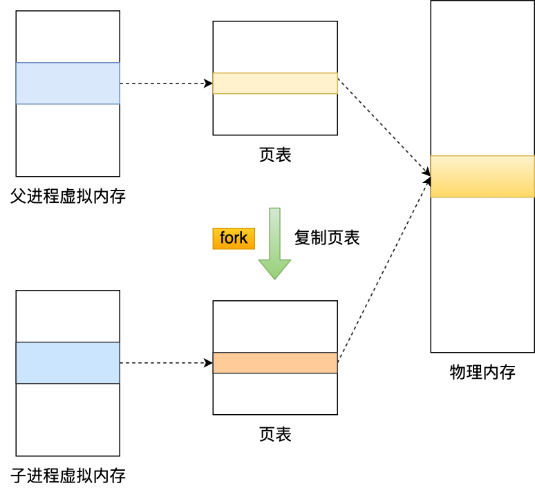

默认触发条件：900s 内 ≥1 次修改 / 300s 内 ≥10 次 / 60s 内 ≥10000 次。

## 五、集群

### 5.1 三种高可用方案

| 方案 | 特点 | 适用场景 |
|------|------|----------|
| 主从复制 | 读写分离，数据异步复制 | 数据冗余、读扩展 |
| 哨兵模式 | 监控 + 自动故障转移 | 主节点宕机自动切换 |
| 切片集群 | 16384 个哈希槽分布到多节点 | 数据量大、需水平扩展 |

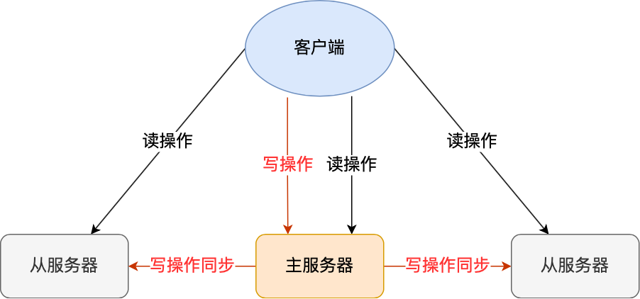

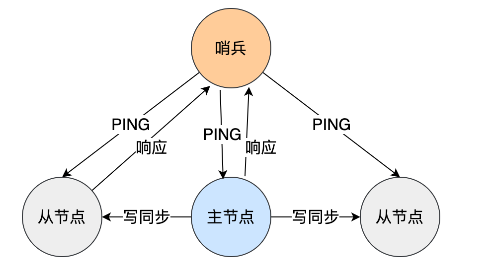

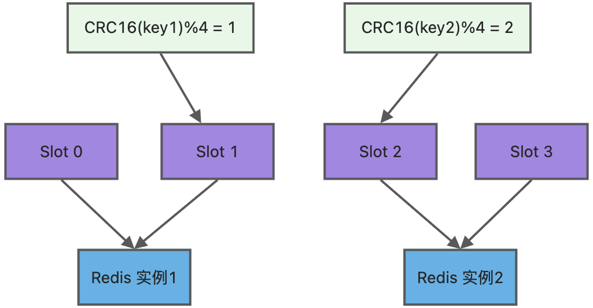

**哈希槽映射**：key → CRC16(key) % 16384 → 槽编号 → 节点

### 5.2 集群脑裂

**现象**：主节点网络故障但未宕机，哨兵选举新主节点 → 出现两个主节点 → 网络恢复后旧主降为从节点，清空数据导致丢失。

**解决**：配置 min-slaves-to-write + min-slaves-max-lag，当从节点数量或延迟不满足时，主节点拒绝写操作。

## 六、过期删除与内存淘汰

### 6.1 过期删除策略

Redis 使用**惰性删除 + 定期删除**组合：

| 策略 | 方式 | 优点 | 缺点 |
|------|------|------|------|
| 惰性删除 | 访问时才检查过期 | CPU 友好 | 内存不友好 |
| 定期删除 | 随机抽 20 个 key，过期比例 >25% 则继续 | 折中 | 难定频率 |

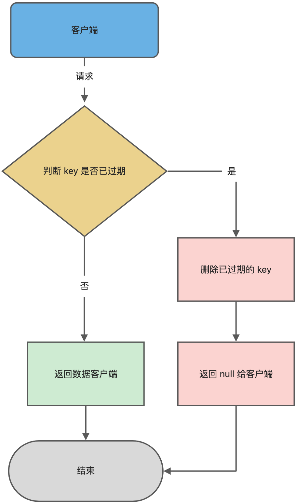

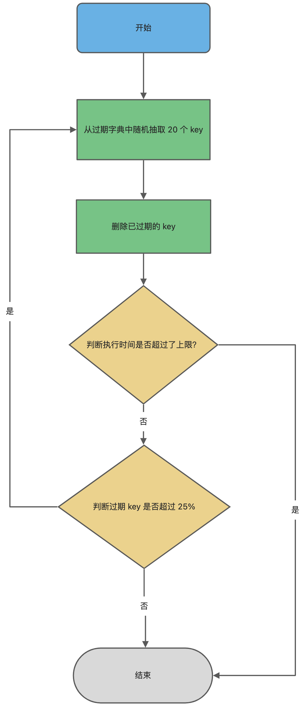

### 6.2 过期键在不同场景下的处理

| 场景 | 处理方式 |
|------|----------|
| RDB 生成 | 过期键不写入 |
| RDB 加载（主） | 过期键不载入 |
| RDB 加载（从） | 全部载入（后续主从同步会覆盖） |
| AOF 写入 | 过期键保留，删除时追加 DEL 命令 |
| AOF 重写 | 过期键不写入 |
| 主从模式 | 从库被动等待主库 DEL 命令 |

### 6.3 内存淘汰策略（8 种）

**不淘汰**：noeviction（默认，超过 maxmemory 直接报错）

**淘汰过期键**：

| 策略 | 淘汰规则 |
|------|----------|
| volatile-random | 随机淘汰设置了过期时间的 key |
| volatile-ttl | 优先淘汰更早过期的 key |
| volatile-lru | 淘汰设置了过期时间中最近最少使用的 key |
| volatile-lfu | 淘汰设置了过期时间中最少使用的 key（4.0+） |

**淘汰所有键**：

| 策略 | 淘汰规则 |
|------|----------|
| allkeys-random | 随机淘汰任意 key |
| allkeys-lru | 淘汰最近最少使用的 key |
| allkeys-lfu | 淘汰最少使用的 key（4.0+） |

### 6.4 LRU vs LFU

| 对比项 | LRU | LFU |
|--------|-----|-----|
| 全称 | Least Recently Used | Least Frequently Used |
| 淘汰依据 | 最近访问时间 | 访问频次 |
| 实现方式 | 对象头 24bit lru 字段记录时间戳 | 高 16bit 记录衰减时间，低 8bit 记录访问频次 |
| 缓存污染 | 无法解决（偶尔访问一次的数据长期驻留） | 通过频次衰减解决 |

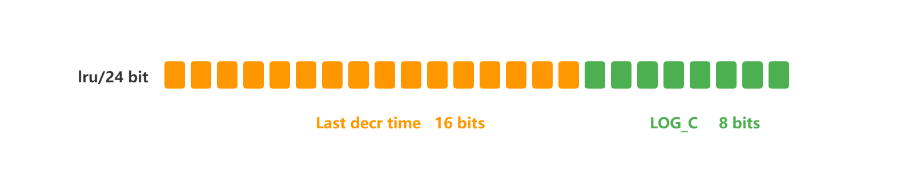

Redis 使用**近似 LRU**：随机采样 5 个 key，淘汰最久未使用的，不需要维护全局链表。

## 七、缓存设计

### 7.1 缓存三大问题

| 问题 | 原因 | 解决方案 |
|------|------|----------|
| 缓存雪崩 | 大量 key 同时过期 / Redis 宕机 | 过期时间加随机值；缓存不过期由后台更新 |
| 缓存击穿 | 热点 key 过期，大量请求直达 DB | 互斥锁（setNX）；热点 key 不设过期时间 |
| 缓存穿透 | 请求的数据缓存和 DB 都不存在 | 非法请求限制；缓存空值/默认值；布隆过滤器 |

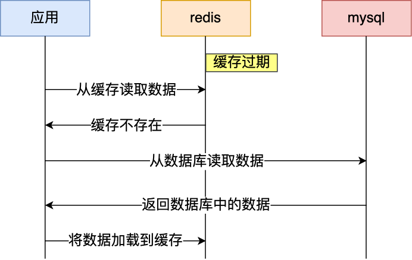

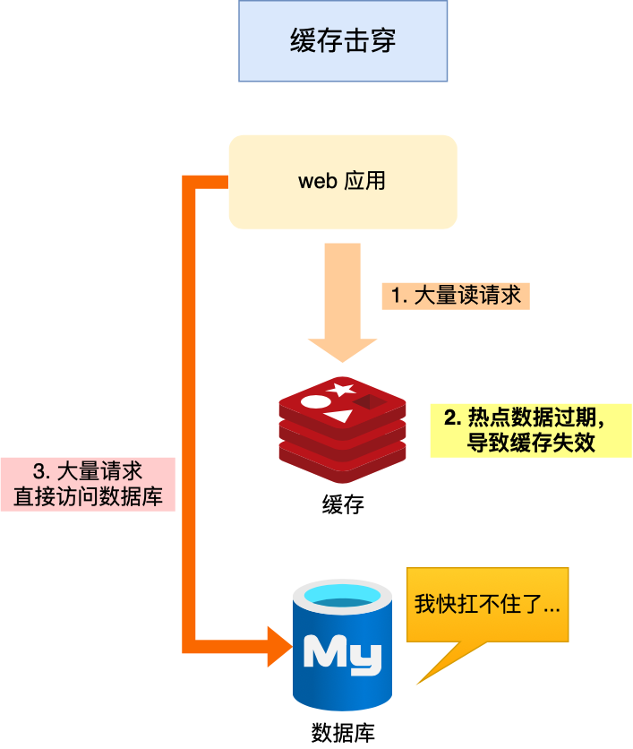

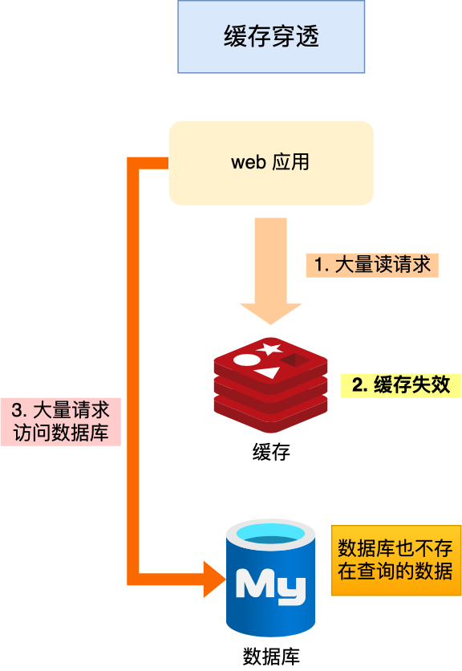

### 7.2 缓存更新策略

| 策略 | 写方式 | 读方式 | 适用场景 |
|------|--------|--------|----------|
| Cache Aside | 先更新 DB 再删除缓存 | 命中缓存直接返回，未命中查 DB 写缓存 | 最常用，读多写少 |
| Read/Write Through | 缓存组件代理 DB 读写 | 同左 | 本地缓存 |
| Write Back | 只更新缓存，异步批量写 DB | 同左 | 写多场景（CPU 缓存） |

**Cache Aside 为什么「先更新 DB 再删除缓存」？**
- 先删缓存再更新 DB：并发时可能读到旧值写入缓存，导致不一致
- 先更新 DB 再删缓存：理论上也可能不一致，但概率极低（缓存写入远快于 DB 写入）

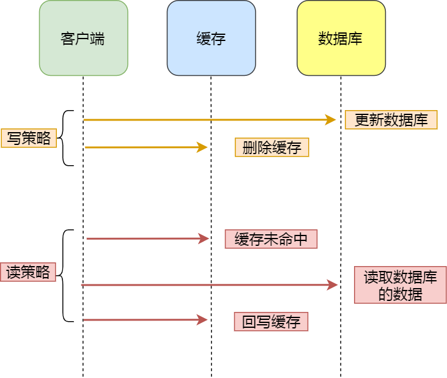

### 7.3 动态缓存热点数据

思路：用 ZSet 按访问时间排序，定期淘汰排名靠后的数据，从 DB 补充新数据。
- `zadd` 更新访问时间
- `zrange` 获取 Top N

## 八、Redis 实战

### 8.1 延迟队列

用 ZSet 实现：score 存延迟执行时间，`zadd` 生产消息，`zrangebyscore` 消费到期消息。


### 8.2 大 Key 处理

**定义**：String > 10KB 或集合类型 > 5000 元素

**危害**：客户端超时阻塞、网络阻塞、工作线程阻塞、集群内存不均

**查找方法**：
1. `redis-cli --bigkeys`（每种类型最大的 key）
2. SCAN + TYPE + STRLEN / LLEN / HLEN / SCARD / ZCARD / MEMORY USAGE
3. RdbTools 解析 RDB 文件

**删除方法**：

| 类型 | 分批删除方式 |
|------|-------------|
| Hash | hscan + hdel |
| List | ltrim |
| Set | sscan + srem |
| ZSet | zremrangebyrank |
| 通用 | unlink（4.0+ 异步删除） |

### 8.3 管道（Pipeline）

客户端批处理技术：将多个命令打包一次发送，减少网络往返。

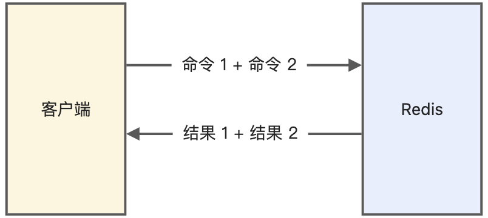

> 管道是客户端功能，非服务端功能。注意避免命令过大导致网络阻塞。

### 8.4 事务

- Redis **不支持回滚**：命令入队时语法错误会拒绝，运行时错误只影响该命令
- DISCARD 只能放弃未执行的事务，不能回滚已执行的
- 原因：事务错误通常是编程错误；回滚与 Redis 简单高效的设计主旨不符

### 8.5 分布式锁

**加锁**：
```bash
SET lock_key unique_value NX PX 10000
```

**解锁（Lua 保证原子性）**：
```lua
if redis.call("get",KEYS[1]) == ARGV[1] then
    return redis.call("del",KEYS[1])
else
    return 0
end
```

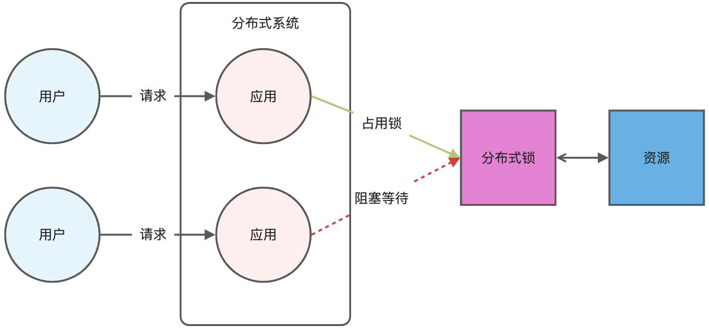

**单节点锁的缺点**：
- 超时时间不好设置（可使用守护线程续约）
- 主从异步复制导致不可靠（主节点宕机未同步，新主仍可加锁）

**Redlock 算法**：
- 部署 N 个独立 Redis 主节点（推荐 5 个）
- 客户端依次向 N 个节点加锁
- 成功条件：超过半数节点加锁成功 且 总耗时 < 锁过期时间
- 失败则向所有节点释放锁

## 复习清单

1. **Redis 和 Memcached 的核心区别？** Redis 支持更多数据类型、持久化、原生集群、发布订阅/Lua/事务。
2. **五种基本数据类型底层实现？** String→SDS，List→quicklist，Hash→压缩列表/哈希表（7.0 listpack），Set→整数集合/哈希表，ZSet→压缩列表/跳表（7.0 listpack）。
3. **SDS 相比 C 字符串的优势？** 二进制安全、O(1) 获取长度、自动扩容防溢出。
4. **Redis 单线程为什么快？** 内存操作 + 无线程切换开销 + I/O 多路复用。
5. **AOF 三种写回策略？** Always（每写刷盘）、Everysec（每秒刷盘）、No（OS 决定）。
6. **AOF 重写如何避免阻塞？** fork 子进程 + 重写缓冲区，写时复制保证数据一致。
7. **RDB bgsave 如何不阻塞主线程？** fork 子进程 + COW，读操作共享内存，写操作复制副本。
8. **集群脑裂如何解决？** 配置 min-slaves-to-write + min-slaves-max-lag，从节点不足时主节点拒绝写。
9. **过期删除策略？** 惰性删除（访问时检查）+ 定期删除（随机抽 20 个 key，过期 >25% 则继续）。
10. **8 种内存淘汰策略？** noeviction + volatile(random/ttl/lru/lfu) + allkeys(random/lru/lfu)。
11. **缓存雪崩/击穿/穿透的区别与解决？** 雪崩→随机过期时间；击穿→互斥锁/不过期；穿透→布隆过滤器/空值缓存。
12. **分布式锁如何实现？** SET NX PX + Lua 解锁；集群用 Redlock（过半节点加锁成功 + 总耗时 < 过期时间）。
