# Redis 数据类型与应用场景

> 来源：[小林 coding - Redis 常见数据类型和应用场景](https://xiaolincoding.com/redis/data_struct/command.html)
> 一句话总结：Redis 提供 9 种数据类型，每种有特定的底层实现和适用场景，选型的关键是理解数据特征与操作需求。

## 一、String

### 1.1 介绍与内部实现

最基本的 key-value 结构，value 最大 512M，可以是字符串或数字。

底层编码 3 种：

| 编码 | 条件 | 特点 |
|------|------|------|
| int | 值为 long 可表示的整数 | 直接存在 ptr 中 |
| embstr | 字符串 ≤44 字节（5.0 版） | 一次内存分配，redisObject + SDS 连续存放 |
| raw | 字符串 >44 字节 | 两次内存分配，redisObject 和 SDS 分开存放 |

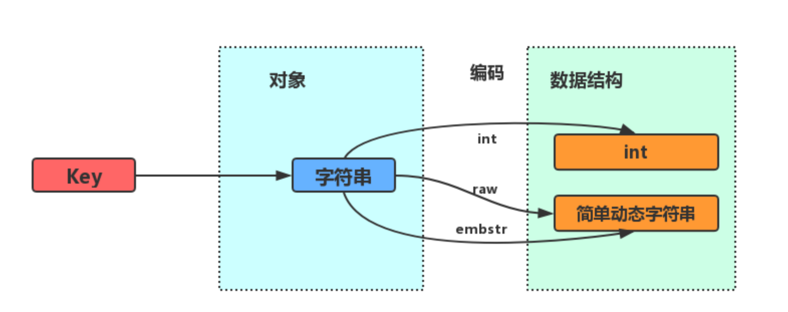

embstr 优点：内存分配/释放仅一次，CPU 缓存友好。缺点：只读，修改时先转为 raw。

### 1.2 常用命令

| 命令 | 用途 |
|------|------|
| SET / GET | 设置/获取值 |
| MSET / MGET | 批量设置/获取 |
| INCR / DECR / INCRBY | 计数器（原子操作） |
| EXPIRE / TTL | 设置/查看过期时间 |
| SET key value EX 60 | 设置带过期时间的值 |
| SETNX | 不存在才插入 |

### 1.3 应用场景

| 场景 | 实现方式 |
|------|----------|
| 缓存对象 | `SET user:1 '{"name":"x","age":18}'` 或 `MSET user:1:name x user:1:age 18` |
| 常规计数 | `INCR article:readcount:1001`（单线程保证原子性） |
| 分布式锁 | `SET lock_key unique_value NX PX 10000` + Lua 解锁 |
| 共享 Session | 多服务器共用 Redis 存储 Session 信息 |

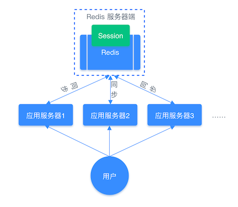

分布式锁解锁 Lua 脚本：
```lua
if redis.call("get",KEYS[1]) == ARGV[1] then
    return redis.call("del",KEYS[1])
else
    return 0
end
```

## 二、List

### 2.1 介绍与内部实现

按插入顺序排序的字符串列表，最大 2^32-1 个元素，支持头尾操作。

| 版本 | 底层结构 |
|------|----------|
| <3.2 | 压缩列表（<512 元素且 <64B）或双向链表 |
| ≥3.2 | quicklist |
| ≥7.0 | quicklist 节点内用 listpack 替代压缩列表 |

### 2.2 常用命令

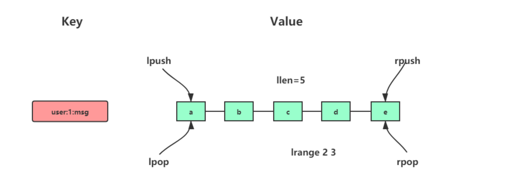

| 命令 | 用途 |
|------|------|
| LPUSH / RPUSH | 头部/尾部插入 |
| LPOP / RPOP | 头部/尾部弹出 |
| LRANGE | 获取指定范围元素 |
| BLPOP / BRPOP | 阻塞式弹出（无数据时阻塞等待） |

### 2.3 应用场景：消息队列

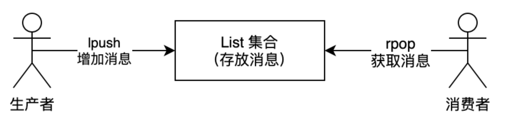

| 需求 | List 实现方式 |
|------|--------------|
| 消息保序 | LPUSH + RPOP（先进先出） |
| 阻塞读取 | BRPOP（避免空轮询消耗 CPU） |
| 重复消息处理 | 生产者自行生成全局唯一 ID |
| 消息可靠性 | BRPOPLPUSH（读消息同时备份到另一个 List） |

**List 消息队列缺陷**：不支持消费组（一条消息只能被一个消费者消费），需用 Stream 替代。

## 三、Hash

### 3.1 介绍与内部实现

键值对集合，value = [{field1, value1}, ..., {fieldN, valueN}]，适合存储对象。

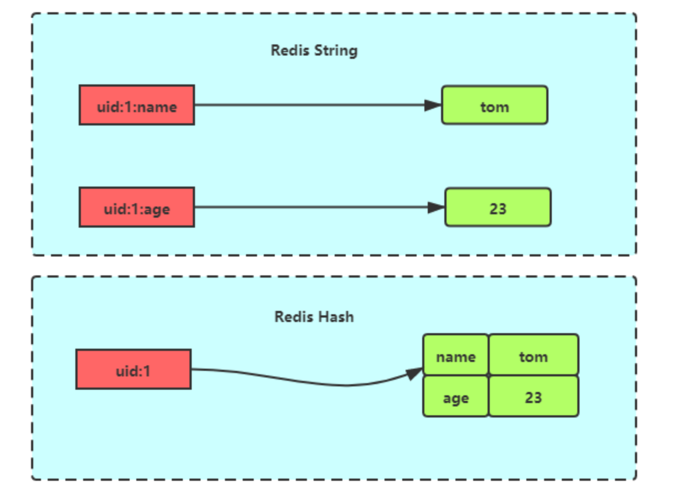

| 条件 | 底层结构 |
|------|----------|
| <512 元素且 <64B | 压缩列表 |
| 其他 | 哈希表 |
| Redis 7.0+ | listpack 替代压缩列表 |

### 3.2 常用命令

| 命令 | 用途 |
|------|------|
| HSET / HGET | 设置/获取单个字段 |
| HMSET / HMGET | 批量设置/获取 |
| HDEL | 删除字段 |
| HLEN | 字段数量 |
| HGETALL | 获取所有键值 |
| HINCRBY | 字段值增量 |

### 3.3 应用场景

**缓存对象**：`HMSET uid:1 name Tom age 15`，比 String+JSON 更适合频繁修改的属性。

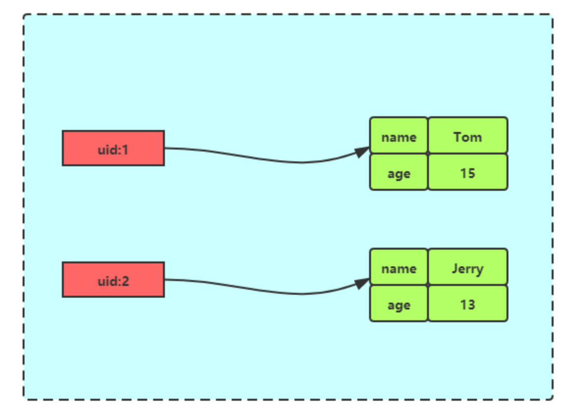

> 选择建议：一般对象用 String+JSON，频繁变化的属性抽出来用 Hash。

**购物车**：

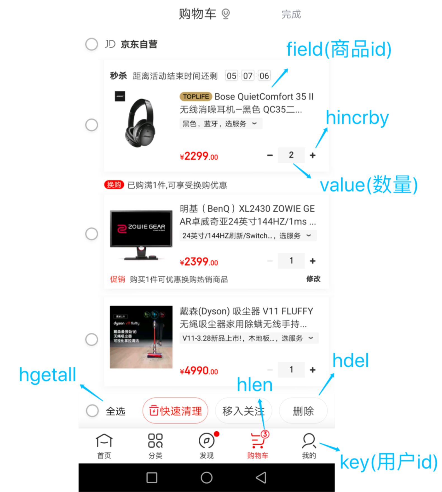

| 操作 | 命令 |
|------|------|
| 添加商品 | `HSET cart:{uid} {gid} 1` |
| 增加数量 | `HINCRBY cart:{uid} {gid} 1` |
| 商品总数 | `HLEN cart:{uid}` |
| 删除商品 | `HDEL cart:{uid} {gid}` |
| 获取所有 | `HGETALL cart:{uid}` |

## 四、Set

### 4.1 介绍与内部实现

无序唯一的键值集合，支持交并差集运算。

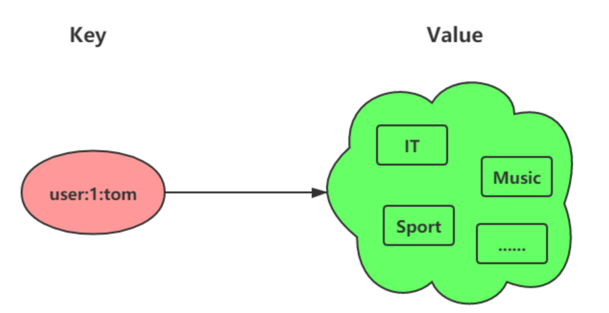

| 条件 | 底层结构 |
|------|----------|
| 元素全为整数且 <512 | 整数集合 |
| 其他 | 哈希表 |

### 4.2 常用命令

| 类别 | 命令 |
|------|------|
| 基本操作 | SADD / SREM / SMEMBERS / SCARD / SISMEMBER |
| 随机选取 | SRANDMEMBER（不移除）/ SPOP（移除） |
| 交集 | SINTER / SINTERSTORE |
| 并集 | SUNION / SUNIONSTORE |
| 差集 | SDIFF / SDIFFSTORE |

> **注意**：交并差集计算复杂度较高，大数据量会阻塞 Redis，建议在从库执行或客户端计算。

### 4.3 应用场景

| 场景 | 实现方式 |
|------|----------|
| 点赞 | `SADD article:1 uid:1`，`SREM article:1 uid:1`，`SCARD article:1` |
| 共同关注 | `SINTER uid:1 uid:2`，推荐用 `SDIFF uid:1 uid:2` |
| 抽奖 | 允许重复：`SRANDMEMBER lucky N`；不允许：`SPOP lucky N` |

## 五、ZSet（有序集合）

### 5.1 介绍与内部实现

比 Set 多了 score（分值）属性，元素不可重复但分值可重复，可按分值排序。

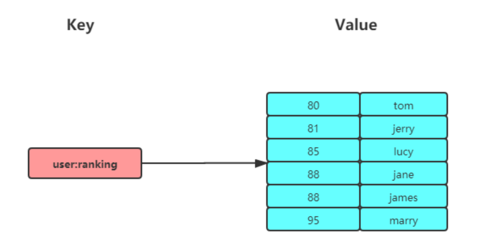

| 条件 | 底层结构 |
|------|----------|
| <128 元素且 <64B | 压缩列表 |
| 其他 | 跳表 + 哈希表 |
| Redis 7.0+ | listpack 替代压缩列表 |

### 5.2 常用命令

| 命令 | 用途 |
|------|------|
| ZADD | 添加带分值元素 |
| ZREM | 删除元素 |
| ZSCORE | 获取分值 |
| ZCARD | 元素个数 |
| ZINCRBY | 分值增量 |
| ZRANGE / ZREVRANGE | 正序/倒序获取 |
| ZRANGEBYSCORE | 按分值范围获取 |
| ZRANGEBYLEX | 按字典序获取（分值必须相同） |
| ZUNIONSTORE / ZINTERSTORE | 并集/交集计算 |

> ZSet **不支持差集运算**。

### 5.3 应用场景

**排行榜**：

```bash
ZADD user:xiaolin:ranking 200 article:1 40 article:2 100 article:3
ZINCRBY user:xiaolin:ranking 1 article:4   # 新增一个赞
ZREVRANGE user:xiaolin:ranking 0 2 WITHSCORES  # 赞数最多的3篇
ZRANGEBYSCORE user:xiaolin:ranking 100 200 WITHSCORES  # 100~200赞的文章
```

**电话/姓名排序**：ZRANGEBYLEX（注意分值必须相同）

```bash
ZRANGEBYLEX phone [132 (133   # 获取132号段
ZRANGEBYLEX names [A (B       # A开头名字
```

## 六、BitMap

### 6.1 介绍与内部实现

一串连续的二进制数组（0/1），通过 offset 定位元素。底层基于 String 类型，将字节数组的每个 bit 位利用起来。

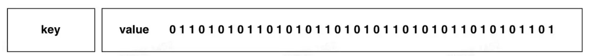

时间复杂度 O(1)，极度节省空间，5000 万用户仅约 6 MB。

### 6.2 常用命令

| 命令 | 用途 |
|------|------|
| SETBIT key offset value | 设置某位为 0/1 |
| GETBIT key offset | 获取某位的值 |
| BITCOUNT key start end | 统计值为 1 的个数 |
| BITOP AND/OR/XOR/NOT destkey key... | 位运算 |
| BITPOS key value | 第一个出现指定值的位置 |

### 6.3 应用场景

| 场景 | 实现 |
|------|------|
| 签到统计 | `SETBIT uid:sign:100:202206 2 1`，`BITCOUNT uid:sign:100:202206` |
| 判断登录态 | `SETBIT login_status 10086 1`，`GETBIT login_status 10086` |
| 连续签到用户 | 多天 BitMap 做 AND 运算，再 BITCOUNT |

## 七、HyperLogLog

### 7.1 介绍

用于基数统计（不重复元素个数），基于概率，标准误算率 0.81%。每个键仅 12 KB 内存可统计接近 2^64 个元素。

### 7.2 常用命令

| 命令 | 用途 |
|------|------|
| PFADD key element... | 添加元素 |
| PFCOUNT key | 返回基数估算值 |
| PFMERGE destkey sourcekey... | 合并多个 HyperLogLog |

### 7.3 应用场景

百万级网页 UV 计数：

```bash
PFADD page1:uv user1 user2 user3
PFCOUNT page1:uv
```

> 需要精确结果时，仍应用 Set 或 Hash。

## 八、GEO

### 8.1 介绍与内部实现

存储地理位置信息。底层基于 Sorted Set，用 GeoHash 编码将经纬度转换为权重分数。

### 8.2 常用命令

| 命令 | 用途 |
|------|------|
| GEOADD key lng lat member | 添加地理位置 |
| GEOPOS key member | 获取经纬度 |
| GEODIST key m1 m2 [m/km] | 两点距离 |
| GEORADIUS key lng lat radius km | 附近搜索 |

### 8.3 应用场景

滴滴叫车：

```bash
GEOADD cars:locations 116.034579 39.030452 33       # 存入车辆位置
GEORADIUS cars:locations 116.054579 39.030452 5 km ASC COUNT 10  # 搜索5公里内车辆
```

## 九、Stream

### 9.1 介绍

Redis 5.0 新增，专为消息队列设计。支持：持久化、自动生成全局唯一 ID、ACK 确认、消费组模式。

### 9.2 常用命令

| 命令 | 用途 |
|------|------|
| XADD key * field value | 插入消息（自动生成 ID） |
| XLEN key | 消息长度 |
| XREAD COUNT n STREAMS key id | 读取消息 |
| XREAD BLOCK ms STREAMS key $ | 阻塞读取最新消息 |
| XGROUP CREATE key group id | 创建消费组 |
| XREADGROUP GROUP g c STREAMS key > | 消费组读取 |
| XPENDING key group | 查看未确认消息 |
| XACK key group id | 确认消息 |

### 9.3 应用场景：消息队列


**消息保序**：XADD 自动生成全局唯一 ID（毫秒时间戳-序号）

**消费组模式**：
- 同一消费组内：一条消息只能被一个消费者消费
- 不同消费组间：可以消费同一条消息

**消息可靠性**：PENDING List 自动保存未确认消息

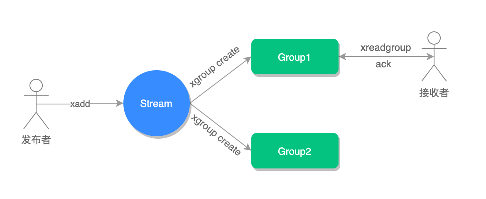

### 9.4 Redis Stream vs 专业消息队列

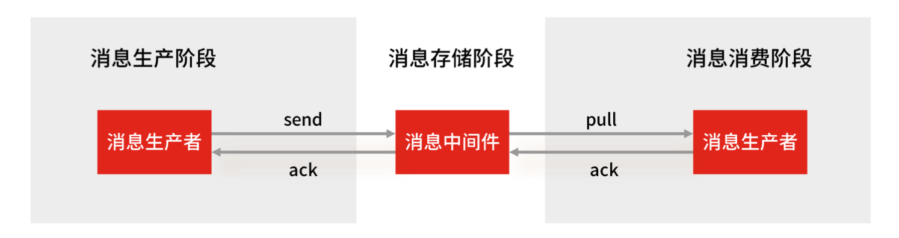

| 对比项 | Redis Stream | 专业 MQ（Kafka/RabbitMQ） |
|--------|-------------|--------------------------|
| 生产者丢消息 | 处理好异常则不会 | 不会 |
| 消费者丢消息 | 不会（PENDING List 保留） | 不会 |
| 中间件丢消息 | **可能**（AOF 异步刷盘 + 主从异步复制） | 不会（多副本） |
| 消息堆积 | **有 OOM 风险**（内存存储） | 无（磁盘存储） |

**结论**：
- 业务简单、对丢失不敏感、积压概率小 → 可用 Redis
- 海量消息、不能丢数据、可能积压 → 用专业 MQ

## 十、数据类型与底层结构总览

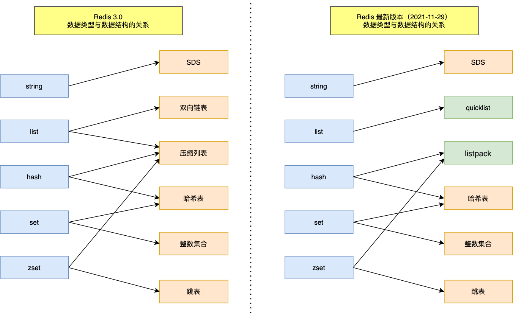

### 9 种类型应用场景汇总

| 类型 | 版本 | 底层实现 | 核心场景 |
|------|------|----------|----------|
| String | 1.0 | SDS（int/embstr/raw） | 缓存对象、计数、分布式锁、Session |
| List | 1.0 | quicklist（7.0 listpack） | 消息队列（简单场景） |
| Hash | 1.0 | 压缩列表/哈希表（7.0 listpack） | 缓存对象、购物车 |
| Set | 1.0 | 整数集合/哈希表 | 点赞、共同关注、抽奖 |
| ZSet | 1.0 | 压缩列表/跳表（7.0 listpack） | 排行榜、排序 |
| BitMap | 2.2 | String | 签到、登录态、连续统计 |
| HyperLogLog | 2.8 | 概率算法 | UV 计数（允许 0.81% 误差） |
| GEO | 3.2 | Sorted Set + GeoHash | 附近搜索、LBS |
| Stream | 5.0 | radix tree | 消息队列（消费组+ACK） |

## 复习清单

1. **String 的 3 种编码？** int（整数）、embstr（短字符串，一次内存分配）、raw（长字符串，两次分配）。
2. **embstr 与 raw 的边界？** Redis 5.0 为 44 字节；embstr 只读，修改时转为 raw。
3. **List 做消息队列的 4 个需求如何满足？** 保序→LPUSH+RPOP；阻塞→BRPOP；去重→自行生成全局 ID；可靠→BRPOPLPUSH。
4. **List 消息队列的缺陷？** 不支持消费组，一条消息只能被一个消费者消费。
5. **Hash vs String+JSON 存对象？** 一般对象用 String+JSON；频繁变化的属性用 Hash。
6. **Set 交并差集的注意事项？** 计算复杂度高，大数据量会阻塞 Redis，应在从库或客户端计算。
7. **ZSet 与 Set 的区别？** ZSet 多了 score 排序属性，但不支持差集运算。
8. **BitMap 的空间优势？** 基于 String 的 bit 位，5000 万用户仅需约 6 MB。
9. **HyperLogLog 的适用场景？** UV 计数，12 KB 统计 2^64 元素，误差 0.81%。
10. **GEO 底层实现？** 基于 Sorted Set，经纬度通过 GeoHash 编码为权重分数。
11. **Stream 相比 List 做消息队列的优势？** 自动生成全局唯一 ID、支持消费组、ACK 确认。
12. **Redis Stream 能否替代专业 MQ？** 不能完全替代：中间件可能丢消息（AOF 异步+主从异步），堆积有 OOM 风险。
