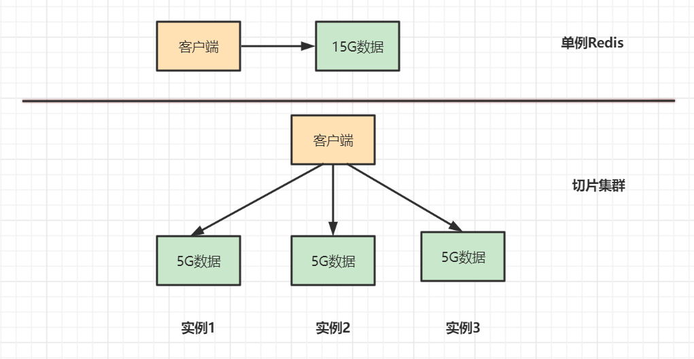
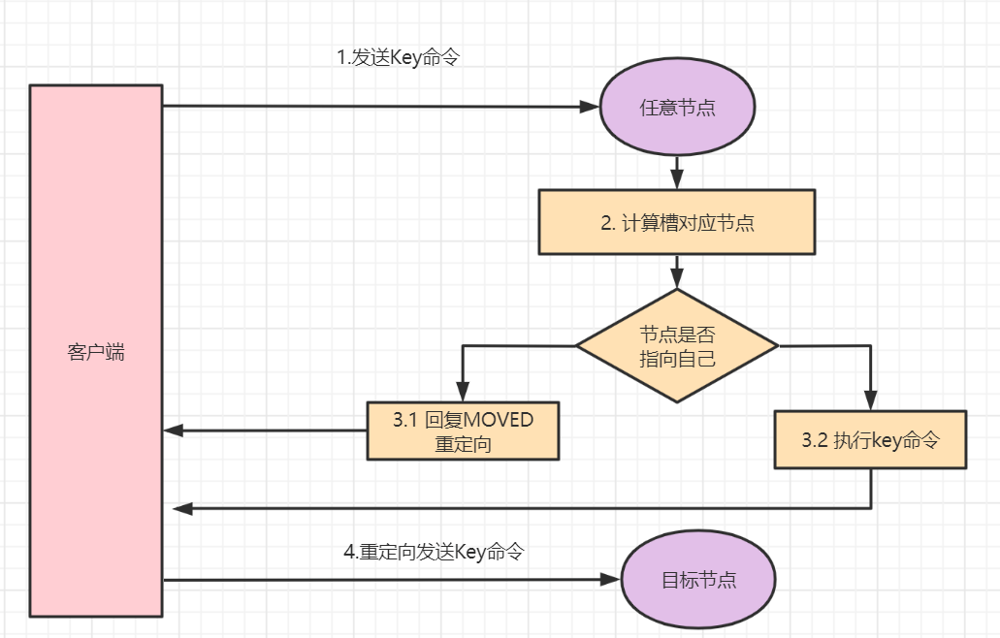
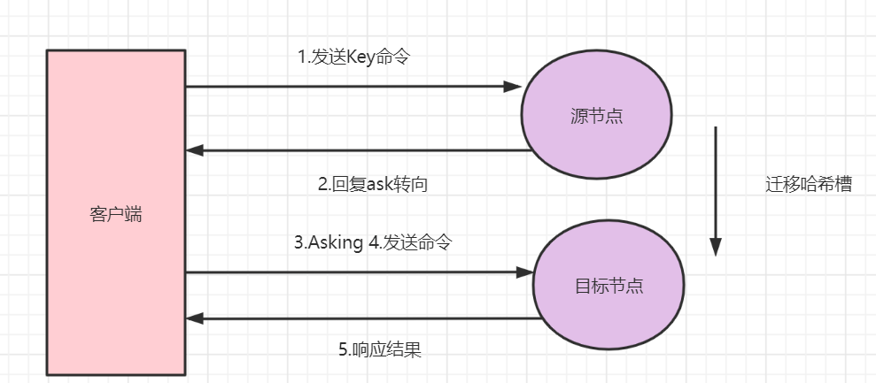
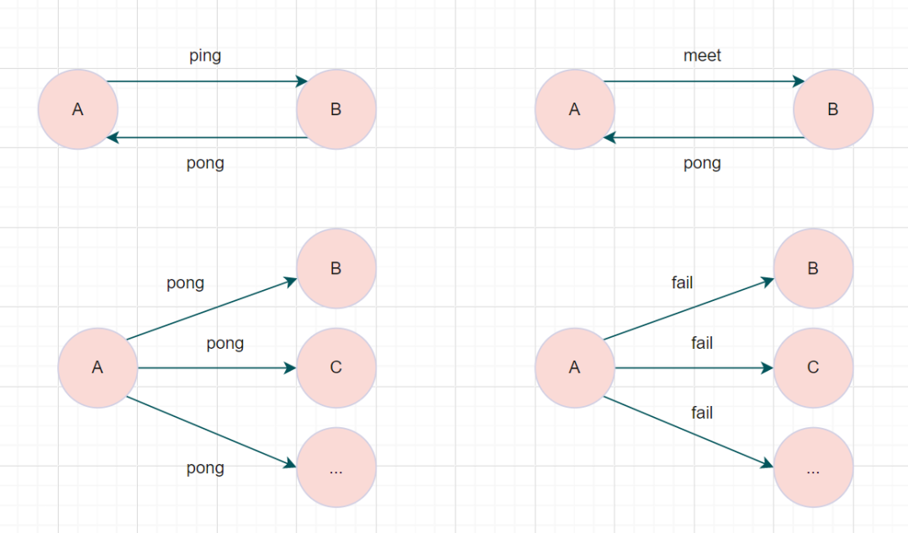

# Redis Cluster 集群原理

> 来源：[小林 coding - Redis Cluster 集群](https://xiaolincoding.com/redis/cluster/cluster.html)
> 一句话总结：Redis Cluster 通过 16384 个哈希槽将数据分片到多节点，客户端缓存槽映射实现高效路由，MOVED/ASK 重定向处理迁移场景，Gossip 协议实现去中心化状态同步，故障转移保证高可用。



## 一、为什么需要 Redis Cluster

### 1.1 单机 Redis 的两大缺陷

| 缺陷 | 表现 | 解决方案 |
|------|------|----------|
| 可用性差 | 单机宕机 → 全部业务不可用 | 主从复制 + 哨兵自动故障转移 |
| 容量受限 | 单机内存有上限；内存越大 fork 越慢、阻塞风险越高 | 切片集群（Sharding） |

### 1.2 哨兵为什么不够

哨兵解决了**可用性**问题，但主从数据**完全相同**，集群容量仍等于单机内存上限。如主节点 64G + 5 个从节点，有效存储仍只有 64G。

**切片集群**（Sharding）思路：将大数据集切分到多台机器，容量随节点数线性扩展。Redis Cluster 是 Redis 官方从 3.0 起提供的切片集群方案。

## 二、哈希槽——数据分片机制

### 2.1 分片方案演进

| 方案 | 做法 | 扩缩容影响 |
|------|------|------------|
| key 直接取模 | `hash(key) % 机器数` | 增减 1 台机器，几乎所有 key 位置变化，需全量搬迁 |
| 哈希槽（Redis Cluster） | key → 槽（固定 16384）→ 节点 | 只需迁移相关槽，key 无感知 |

核心思想：在 key 和机器之间加一层「槽」做解耦。

```
key → 哈希槽（固定 16384 个，永不变） → 机器（可增可减）
```

### 2.2 槽号计算

```
slot = CRC16(key) % 16384    // 取值范围 0 ~ 16383
```

### 2.3 槽的分配

集群初始化时，16384 个槽尽量平均分给各主节点。例如 3 主节点：

| 节点 | 负责槽范围 | 槽数量 |
|------|-----------|--------|
| A | 0 ~ 5460 | 5461 |
| B | 5461 ~ 10922 | 5462 |
| C | 10923 ~ 16383 | 5461 |

每个节点本地维护一份完整的「槽 → 节点」映射表，节点间持续同步。

### 2.4 为什么是 16384 而不是 65536

| 考量 | 16384 | 65536 |
|------|-------|-------|
| Gossip 消息中槽位图大小 | 16384 / 8 = **2KB** | 65536 / 8 = **8KB** |
| 槽粒度是否够细 | 1000 节点下每节点约 16 槽，足够 | 更细但无必要 |
| 带宽开销 | 较小 | 显著增大 |

**结论**：16384 是带宽和粒度的平衡点。节点间频繁交换槽位图，消息体越小越好。

## 三、客户端路由机制

### 3.1 Smart Client

客户端启动时从任意节点拉取「槽 → 节点」映射表并缓存本地。每次请求：

1. CRC16 算出 key 所属槽号
2. 查本地映射表定位目标节点
3. 直接发请求（**本地计算，一次命中**）

常见 Smart Client：Jedis、Lettuce、go-redis、`redis-cli -c`。

### 3.2 MOVED 重定向——永久搬迁

当槽已完整迁移到新节点，客户端旧缓存命中旧节点时触发：

```
(error) MOVED 100 192.168.1.2:6379
```

客户端行为：**更新本地缓存** → 重新发请求到新节点。下次同槽 key 一次命中。



### 3.3 ASK 重定向——临时借道

当槽正在迁移中（部分 key 已搬、部分未搬），旧节点对已迁走的 key 返回：

```
(error) ASK 100 192.168.1.2:6379
```

客户端行为：**不更新本地缓存** → 先发 `ASKING` 命令到新节点 → 再发实际请求。

`ASKING` 的作用：告诉新节点「我知道你还没正式接管这个槽，但请破例处理这次请求」。



### 3.4 MOVED vs ASK 对比

| 维度 | MOVED | ASK |
|------|-------|-----|
| 触发场景 | 槽已完整迁移完毕 | 槽正在迁移中（部分 key 已搬） |
| 语义 | 永久搬家通知 | 临时借道通知 |
| 客户端更新缓存 | **是** | **否** |
| 是否需要 ASKING | 否 | **是**（否则新节点会返回 MOVED 回指旧节点） |
| 对迁移的意义 | 迁移完成后的最终状态同步 | 保证迁移过程中请求仍可正确处理 |

## 四、Gossip 协议——节点间通信

### 4.1 为什么选去中心化

| 方式 | 优点 | 缺点 |
|------|------|------|
| 中心化（如哨兵） | 状态一致快 | 管理节点自身需要高可用，架构复杂 |
| 去中心化（Gossip） | 无单点、实现简单 | 信息传播有延迟（最终一致） |

### 4.2 Gossip 工作原理

每个节点**周期性地随机挑几个节点**交换集群状态，经若干轮后全集群收敛一致。类似八卦传播：不逐个通知，而是每人传几人，一传十十传百。

### 4.3 消息类型

| 消息 | 用途 | 携带集群状态 |
|------|------|:------------:|
| ping | 每秒随机发，附带自身所知集群状态 | 是 |
| pong | 收到 ping 后回复确认，附自身状态 | 是 |
| meet | 向新节点打招呼，邀其加入集群 | 是 |
| fail | 广播某节点已确认下线 | 否 |

### 4.4 集群总线端口

节点间通信走**集群总线端口** = 业务端口 + 10000。如业务端口 6379 → 总线端口 16379。

> 部署时**两个端口都要放行**，忘记放 16379 是常见踩坑点。

### 4.5 Gossip 的代价

消息量随节点数**平方级增长**（每个节点都要和其他节点通信 + 消息体含集群状态）。因此官方建议：**主节点数量不超过 1000**。



## 五、故障转移

### 5.1 故障发现

| 阶段 | 标记 | 含义 | 触发条件 |
|------|------|------|----------|
| 主观下线 | PFAIL | 单个节点认为目标不可达 | ping 超时（超过 `cluster-node-timeout`） |
| 客观下线 | FAIL | 集群确认目标下线 | 超过半数主节点标记 PFAIL |

### 5.2 故障转移流程

1. 从节点发现主节点被标记为 FAIL
2. 从节点发起**选举**：向所有主节点请求投票
3. 获得多数主节点投票的从节点**晋升为新主节点**
4. 新主节点广播 PONG 通知全集群槽归属变更
5. 客户端通过 MOVED 重定向逐步更新缓存

### 5.3 选举规则

- 只有持有主节点槽的从节点才能参与选举
- 优先选择**复制偏移量最大**（数据最新）的从节点
- 需获得 **> N/2 + 1** 张主节点选票（N 为主节点数）

## 六、复习清单

1. **Redis Cluster 解决的核心问题是什么？** 单机容量受限（哨兵只能解决可用性，不能扩容）。
2. **哈希槽的数量是多少？能否改变？** 16384 个，固定不可变。
3. **key 如何映射到槽？** `slot = CRC16(key) % 16384`。
4. **为什么选择 16384 而不是 65536 个槽？** Gossip 消息携带槽位图，16384 仅 2KB，65536 需 8KB，带宽开销差异大。
5. **Smart Client 的工作原理？** 客户端缓存「槽 → 节点」映射表，请求时本地计算槽号 → 查表 → 直连目标节点。
6. **MOVED 重定向和 ASK 重定向的区别？** MOVED 是永久搬迁（更新缓存），ASK 是临时借道（不更新缓存，需先发 ASKING）。
7. **ASKING 命令的作用？** 告诉新节点「我通过 ASK 重定向来的，请临时处理这次请求」，否则新节点会因未正式接管该槽而拒绝。
8. **Gossip 协议的优缺点？** 优点：去中心化无单点、实现简单；缺点：信息传播有延迟、消息量随节点数平方增长。
9. **Redis Cluster 的四种 Gossip 消息？** ping（探测+状态同步）、pong（确认+状态同步）、meet（邀请新节点）、fail（广播下线）。
10. **集群总线端口如何计算？** 业务端口 + 10000（如 6379 → 16379）。
11. **故障转移中主观下线和客观下线的区别？** 主观下线（PFAIL）是单节点判定；客观下线（FAIL）需过半主节点同意。
12. **从节点选举新主的条件？** 需获 > N/2 + 1 张主节点选票，优先选择复制偏移量最大的从节点。
